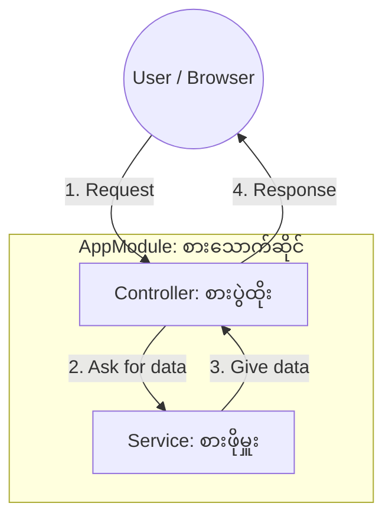

# Day 1: Manual NestJS Setup (The Ultimate Guide) 🏗️

ဒီ Guide မှာ Full-stack စနစ်တစ်ခုကို ဘယ်လို Plan ဆွဲရမလဲ၊ ပြီးတော့ NestJS Backend ကို အစကနေ ဘယ်လိုတည်ဆောက်ရမလဲဆိုတာကို အသေးစိတ် ရှင်းပြပေးသွားပါမယ်။

---

## 🌍 Step 0: The 3-Project Composition
Code တွေ စမရေးခင်မှာ၊ ကျွန်တော်တို့ရဲ့ စနစ်တစ်ခုလုံး (Ecosystem) ကို အရင်ကြိုပြီး Plan ဆွဲကြပါမယ်။ အတူတကွ ချိတ်ဆက်အလုပ်လုပ်မယ့် သီးခြား App (၃) ခုကို တည်ဆောက်သွားမှာ ဖြစ်ပါတယ်။

1. **`backend/`**: အဓိက "Engine" (NestJS) ဖြစ်ပါတယ်။ Data တွေ သိမ်းဆည်းတာနဲ့ လုပ်ငန်းစဉ် (Logic) အားလုံးကို သူက ကိုင်တွယ်ဖြေရှင်းပေးပါမယ်။
2. **`frontend/`**: Customer တွေ ကားငှားဖို့အတွက် သုံးမယ့် "Mobile App" (Expo/React Native) ဖြစ်ပါတယ်။
3. **`react/`**: ပိုင်ရှင်တွေ ကားတွေကို စီမံခန့်ခွဲဖို့အတွက် သုံးမယ့် "Admin Dashboard" (Vite/React) ဖြစ်ပါတယ်။

### သူတို့ကို ဘယ်လိုဖန်တီးမလဲ?
အဓိက Workspace Folder တစ်ခုကို အရင်ဖန်တီးပြီး၊ အဲ့ဒီအထဲမှာ Sub-project တစ်ခုချင်းစီကို ကိုယ်တိုင် (Manually) တည်ဆောက်သွားပါမယ်။
```powershell
# အဓိက Folder ကြီးကို ဖန်တီးမယ်
mkdir full-stack-development
cd full-stack-development

# Sub-projects တွေကို ဖန်တီးမယ်
mkdir backend
mkdir frontend
mkdir react
```

---

## 📊 The Architecture Diagram


---

## 🛠️ Step 1: Initialize the Project
Project ရဲ့ Environment ကို အရင်ဆုံး ပြင်ဆင်ပြီး လိုအပ်တဲ့ အခြေခံ Dependencies တွေကို Install လုပ်ပါမယ်။

```powershell
# Node.js project စတင်မယ်
npm init -y

# NestJS Core Dependencies တွေကို Install လုပ်မယ်
npm install @nestjs/core \
  @nestjs/common \
  reflect-metadata \
  rxjs

# TypeScript Development Tools တွေကို Install လုပ်မယ်
npm install --save-dev \
  typescript \
  ts-node \
  @types/node

npx tsc --init
```
> **💡 Deep Explainer (အသေးစိတ် ရှင်းလင်းချက်)**: 
> - **reflect-metadata**: NestJS ကို **Decorators** တွေ အသုံးပြုခွင့်ပေးတဲ့ Library ဖြစ်ပါတယ်။
> Class တွေကို ဘယ်လိုချိတ်ဆက်ရမလဲဆိုတာကို NestJS က သိအောင် "အပို အချက်အလက်တွေ" (Metadata) ကို သူက သိမ်းဆည်းပေးပါတယ်။
> - **rxjs**: Reactive programming အတွက် သုံးတဲ့ Library ပါ။ 
> Asynchronous data လမ်းကြောင်းတွေကို ကိုင်တွယ်ဖို့ NestJS က အသုံးပြုပါတယ်။

---

## 🛠️ Step 2: The Service (စားဖိုမှူး 👨‍🍳)
**File**: `src/app.service.ts`
Service က **Business Logic** ကို ကိုင်တွယ်ပါတယ်။ Application ရဲ့ အလုပ်လုပ်ပုံ "ဘယ်လိုအလုပ်လုပ်မလဲ (How)" ဆိုတာကို သူက တာဝန်ယူပါတယ်။

```typescript
import { Injectable } from '@nestjs/common';

@Injectable()
export class AppService {
  getTime(): string {
    return new Date().toLocaleTimeString();
  }
}
```
> **💡 Deep Explainer**: 
> - **@Injectable()**: ဒီ Class ကို **Provider** အနေနဲ့ သတ်မှတ်ပေးတာပါ။ ဒီ Class ကို ဖန်တီးပြီး တခြား Class တွေနဲ့ပါ မျှဝေသုံးစွဲလို့ရတယ်ဆိုတာကို NestJS "IoC Container" (မန်နေဂျာ) ဆီ အသိပေးလိုက်တာ ဖြစ်ပါတယ်။

---

## 🛠️ Step 3: The Controller (စားပွဲထိုး 🤵‍♂️)
**File**: `src/app.controller.ts`
Controller က **Routing** ကို ကိုင်တွယ်ပါတယ်။ Application ရဲ့ လမ်းကြောင်းတွေ "ဘယ်နေရာကို သွားမလဲ (Where/URLs)" ဆိုတာကို တာဝန်ယူပါတယ်။

```typescript
import { Controller, Get } from '@nestjs/common';
import { AppService } from './app.service';

@Controller() // Base path က '/' ပါ
export class AppController {
  // Dependency Injection: Constructor ထဲမှာ Service ကို တောင်းဆိုထားပါတယ်
  constructor(private readonly appService: AppService) {}

  @Get('time') // URL: http://localhost:3000/time
  getTime(): string {
    return this.appService.getTime();
  }
}
```
> **💡 Deep Explainer (Dependency Injection)**: 
> ကျွန်တော်တို့က `new AppService()` ဆိုပြီး ဘယ်တော့မှ ရေးမှာ မဟုတ်ပါဘူး။ အဲဒီအစား၊ Constructor ထဲမှာ ကြေညာပေးလိုက်ရုံပါပဲ။ NestJS က အလိုအလျောက် ရှာဖွေပြီး "ထည့်သွင်း (Inject)" ပေးသွားမှာပါ။ ဒါဟာ သပ်ရပ်ပြီး Modular ဖြစ်တဲ့ Code တွေ ရေးသားခြင်းရဲ့ လျှို့ဝှက်ချက်ပါပဲ။

---

## 🛠️ Step 4: The Module (အဆောက်အအုံ 🏢)
**File**: `src/app.module.ts`
Module ဆိုတာကတော့ Controller နဲ့ Service ကို အတူတကွ ချိတ်ဆက်ပေးတဲ့ **Orchestrator (ပေါင်းစပ်ညှိနှိုင်းပေးသူ)** ဖြစ်ပါတယ်။

```typescript
import { Module } from '@nestjs/common';
import { AppController } from './app.controller';
import { AppService } from './app.service';

@Module({
  controllers: [AppController],
  providers: [AppService],
})
export class AppModule {}
```
> **💡 Deep Explainer**: 
> မည်သည့် NestJS app မှာမဆို အနည်းဆုံး Module တစ်ခု (Root Module) ပါရှိရပါတယ်။ သူက ဆက်စပ်နေတဲ့ Code အစိတ်အပိုင်းတွေကို စုစည်းပေးတဲ့ နယ်နိမိတ်တစ်ခုလို လုပ်ဆောင်ပေးပါတယ်။

---

## 🛠️ Step 5: The Bootstrap (စက်နှိုးခြင်း 🔑)
**File**: `src/main.ts`
Server တစ်ခုလုံးကို စတင်လည်ပတ်ပေးမယ့် အဓိက Entry point ဖိုင် ဖြစ်ပါတယ်။

```typescript
import { NestFactory } from '@nestjs/core';
import { AppModule } from './app.module';

async function bootstrap() {
  const app = await NestFactory.create(AppModule);
  await app.listen(3000); // Port 3000 နဲ့ Server ကို စတင်ပါမယ်
}
bootstrap();
```

---

## 🏁 Day 1 Summary (အနှစ်ချုပ်)
- **Controller** = တံခါးစောင့် / လမ်းကြောင်းပြသူ (Routing).
- **Service** = ဦးနှောက် / အလုပ်လုပ်ပုံ (Logic).
- **Module** = ကော် / စုစည်းပေးသူ (Organization).
- **Dependency Injection** = သူတို့ကို အလိုအလျောက် ချိတ်ဆက်ပေးတဲ့ စနစ်။
