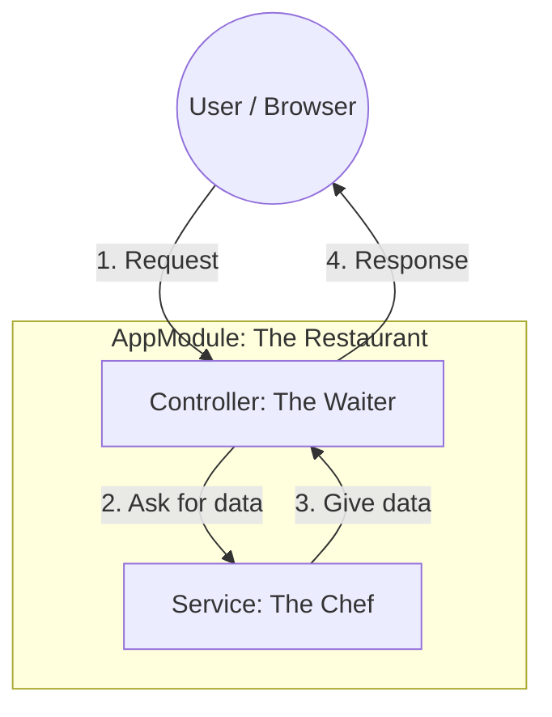

# Day 1: Manual NestJS Setup (The Ultimate Guide) 🏗️

This guide explains how to plan your full-stack system and build the NestJS backend from scratch.

---

## 🌍 Step 0: The 3-Project Composition
Before coding, we planned our entire ecosystem. We are building **three** independent apps that work together:

1. **`backend/`**: The core "Engine" (NestJS). It stores all data and handles logic.
2. **`frontend/`**: The "Mobile App" (Expo/React Native) for customers to rent cars.
3. **`react/`**: The "Admin Dashboard" (Vite/React) for owners to manage their fleet.

### How we created them:
We created a main workspace folder and then manually initialized each sub-project:
```powershell
# Create the main folder
mkdir full-stack-development
cd full-stack-development

# Create the sub-projects
mkdir backend
mkdir frontend
mkdir react
```

---

## 📊 The Architecture Diagram


---

## 🛠️ Step 1: Initialize the Project
We set up the project environment and install the core dependencies.

```powershell
# Initialize Node.js project
npm init -y

# Install NestJS Core Dependencies
npm install @nestjs/core @nestjs/common reflect-metadata rxjs

# Install TypeScript Development Tools
npm install --save-dev typescript ts-node @types/node
npx tsc --init
```
> **💡 Deep Explainer**: 
> - **reflect-metadata**: A library that allows NestJS to use **Decorators**. It stores "extra information" about classes so NestJS knows how to link them together.
> - **rxjs**: A library for reactive programming. NestJS uses it to handle asynchronous data streams.

---

## 🛠️ Step 2: The Service (The Chef 👨‍🍳)
**File**: `src/app.service.ts`
The Service contains the **Business Logic**. It handles the "How" of the application.

```typescript
import { Injectable } from '@nestjs/common';

@Injectable()
export class AppService {
  getTime(): string {
    return new Date().toLocaleTimeString();
  }
}
```
> **💡 Deep Explainer**: 
> - **@Injectable()**: This marks the class as a **Provider**. It tells the NestJS "IoC Container" (the manager) that this class can be created and shared with other classes.

---

## 🛠️ Step 3: The Controller (The Waiter 🤵‍♂️)
**File**: `src/app.controller.ts`
The Controller handles **Routing**. It manages the "Where" (URLs) of the application.

```typescript
import { Controller, Get } from '@nestjs/common';
import { AppService } from './app.service';

@Controller() // Base path is '/'
export class AppController {
  // Dependency Injection: We ask for the Service in the constructor
  constructor(private readonly appService: AppService) {}

  @Get('time') // URL: http://localhost:3000/time
  getTime(): string {
    return this.appService.getTime();
  }
}
```
> **💡 Deep Explainer (Dependency Injection)**: 
> We never say `new AppService()`. Instead, we just declare it in the constructor. NestJS automatically finds the instance and "injects" it. This is the secret to clean, modular code.

---

## 🛠️ Step 4: The Module (The Building 🏢)
**File**: `src/app.module.ts`
The Module is the **Orchestrator** that ties the Controller and Service together.

```typescript
import { Module } from '@nestjs/common';
import { AppController } from './app.controller';
import { AppService } from './app.service';

@Module({
  controllers: [AppController],
  providers: [AppService],
})
export class AppModule {}
```
> **💡 Deep Explainer**: 
> Every NestJS app has at least one module (the Root Module). It acts as a boundary that organizes related pieces of code.

---

## 🛠️ Step 5: The Bootstrap (The Ignition 🔑)
**File**: `src/main.ts`
The entry point that starts the entire server.

```typescript
import { NestFactory } from '@nestjs/core';
import { AppModule } from './app.module';

async function bootstrap() {
  const app = await NestFactory.create(AppModule);
  await app.listen(3000); // Start the server on Port 3000
}
bootstrap();
```

---

## 🏁 Day 1 Summary
- **Controller** = Gatekeeper / Routing.
- **Service** = Brain / Logic.
- **Module** = Glue / Organization.
- **Dependency Injection** = The system that automatically connects them.
