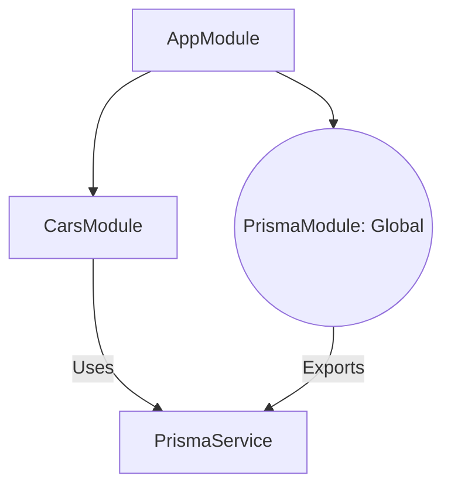

# Day 3: Car Inventory CRUD & Modular Architecture 🏎️💎

Today we moved from a single app to a **Modular System** and built our first real API features.

---

## 📊 The Modular Architecture
We separated the database from the features so multiple modules can share the connection.



---

## 🛠️ Step 1: The Global Prisma Module
We moved `PrismaService` into its own module with the `@Global()` decorator.
**Why?** This allows any other module (like Cars or Users) to use the database without importing `PrismaModule` over and over.

---

## 🛠️ Step 2: Car CRUD Implementation

### The Controller (The Waiter 🤵‍♂️)
Handles the URLs and HTTP methods:
- `POST /cars`: Create
- `GET /cars`: Read All
- `GET /cars/:id`: Read One
- `PATCH /cars/:id`: Update
- `DELETE /cars/:id`: Delete

### The Service (The Chef 👨‍🍳)
Uses Prisma to talk to the database:
```typescript
async create(data: { brand: string; model: string; year: number; pricePerDay: number }) {
  return this.prisma.car.create({ data });
}
```

---

## ⚠️ Troubleshooting: The "Ghost" Server
We learned about the **`EADDRINUSE`** error. 
- **The Problem**: A previous server process was still running on port 3000.
- **The Fix**: We used `Stop-Process` to kill the hidden process before starting the new one.

---

## 💡 Key Takeaways
1. **Feature Modules**: Organize your code by "What it does" (e.g., Cars, Users).
2. **Global Modules**: Use for tools everyone needs (like Databases).
3. **Type Casting**: Use `as string` to help TypeScript understand environment variables.
4. **CRUD**: The bread and butter of every backend application.

---

## ✅ Day 3 Graduation
You successfully registered a **2024 Toyota Camry** in your cloud database! 🏁🌍🏆
