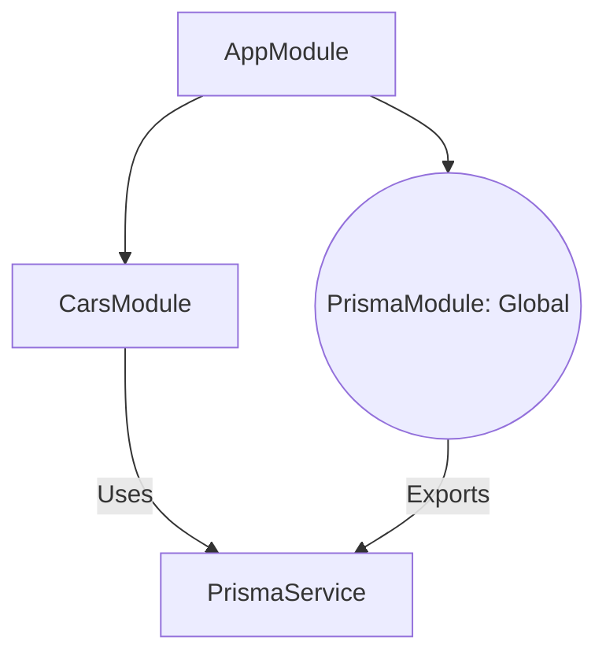

# Day 3: Car Inventory CRUD & Modular Architecture 🏎️💎

ဒီနေ့မှာတော့ ဖိုင်တစ်ခုတည်းမှာ အကုန်ရေးတဲ့ပုံစံကနေ **Modular System (အပိုင်းလိုက် ခွဲခြားတည်ဆောက်တဲ့ စနစ်)** ပြောင်းလဲပြီး၊ ကျွန်တော်တို့ရဲ့ ပထမဆုံး အစစ်အမှန် API Feature တွေကို စတင်တည်ဆောက်သွားပါမယ်။

---

## 📊 The Modular Architecture
Database ချိတ်ဆက်မှုကို Feature တွေနဲ့ သီးခြားခွဲထုတ်လိုက်ပါတယ်။ ဒါမှသာ Module မျိုးစုံကနေ အဲဒီ Database ချိတ်ဆက်မှုကို မျှဝေသုံးစွဲနိုင်မှာ ဖြစ်ပါတယ်။



---

## 🛠️ Step 1: The Global Prisma Module
`PrismaService` ကို သူနဲ့သက်ဆိုင်တဲ့ ကိုယ်ပိုင် Module ထဲကို ရွှေ့လိုက်ပြီး `@Global()` decorator ကို အသုံးပြုထားပါတယ်။

**ဘာကြောင့်လဲ?**
ဒီလိုလုပ်လိုက်ခြင်းအားဖြင့် (Cars ဒါမှမဟုတ် Users လိုမျိုး) တခြား Module တွေက `PrismaModule` ကို ခဏခဏ Import ပြန်လုပ်စရာမလိုတော့ဘဲ Database ကို တိုက်ရိုက် ခေါ်သုံးနိုင်သွားမှာ ဖြစ်ပါတယ်။
> **💡 Deep Explainer**: သာမန်အားဖြင့် NestJS မှာ Module A က Module B ထဲက Service ကို သုံးချင်ရင် `imports: [ModuleB]` ဆိုပြီး အမြဲကြေညာပေးရပါတယ်။ ဒါပေမယ့် `@Global()` တပ်ပေးလိုက်တဲ့အခါမှာတော့ တစ်ခါ Import လုပ်ထားရုံနဲ့ တစ်စီမံကိန်းလုံး (Global Scope) ကနေ အလွယ်တကူ ခေါ်သုံးခွင့် ရသွားစေပါတယ်။

---

## 🛠️ Step 2: Car CRUD Implementation
**CRUD** ဆိုတာ (Create, Read, Update, Delete) ရဲ့ အတိုကောက်ဖြစ်ပြီး၊ Application တိုင်းရဲ့ အသက်သွေးကြော လုပ်ဆောင်ချက်တွေ ဖြစ်ပါတယ်။

### The Controller (စားပွဲထိုး 🤵‍♂️)
URLs တွေနဲ့ HTTP methods တွေကို ကိုင်တွယ်ဖြေရှင်းပေးပါတယ်။ Client (Postman/Mobile App) ကနေ လာတဲ့ Request တွေကို လက်ခံပြီး သက်ဆိုင်ရာ Service ဆီကို လွှဲပြောင်းပေးပါတယ်။
- `POST /cars`: အသစ်ဖန်တီးမယ် (Create)
- `GET /cars`: အားလုံးကို ဖတ်မယ် (Read All)
- `GET /cars/:id`: တစ်ခုတည်းကို ဖတ်မယ် (Read One)
- `PATCH /cars/:id`: ပြင်ဆင်မယ် (Update)
- `DELETE /cars/:id`: ဖျက်မယ် (Delete)

### The Service (စားဖိုမှူး 👨‍🍳)
Controller ကနေ လွှဲပြောင်းပေးလာတဲ့ အလုပ်တွေကို လက်ခံပြီး Database နဲ့ စကားပြောဖို့ Prisma ကို အသုံးပြုပါတယ်။ 

```typescript
async create(data: { 
  brand: string; 
  model: string; 
  year: number; 
  pricePerDay: number 
}) {
  // Prisma ကိုသုံးပြီး Database ထဲကို Car အသစ်တစ်ခု သိမ်းဆည်းလိုက်တာပါ
  return this.prisma.car.create({ data });
}
```
> **💡 Deep Explainer (Data Flow)**: 
> Client ကနေ `POST` Request နဲ့အတူ ကားအချက်အလက် (JSON) တွေကို ပို့လိုက်ပါတယ်။ Controller က အဲ့ဒီ JSON ကို လက်ခံရယူပြီး Service ဆီကို ထပ်ဆင့်ပေးပို့ပါတယ်။ Service ကမှတစ်ဆင့် Prisma ကို ခိုင်းစေပြီး Database ထဲကို အမှန်တကယ် သွားရောက်သိမ်းဆည်း (Save) ပေးတာ ဖြစ်ပါတယ်။

---

## ⚠️ Troubleshooting: The "Ghost" Server
ဒီနေ့မှာ **`EADDRINUSE`** Error အကြောင်းကိုလည်း လေ့လာခဲ့ရပါတယ်။ 
- **ပြဿနာ (The Problem)**: အရင် Run ခဲ့တဲ့ Server Process အဟောင်းက Port 3000 မှာ ဆက်ပြီး အလုပ်လုပ်နေတာပါ။
- **ဖြေရှင်းချက် (The Fix)**: Server အသစ် မစခင်မှာ `Stop-Process` ကိုသုံးပြီး နောက်ကွယ်မှာ ပုန်းနေတဲ့ Process အဟောင်းကို ဖျက်ချ (Kill) ခဲ့ပါတယ်။

---

## 💡 Key Takeaways (အဓိက မှတ်သားစရာများ)
1. **Feature Modules**: Code တွေကို "သူဘာလုပ်သလဲ" ဆိုတဲ့ အပေါ်မူတည်ပြီး စနစ်တကျ စုစည်းပါ (ဥပမာ - Cars, Users)။
2. **Global Modules**: အားလုံး လိုအပ်တဲ့ Tools တွေ (ဥပမာ Database လိုမျိုး) အတွက် အသုံးပြုပါ။
3. **Type Casting**: Environment Variables တွေကို TypeScript က နားလည်အောင် ကူညီပေးဖို့ `as string` ကို အသုံးပြုပါ။
4. **CRUD**: Backend Application တိုင်းရဲ့ မရှိမဖြစ် အခြေခံလုပ်ဆောင်ချက်တွေ ဖြစ်ပါတယ်။

---

## ✅ Day 3 Graduation (ပြီးမြောက်ခြင်း)
သင့်ရဲ့ Cloud Database ထဲမှာ **2024 Toyota Camry** ကို အောင်မြင်စွာ မှတ်ပုံတင်နိုင်ခဲ့ပါပြီ! 🏁🌍🏆
