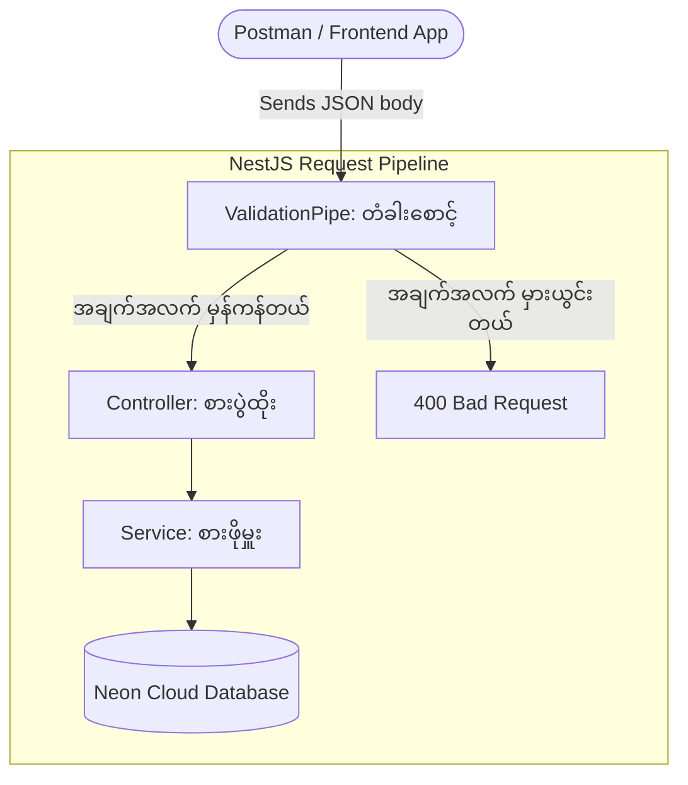
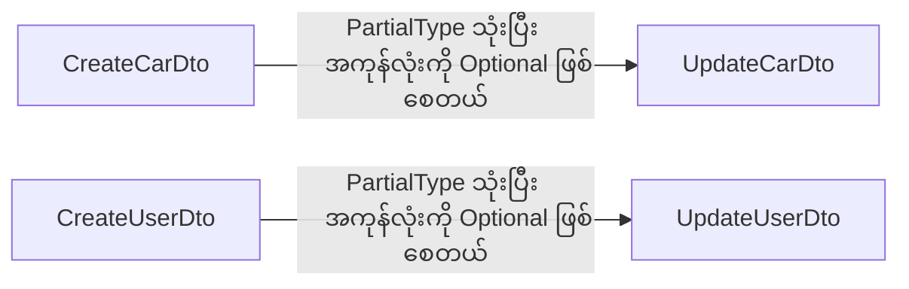
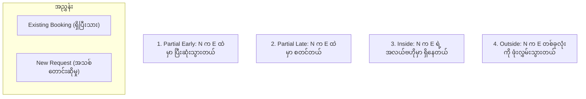

# Day 4: DTOs, Validation & Error Handling 🛡️

ဒီနေ့မှာတော့ API အတွက် "အကာအကွယ်ဒိုင်းလွှား (Shield)" ကို တည်ဆောက်သွားပါမယ်။ ဒါသာမရှိရင် အချက်အလက်အမှားတွေ (ဒါမှမဟုတ်) Hacker တွေက ပေးပို့လိုက်တဲ့ Data တွေဟာ Database ထဲကို ဝင်ရောက်ပြီး ဖျက်ဆီးသွားနိုင်ပါတယ်။

---

## 📊 The Validation Layer Diagram
DTO တွေ မရှိရင် Data အမှားတွေက Database ထဲကို တိုက်ရိုက် ရောက်သွားပါတယ်။ DTO တွေ ရှိလာတဲ့အခါမှာတော့ တံခါးဝမှာတင် အမှားတွေကို ပိတ်ပင်လိုက်ပါတယ်။



---

## 📊 The DTO Inheritance Diagram
`UpdateCarDto` နဲ့ `UpdateUserDto` တွေကို အစကနေ အသစ်ပြန်ရေးစရာ မလိုပါဘူး။ သူတို့ရဲ့ မူလ `Create` DTO တွေဆီကနေ အမွေဆက်ခံ (Inherit) ထားတာ ဖြစ်ပါတယ်။



---

## 🛠️ Step 1: Install the Validation Tools
NestJS မှာ Validation tools တွေက ပုံမှန်အားဖြင့် အလိုအလျောက် ပါမလာပါဘူး။ အောက်ပါ Library နှစ်ခုကို Install လုပ်ဖို့ လိုအပ်ပါတယ်။

```powershell
npm install class-validator class-transformer
npm install @nestjs/mapped-types
```

> **💡 Deep Explainer (အသေးစိတ် ရှင်းလင်းချက်)**:
> - **class-validator**: `@IsString()`, `@IsEmail()`, `@Min()` လိုမျိုး Decorator တွေကို ထောက်ပံ့ပေးပါတယ်။
> - **class-transformer**: JSON အကြမ်းထည်ကြီးကို အမှန်တကယ် TypeScript Class object အဖြစ် ပြောင်းလဲပေးပါတယ်။ ဒါမှသာ Validator တွေက အလုပ်လုပ်နိုင်မှာပါ။
> - **@nestjs/mapped-types**: `PartialType()` ကို ထောက်ပံ့ပေးတဲ့အတွက် DTO တွေကို ထပ်ခါတလဲလဲ မရေးရဘဲ "Optional" (ထည့်လည်းရ၊ မထည့်လည်းရ) DTO အသစ်တွေကို အလွယ်တကူ ဖန်တီးနိုင်ပါတယ်။

---

## 🛠️ Step 2: Activate the Global "Bouncer"
**File**: `src/main.ts`

App တစ်ခုလုံးမှာရှိတဲ့ **Endpoint တိုင်း** ကို ကာကွယ်ပေးနိုင်ဖို့ `ValidationPipe` ကို Global အနေနဲ့ ကြေညာပါမယ်။

```typescript
import { NestFactory } from '@nestjs/core';
import { ValidationPipe } from '@nestjs/common'; // 👈 ဒါကို ထည့်ပါ
import { AppModule } from './app.module';

async function bootstrap() {
  const app = await NestFactory.create(AppModule);

  // လမ်းကြောင်း အားလုံးအတွက် Validation Bouncer ကို ဖွင့်ပါမယ်
  app.useGlobalPipes(new ValidationPipe({
    whitelist: true, // 👈 DTO မှာ မပါတဲ့ အပို field တွေကို ဖယ်ထုတ်ပေးပါမယ်
  }));

  await app.listen(3000);
  console.log('Server is running on http://localhost:3000');
}
bootstrap();
```

> **💡 Deep Explainer (`whitelist: true`)**:
> ဒါဟာ လုံခြုံရေးအတွက် အလွန်အရေးကြီးတဲ့ အချက်ပါ။ ဥပမာ - Hacker တစ်ယောက်က `{ "price": 50, "hacker": "I am here" }` လို့ လှမ်းပို့လိုက်ရင်၊ `hacker` ဆိုတဲ့ Field ကို Service ဆီ မရောက်ခင်မှာတင် အလိုအလျောက် ဖယ်ထုတ်ပစ်လိုက်ပါတယ်။ ဒါကြောင့် Database က အဲ့ဒီ Hacker ဆိုတဲ့ Field ကို ဘယ်တော့မှ မြင်တွေ့ရမှာ မဟုတ်ပါဘူး။

---

## 🛠️ Step 3: The `CreateCarDto` (The Cars Shield 🏎️)
**File**: `src/cars/dto/create-car.dto.ts`

"ကားအသစ်" တစ်စီး စာရင်းသွင်းတဲ့အခါ ဘယ်လိုအချက်အလက်တွေ ပါရမလဲ ဆိုတဲ့ စည်းမျဉ်းတွေကို တိတိကျကျ သတ်မှတ်ပါမယ်။

```typescript
import { 
  IsString, 
  IsInt, 
  IsNumber, 
  Min, 
  IsOptional, 
  IsBoolean 
} from 'class-validator';

export class CreateCarDto {
  @IsString()
  brand: string;

  @IsString()
  model: string;

  @IsInt()     // ကိန်းပြည့် ဖြစ်ရပါမယ် (ဒသမကိန်း မရပါ)
  @Min(1900)   // ၁၉၀၀ မော်ဒယ်ထက် စောလို့ မရပါ
  year: number;

  @IsNumber()  // ဒသမကိန်း ပါလို့ရပါတယ် (ဥပမာ - 50.99)
  @Min(0)      // ဈေးနှုန်းက အနုတ်လက္ခဏာ ပြလို့မရပါ!
  pricePerDay: number;

  @IsOptional()  // အသစ်ဖန်တီးချိန်မှာ မထည့်လည်း ရပါတယ်
  @IsBoolean()
  isAvailable?: boolean;
}
```

> **💡 Decorator Reference (အညွှန်း)**:
> | Decorator | ဘာကို စစ်ဆေးသလဲ (What it checks) |
> |---|---|
> | `@IsString()` | စာသား (Text) ဖြစ်ရပါမယ် |
> | `@IsInt()` | ကိန်းပြည့် (Whole number) ဖြစ်ရပါမယ် |
> | `@IsNumber()` | ဒသမကိန်း (Decimal number) လည်း ရပါတယ် |
> | `@Min(n)` | `n` (သို့မဟုတ်) `n` ထက် ပိုကြီးရပါမယ် |
> | `@IsBoolean()` | `true` သို့မဟုတ် `false` ဖြစ်ရပါမယ် |
> | `@IsOptional()` | မဖြစ်မနေ ထည့်စရာ မလိုပါ (Not required) |

---

## 🛠️ Step 4: The `UpdateCarDto` (The Smart Shortcut ✨)
**File**: `src/cars/dto/update-car.dto.ts`

စည်းမျဉ်းတွေ အကုန်လုံးကို အသစ်ပြန်ရေးနေမယ့်အစား၊ `PartialType` ကို သုံးပြီး `CreateCarDto` ဆီကနေ အကုန်လုံးကို ဆက်ခံပါမယ်။ ပြီးရင် Field အကုန်လုံးကို **Optional** အဖြစ် ပြောင်းလဲပေးပါမယ်။

```typescript
import { PartialType } from '@nestjs/mapped-types';
import { CreateCarDto } from './create-car.dto';

// ဒီလိုရေးလိုက်တာနဲ့ brand, model, year, pricePerDay အားလုံးကို Optional ဖြစ်သွားစေပါတယ်
export class UpdateCarDto extends PartialType(CreateCarDto) {}
```

> **💡 Deep Explainer**:
> ဒါကို **DRY Principle (Don't Repeat Yourself - ထပ်ခါတလဲလဲ မရေးရ)** လို့ ခေါ်ပါတယ်။ Validation စည်းမျဉ်းတွေကို `CreateCarDto` တစ်နေရာထဲမှာပဲ ရေးထားပြီး `UpdateCarDto` က အကုန်လုံးကို ငှားသုံးသွားတာပါ။ `CreateCarDto` မှာ စည်းမျဉ်းတစ်ခု ပြင်လိုက်တာနဲ့ `UpdateCarDto` မှာပါ အလိုအလျောက် ပြင်ပြီးသား ဖြစ်သွားပါမယ်!

---

## 🛠️ Step 5: Wiring the DTOs into Cars Controller & Service
**File**: `src/cars/cars.controller.ts`
**File**: `src/cars/cars.service.ts`

အရင်တုန်းက ရေးခဲ့တဲ့ Inline types တွေကို ဖယ်ထုတ်ပြီး ကျွန်တော်တို့ရဲ့ DTO အသစ်လေးတွေနဲ့ အစားထိုးပါမယ်။

```typescript
// cars.controller.ts (အဓိက ပြောင်းလဲမှု)
@Post()
create(@Body() createCarDto: CreateCarDto) {       // 👈 Inline type နေရာမှာ DTO နဲ့ အစားထိုးလိုက်ပါတယ်
  return this.carsService.create(createCarDto);
}

@Patch(':id')
update(
  @Param('id') id: string, 
  @Body() updateCarDto: UpdateCarDto // 👈 UpdateCarDto
) { 
  return this.carsService.update(+id, updateCarDto);
}
```

```typescript
// cars.service.ts (အဓိက ပြောင်းလဲမှု)
async create(createCarDto: CreateCarDto) {
  // 👈 DTO ကြောင့် Code ပိုရှင်းသွားပါတယ်!
  return this.prisma.car.create({ data: createCarDto }); 
}

async update(id: number, updateCarDto: UpdateCarDto) {
  return this.prisma.car.update({ 
    where: { id }, 
    data: updateCarDto 
  });
}
```

---

## 🧪 Cars Validation: Postman Test Cases

### ✅ Success: မှန်ကန်သော ကားအချက်အလက်
```json
{
  "brand": "Toyota",
  "model": "Camry",
  "year": 2024,
  "pricePerDay": 55
}
```

### ❌ Fail: `brand` မပါဝင်ခြင်း
```json
{
  "model": "Corolla",
  "year": 2022,
  "pricePerDay": 40
}
```
**မျှော်လင့်ထားသည့် ရလဒ် (Expected)**: `400` → `"brand must be a string"`

### ❌ Fail: `year` အတွက် Type မှားယွင်းနေခြင်း
```json
{
  "brand": "Honda",
  "Civic": "model",
  "year": "Last Year",
  "pricePerDay": 40
}
```
**Expected**: `400` → `"year must be an integer number"`

### ❌ Fail: `pricePerDay` အနုတ်လက္ခဏာ ဖြစ်နေခြင်း
```json
{
  "brand": "Honda",
  "model": "Civic",
  "year": 2022,
  "pricePerDay": -100
}
```
**Expected**: `400` → `"pricePerDay must not be less than 0"`

### 🛡️ Whitelist Test: "Hacker" Field အပိုထည့်ကြည့်ခြင်း
```json
{
  "brand": "Toyota",
  "model": "Camry",
  "year": 2024,
  "pricePerDay": 50,
  "hacker": "I am here"
}
```
**Expected**: `201` → ပြန်လာတဲ့ Response ထဲမှာ **`"hacker"` ဆိုတာ လုံးဝ မပါလာတော့ပါဘူး**။ အလိုအလျောက် ဖြတ်ထုတ်ခံလိုက်ရပါပြီ! 💨

---

## 🛠️ Step 6: The `CreateUserDto` (Advanced Validation 👤)
**File**: `src/users/dto/create-user.dto.ts`

User တွေအတွက်တော့ ပိုမိုရှုပ်ထွေးတဲ့ စည်းမျဉ်းတွေ လိုအပ်ပါတယ်။ Email ပုံစံ မှန်မမှန်၊ Password အရှည်နဲ့ Enum (သတ်မှတ်ထားတဲ့ တန်ဖိုး) တွေ ဟုတ်မဟုတ် စစ်ဆေးပါမယ်။

```typescript
import { 
  IsEmail, 
  IsString, 
  MinLength, 
  IsEnum, 
  IsOptional 
} from 'class-validator';

enum UserRole {
  USER = 'USER',
  ADMIN = 'ADMIN',
}

export class CreateUserDto {
  @IsEmail() // 👈 "user@example.com" လို ပုံစံမျိုး ဟုတ်မဟုတ် စစ်ဆေးပါတယ်
  email: string;

  @IsString()
  @MinLength(8, { 
    message: 'Password is too weak! Must be at least 8 characters.' 
  }) // 👈 စိတ်ကြိုက် Error message ရေးလို့ရပါတယ်
  password: string;

  @IsString()
  @IsOptional()
  name?: string;

  @IsEnum(UserRole) // 👈 'USER' သို့မဟုတ် 'ADMIN' ပဲ ဖြစ်ရပါမယ်
  @IsOptional()
  role?: UserRole;
}
```

> **💡 New Decorator Reference**:
> | Decorator | ဘာကို စစ်ဆေးသလဲ |
> |---|---|
> | `@IsEmail()` | မှန်ကန်တဲ့ Email ပုံစံ ဖြစ်ရပါမယ် |
> | `@MinLength(n)` | အနည်းဆုံး စာလုံးရေ `n` လုံး ရှိရပါမယ် |
> | `@IsEnum(EnumName)` | သတ်မှတ်ထားတဲ့ Enum ထဲက တန်ဖိုးတစ်ခုခုပဲ ဖြစ်ရပါမယ် |

---

## 🛠️ Step 7: The `UpdateUserDto`
**File**: `src/users/dto/update-user.dto.ts`

Cars မှာတုန်းကလိုပဲ `CreateUserDto` ဆီကနေ အမွေဆက်ခံပြီး အရာအားလုံးကို Optional အဖြစ် ပြောင်းလိုက်ပါမယ်။

```typescript
import { PartialType } from '@nestjs/mapped-types';
import { CreateUserDto } from './create-user.dto';

export class UpdateUserDto extends PartialType(CreateUserDto) {}
```

---

## 🛠️ Step 8: Complete Users Service with Error Handling
**File**: `src/users/users.service.ts`

ဒီနေ့အတွက် အမြင့်ဆုံးအဆင့် (Advanced Pattern) ပါပဲ။ Database ကနေ တက်လာတဲ့ Error တွေကို ဖမ်းယူဖြေရှင်းပါမယ်။

```typescript
import {
  Injectable,
  ConflictException,
  InternalServerErrorException
} from '@nestjs/common';
import { PrismaService } from '../prisma/prisma.service';
import { CreateUserDto } from './dto/create-user.dto';
import { UpdateUserDto } from './dto/update-user.dto';

@Injectable()
export class UsersService {
  constructor(private prisma: PrismaService) {}

  // CREATE - Email ထပ်နေတာကို တားဆီးထားပါတယ်
  async create(createUserDto: CreateUserDto) {
    try {
      return await this.prisma.user.create({ data: createUserDto });
    } catch (error) {
      if (error.code === 'P2002') { // Prisma Unique Constraint Error
        const target = error.meta?.target as string[];
        const fieldName = target ? target.join(', ') : 'field';
        throw new ConflictException(
          `The ${fieldName} is already taken! Please use another one.`
        );
      }
      console.error('Database Error:', error);
      throw new InternalServerErrorException('Something went wrong on our side.');
    }
  }

  // READ ALL
  async findAll() {
    return this.prisma.user.findMany();
  }

  // READ ONE
  async findOne(id: number) {
    return this.prisma.user.findUnique({ where: { id } });
  }

  // UPDATE - Email ထပ်တာကို ကာကွယ်ထားပါတယ်
  async update(id: number, updateUserDto: UpdateUserDto) {
    try {
      return await this.prisma.user.update({ 
        where: { id }, 
        data: updateUserDto 
      });
    } catch (error) {
      if (error.code === 'P2002') {
        const target = error.meta?.target as string[];
        const fieldName = target ? target.join(', ') : 'field';
        throw new ConflictException(
          `The ${fieldName} is already taken! Please use another one.`
        );
      }
      throw new InternalServerErrorException('Something went wrong on our side.');
    }
  }

  // DELETE
  async remove(id: number) {
    return this.prisma.user.delete({ where: { id } });
  }
}
```

---

## 🛠️ Step 9: Complete Users Controller with `ParseIntPipe`
**File**: `src/users/users.controller.ts`

```typescript
import { 
  Controller, Get, Post, Body, Patch, Param, Delete, ParseIntPipe 
} from '@nestjs/common';
import { UsersService } from './users.service';
import { CreateUserDto } from './dto/create-user.dto';
import { UpdateUserDto } from './dto/update-user.dto';

@Controller('users')
export class UsersController {
  constructor(private readonly usersService: UsersService) {}

  @Post()
  create(@Body() createUserDto: CreateUserDto) {
    return this.usersService.create(createUserDto);
  }

  @Get()
  findAll() {
    return this.usersService.findAll();
  }

  @Get(':id')
  // 👈 `ParseIntPipe` က +id နေရာမှာ အစားထိုးသွားပါတယ်!
  findOne(@Param('id', ParseIntPipe) id: number) { 
    return this.usersService.findOne(id);
  }

  @Patch(':id')
  update(
    @Param('id', ParseIntPipe) id: number, 
    @Body() updateUserDto: UpdateUserDto
  ) {
    return this.usersService.update(id, updateUserDto);
  }

  @Delete(':id')
  remove(@Param('id', ParseIntPipe) id: number) {
    return this.usersService.remove(id);
  }
}
```

> **💡 Deep Explainer (`ParseIntPipe`)**:
> အရင်က Code တွေမှာ URL string ကို နံပါတ်ပြောင်းဖို့ `+id` ကို သုံးခဲ့ပါတယ်။ `ParseIntPipe` က အဲ့ဒါကို အလိုအလျောက် လုပ်ပေးရုံတင်မကဘူး၊ `/users/abc` လိုမျိုး (နံပါတ်မဟုတ်တာတွေ) ပါလာခဲ့ရင် `400 Bad Request` ကို ချက်ချင်း ပစ်ထုတ်ပေးပါတယ်။ ဒါဟာ URL Parameters တွေကို ကိုင်တွယ်တဲ့ Professional အကျဆုံး နည်းလမ်းပဲ ဖြစ်ပါတယ်။

---

## 🧪 Users Validation: Postman Test Cases

### ✅ Success: မှန်ကန်သော User (Standard)
```json
{
  "email": "student@gmail.com",
  "password": "securePassword123",
  "name": "Super Student",
  "role": "USER"
}
```

### ✅ Success: မှန်ကန်သော User (Admin, no name)
```json
{
  "email": "admin1@test.com",
  "password": "securePassword123",
  "role": "ADMIN"
}
```

### ❌ Fail: Email ပုံစံ မှားနေခြင်း
```json
{
  "email": "not-an-email",
  "password": "securePassword123"
}
```
**Expected**: `400` → `"email must be an email"`

### ❌ Fail: Password အရှည် မပြည့်ခြင်း (Custom message!)
```json
{
  "email": "test@test.com",
  "password": "123"
}
```
**Expected**: `400` → `"Password is too weak! Must be at least 8 characters."`

### ❌ Fail: Role မှားယွင်းနေခြင်း
```json
{
  "email": "test@test.com",
  "password": "securePassword123",
  "role": "SUPERMAN"
}
```
**Expected**: `400` → `"role must be one of the following values: USER, ADMIN"`

### ❌ Fail: Email ထပ်နေခြင်း (Database Error)
*တူညီတဲ့ Email ကို နှစ်ကြိမ် ဆက်တိုက် ပို့ကြည့်ပါ။*
**Expected**: `409 Conflict` → `"The email is already taken! Please use another one."`

---

## ⚠️ Key Lesson: Validation vs. Database Constraints

| Type (အမျိုးအစား) | ဘယ်နေရာမှာ အလုပ်လုပ်လဲ | ဥပမာ |
|---|---|---|
| **DTO Validation** | Service ဆီ မရောက်ခင် (Memory ထဲမှာ) | "ဒါက မှန်ကန်တဲ့ Email ပုံစံ ဟုတ်ရဲ့လား?" |
| **Database Constraint** | Database အင်ဂျင်ထဲမှာ | "ဒီ Email က Table ထဲမှာ ရှိနေပြီးသားလား?" |

DTO က အရင်ဆုံး အလုပ်လုပ်ပါတယ်။ Data က DTO ကို ဖြတ်ကျော်သွားနိုင်မှ Database ဆီ ရောက်သွားတာပါ။ တကယ်လို့ Database ကသာ လက်မခံဘဲ ပယ်ချလိုက်ရင် (ဥပမာ - Email ထပ်နေတာမျိုး)၊ အဲ့ဒီ Error ကို ကျွန်တော်တို့က `try/catch` နဲ့ `error.code === 'P2002'` ကို သုံးပြီး ကိုယ်တိုင် (Manually) ဖမ်းယူပေးရပါမယ်။

---

## 🛠️ Step 10: The `CreateBookingDto` (Relational Shield) 🤝
Booking တစ်ခုမှာ User နဲ့ Car နှစ်ခုစလုံး ပါဝင်ပတ်သက်နေတဲ့အတွက်၊ ကျွန်တော်တို့ရဲ့ DTO ဟာ သူတို့ရဲ့ IDs တွေနဲ့ နေ့စွဲ (Date) တွေကို သေချာကိုင်တွယ်နိုင်ဖို့ လိုအပ်ပါတယ်။

**File**: `src/bookings/dto/create-booking.dto.ts`
```typescript
import { IsInt, IsDateString, IsNumber, Min } from 'class-validator';

export class CreateBookingDto {
  // 👈 ISO8601 string ဖြစ်မဖြစ် စစ်ဆေးပါတယ် (ဥပမာ - "2026-05-12T00:00:00Z")
  @IsDateString() 
  startDate: string;

  @IsDateString()
  endDate: string;

  @IsNumber()
  @Min(0)
  totalPrice: number;

  @IsInt() // 👈 User ဆီကို ညွှန်ပြနေတဲ့ ID
  userId: number;

  @IsInt() // 👈 Car ဆီကို ညွှန်ပြနေတဲ့ ID
  carId: number;
}
```

---

## 🛠️ Step 11: The Bookings Controller
**File**: `src/bookings/bookings.controller.ts`

```typescript
import { Controller, Get, Post, Body } from '@nestjs/common';
import { BookingsService } from './bookings.service';
import { CreateBookingDto } from './dto/create-booking.dto';

@Controller('bookings')
export class BookingsController {
  constructor(private readonly bookingsService: BookingsService) {}

  @Post()
  create(@Body() createBookingDto: CreateBookingDto) {
    return this.bookingsService.create(createBookingDto);
  }

  @Get()
  findAll() {
    return this.bookingsService.findAll();
  }
}
```

---

## 🛠️ Step 12: Smart Bookings Service (The "Brain") 🧠
ဒီနေရာဟာ **One-to-Many Relationships (ဆက်သွယ်မှုများ)** နဲ့ **Double-Booking Protection (ရက်ထပ်တာကို တားဆီးခြင်း)** တွေကို ဖြေရှင်းပေးမယ့် နေရာဖြစ်ပါတယ်။

**File**: `src/bookings/bookings.service.ts`
```typescript
import { Injectable, ConflictException } from '@nestjs/common';
import { PrismaService } from '../prisma/prisma.service';
import { CreateBookingDto } from './dto/create-booking.dto';

@Injectable()
export class BookingsService {
  constructor(private prisma: PrismaService) {}

  async create(createBookingDto: CreateBookingDto) {
    const { carId, startDate, endDate } = createBookingDto;

    // 1. SMART OVERLAP CHECK (ရက်ထပ်/မထပ် စစ်ဆေးခြင်း)
    // Logic: ဒီကားအတွက် တောင်းဆိုထားတဲ့ ရက်တွေနဲ့ ငြိစွန်းနေတဲ့ တခြား Booking များ ရှိသလား ရှာပါမယ်
    const existingBooking = await this.prisma.booking.findFirst({
      where: {
        carId: carId,
        AND: [
          { startDate: { lte: new Date(endDate) } },
          { endDate: { gte: new Date(startDate) } },
        ],
      },
    });

    if (existingBooking) {
      throw new ConflictException(
        'This car is already booked for the selected dates! 🚫'
      );
    }

    // 2. CREATE WITH RELATIONSHIPS (ချိတ်ဆက်မှုများနှင့်တကွ ဖန်တီးခြင်း)
    return this.prisma.booking.create({
      data: createBookingDto,
      // "include" ရဲ့ စွမ်းအား: Response အနေနဲ့ ပြန်လာတဲ့အခါ 
      // User နဲ့ Car ရဲ့ အချက်အလက်တွေကိုပါ တစ်ပါတည်း ဆွဲထုတ်ပေးပါတယ်
      include: {
        car: true,
        user: true,
      },
    });
  }

  async findAll() {
    return this.prisma.booking.findMany({
      include: { car: true, user: true },
    });
  }
}
```

---

## 🧠 Deep Explainer: The Overlap Formula (ရက်ထပ်ခြင်းကို တွက်ချက်သည့် ဖော်မြူလာ)
ဒီဖော်မြူလာ `(StartA <= EndB) AND (EndA >= StartB)` ဟာ အလွန်တိကျတဲ့ သင်္ချာနည်းလမ်း တစ်ခုဖြစ်ပါတယ်။ သူက **ရက်ထပ်နိုင်တဲ့ ပုံစံ ၄ မျိုးစလုံး** ကို ဖမ်းမိနိုင်ပါတယ်။



---

## 🧪 Bookings: Postman "Stress Test" Scenarios
ကျွန်တော်တို့ရဲ့ Logic မှန်ကန်မှုကို အောက်ပါ Test ၅ မျိုးနဲ့ သေချာ စမ်းသပ်စစ်ဆေးခဲ့ပါတယ်။

| Test Case | Scenario (အခြေအနေ) | Request Dates | Result (ရလဒ်) |
|---|---|---|---|
| **Base Case** | The existing booking | May 10 - May 20 | Created ✅ |
| **Test 1** | Partial Early | May 05 - **May 15** | 409 Conflict 🚫 |
| **Test 2** | Partial Late | **May 15** - May 25 | 409 Conflict 🚫 |
| **Test 3** | Inside | May 12 - May 18 | 409 Conflict 🚫 |
| **Test 4** | Outside | May 05 - May 25 | 409 Conflict 🚫 |
| **Test 5** | The Gap | May 21 - May 25 | 201 Created ✅ |

---

## 💡 Day 4 Key Takeaways (အဓိက မှတ်သားစရာများ)
1. **Global `ValidationPipe`**: `main.ts` မှာ တစ်ခါ ဖွင့်လိုက်တာနဲ့ လမ်းကြောင်းတိုင်းကို ကာကွယ်ပေးသွားပါတယ်။
2. **`whitelist: true`**: တောင်းဆိုမှုထဲမှာ မျှော်လင့်မထားတဲ့ အပို Field တွေ ပါလာရင် အလိုအလျောက် ဖယ်ထုတ်ပေးပါတယ်။
3. **`PartialType`**: "Create" DTO ကနေ "Update" DTO ကို အလွယ်တကူ ကူးယူဖန်တီးနိုင်တဲ့ DRY နည်းလမ်းဖြစ်ပါတယ်။
4. **`ParseIntPipe`**: URL parameters တွေကို နံပါတ်ပြောင်းဖို့ အသုံးပြုရတဲ့ Professional အကျဆုံး နည်းလမ်းပါ။
5. **`P2002`**: "Unique constraint violation (အချက်အလက် ထပ်နေခြင်း)" အတွက် Prisma က ထုတ်ပေးတဲ့ Code ဖြစ်ပါတယ်။ အမြဲတမ်း Handle လုပ်ပေးပါ!
6. **Custom messages**: ပိုမိုကောင်းမွန်တဲ့ UX အတွက် `@Min(0, { message: 'Your custom message here!' })` လိုမျိုး ကိုယ်ပိုင် Message တွေကို အသုံးပြုပါ။

---

## ✅ Day 4 Graduation 🎖️
သင်ဟာ Car Rental API အတွက် ဘယ်လိုမှ ထိုးဖောက်လို့မရတဲ့ Validation အကာအကွယ်နဲ့ ဉာဏ်ရည်ထက်မြက်တဲ့ Booking စနစ်ကို အောင်မြင်စွာ တည်ဆောက်နိုင်ခဲ့ပါပြီ။
သင့်ရဲ့ API ဟာ **ရှုပ်ထွေးတဲ့ Data ချိတ်ဆက်မှုတွေ** ကို သေချာကိုင်တွယ်နိုင်ရုံသာမက၊ **ရက်ထပ်တဲ့ ပြဿနာတွေ (Scheduling conflicts)** ကနေလည်း လုပ်ငန်းကို အပြည့်အဝ ကာကွယ်ပေးနိုင်သွားပါပြီ။ 🛡️🤝🏎️🏆
