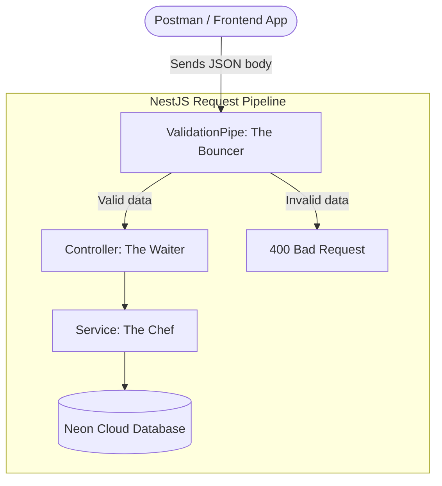
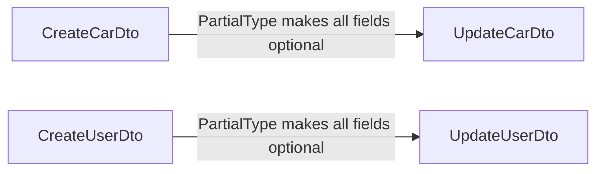
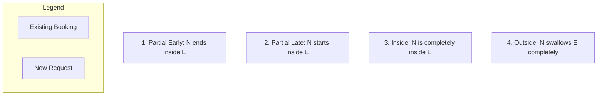

# Day 4: DTOs, Validation & Error Handling🛡️

Today we built the "Shield" for our API. Without this, bad or malicious data could corrupt our database.

---

## 📊 The Validation Layer Diagram

Without DTOs, bad data goes straight into the database. With DTOs, it gets blocked at the door.



---

## 📊 The DTO Inheritance Diagram

`UpdateCarDto` and `UpdateUserDto` are NOT written from scratch. They inherit from their `Create` counterparts!



---

## 🛠️ Step 1: Install the Validation Tools

NestJS does not include validation tools by default. We must install two libraries.

```powershell
npm install class-validator class-transformer
npm install @nestjs/mapped-types
```

> **💡 Deep Explainer**:
> - **class-validator**: Provides decorators like `@IsString()`, `@IsEmail()`, `@Min()`.
> - **class-transformer**: Converts the raw incoming JSON into a real TypeScript class instance so the validators can work on it.
> - **@nestjs/mapped-types**: Provides `PartialType()` so we can create "optional" versions of our DTOs without rewriting them.

---

## 🛠️ Step 2: Activate the Global "Bouncer"

**File**: `src/main.ts`

We add `ValidationPipe` globally so it protects **every single endpoint** in the app.

```typescript
import { NestFactory } from '@nestjs/core';
import { ValidationPipe } from '@nestjs/common'; // 👈 Add this
import { AppModule } from './app.module';

async function bootstrap() {
  const app = await NestFactory.create(AppModule);

  // Activate the Validation Bouncer for ALL routes
  app.useGlobalPipes(new ValidationPipe({
    whitelist: true, // 👈 Strips extra fields not defined in the DTO
  }));

  await app.listen(3000);
  console.log('Server is running on http://localhost:3000');
}
bootstrap();
```

> **💡 Deep Explainer (`whitelist: true`)**:
> This is a security feature. If a hacker sends `{ "price": 50, "hacker": "I am here" }`, the `hacker` field is automatically removed before it ever reaches your Service. The database never sees it.

---

## 🛠️ Step 3: The `CreateCarDto` (The Cars Shield 🏎️)

**File**: `src/cars/dto/create-car.dto.ts`

We define the exact rules for what a valid "New Car" request looks like.

```typescript
import { IsString, IsInt, IsNumber, Min, IsOptional, IsBoolean } from 'class-validator';

export class CreateCarDto {
  @IsString()
  brand: string;

  @IsString()
  model: string;

  @IsInt()     // Must be a whole number (no decimals)
  @Min(1900)   // Cars cannot be older than 1900
  year: number;

  @IsNumber()  // Can have decimals (e.g., 50.99)
  @Min(0)      // Price cannot be negative!
  pricePerDay: number;

  @IsOptional()  // Not required when creating
  @IsBoolean()
  isAvailable?: boolean;
}
```

> **💡 Decorator Reference**:
> | Decorator | What it checks |
> |---|---|
> | `@IsString()` | Must be text |
> | `@IsInt()` | Must be a whole number |
> | `@IsNumber()` | Can be a decimal number |
> | `@Min(n)` | Must be greater than or equal to `n` |
> | `@IsBoolean()` | Must be `true` or `false` |
> | `@IsOptional()` | Field is not required |

---

## 🛠️ Step 4: The `UpdateCarDto` (The Smart Shortcut ✨)

**File**: `src/cars/dto/update-car.dto.ts`

Instead of rewriting all the rules, we use `PartialType` to inherit everything from `CreateCarDto` but make every field **optional**.

```typescript
import { PartialType } from '@nestjs/mapped-types';
import { CreateCarDto } from './create-car.dto';

// This automatically makes brand, model, year, pricePerDay all optional
export class UpdateCarDto extends PartialType(CreateCarDto) {}
```

> **💡 Deep Explainer**:
> This is the **DRY Principle** (Don't Repeat Yourself). The validation rules are written only once in `CreateCarDto`, and `UpdateCarDto` borrows all of them. If you change a rule in `CreateCarDto`, `UpdateCarDto` is automatically updated too!

---

## 🛠️ Step 5: Wiring the DTOs into Cars Controller & Service

**File**: `src/cars/cars.controller.ts`
**File**: `src/cars/cars.service.ts`

Replace the old "inline" types with our new clean DTOs.

```typescript
// cars.controller.ts (The key change)
@Post()
create(@Body() createCarDto: CreateCarDto) {       // 👈 DTO replaces the inline type
  return this.carsService.create(createCarDto);
}

@Patch(':id')
update(@Param('id') id: string, @Body() updateCarDto: UpdateCarDto) { // 👈 UpdateCarDto
  return this.carsService.update(+id, updateCarDto);
}
```

```typescript
// cars.service.ts (The key change)
async create(createCarDto: CreateCarDto) {
  return this.prisma.car.create({ data: createCarDto }); // 👈 Cleaner!
}

async update(id: number, updateCarDto: UpdateCarDto) {
  return this.prisma.car.update({ where: { id }, data: updateCarDto });
}
```

---

## 🧪 Cars Validation: Postman Test Cases

### ✅ Success: Valid Car
```json
{
  "brand": "Toyota",
  "model": "Camry",
  "year": 2024,
  "pricePerDay": 55
}
```

### ❌ Fail: Missing `brand`
```json
{
  "model": "Corolla",
  "year": 2022,
  "pricePerDay": 40
}
```
**Expected**: `400` → `"brand must be a string"`

### ❌ Fail: Wrong type for `year`
```json
{
  "brand": "Honda",
  "model": "Civic",
  "year": "Last Year",
  "pricePerDay": 40
}
```
**Expected**: `400` → `"year must be an integer number"`

### ❌ Fail: Negative `pricePerDay`
```json
{
  "brand": "Honda",
  "model": "Civic",
  "year": 2022,
  "pricePerDay": -100
}
```
**Expected**: `400` → `"pricePerDay must not be less than 0"`

### 🛡️ Whitelist Test: Extra "Hacker" Field
```json
{
  "brand": "Toyota",
  "model": "Camry",
  "year": 2024,
  "pricePerDay": 50,
  "hacker": "I am here"
}
```
**Expected**: `201` → Response body **does NOT contain `"hacker"`**. Stripped away! 💨

---

## 🛠️ Step 6: The `CreateUserDto` (Advanced Validation 👤)

**File**: `src/users/dto/create-user.dto.ts`

Users require more advanced rules: email format, password length, and Enum values.

```typescript
import { IsEmail, IsString, MinLength, IsEnum, IsOptional } from 'class-validator';

enum UserRole {
  USER = 'USER',
  ADMIN = 'ADMIN',
}

export class CreateUserDto {
  @IsEmail() // 👈 Checks if it looks like "user@example.com"
  email: string;

  @IsString()
  @MinLength(8, { message: 'Password is too weak! Must be at least 8 characters.' })
  password: string;

  @IsString()
  @IsOptional()
  name?: string;

  @IsEnum(UserRole) // 👈 Only 'USER' or 'ADMIN' are allowed
  @IsOptional()
  role?: UserRole;
}
```

> **💡 New Decorator Reference**:
> | Decorator | What it checks |
> |---|---|
> | `@IsEmail()` | Must look like a valid email address |
> | `@MinLength(n)` | Must be at least `n` characters long |
> | `@IsEnum(EnumName)` | Must be one of the defined Enum values |

---

## 🛠️ Step 7: The `UpdateUserDto`

**File**: `src/users/dto/update-user.dto.ts`

Same pattern as cars — inherit from `CreateUserDto` and make everything optional.

```typescript
import { PartialType } from '@nestjs/mapped-types';
import { CreateUserDto } from './create-user.dto';

export class UpdateUserDto extends PartialType(CreateUserDto) {}
```

---

## 🛠️ Step 8: Complete Users Service with Error Handling

**File**: `src/users/users.service.ts`

This is the most advanced pattern of the day: catching Database-specific errors.

```typescript
import {
  Injectable,
  ConflictException,
  InternalServerErrorException
} from '@nestjs/common';
import { PrismaService } from '../prisma/prisma.service';
import { CreateUserDto } from './dto/create-user.dto';
import { UpdateUserDto } from './dto/update-user.dto';

@Injectable()
export class UsersService {
  constructor(private prisma: PrismaService) {}

  // CREATE - with duplicate email protection
  async create(createUserDto: CreateUserDto) {
    try {
      return await this.prisma.user.create({ data: createUserDto });
    } catch (error) {
      if (error.code === 'P2002') { // Prisma Unique Constraint Error
        const target = error.meta?.target as string[];
        const fieldName = target ? target.join(', ') : 'field';
        throw new ConflictException(`The ${fieldName} is already taken! Please use another one.`);
      }
      console.error('Database Error:', error);
      throw new InternalServerErrorException('Something went wrong on our side.');
    }
  }

  // READ ALL
  async findAll() {
    return this.prisma.user.findMany();
  }

  // READ ONE
  async findOne(id: number) {
    return this.prisma.user.findUnique({ where: { id } });
  }

  // UPDATE - also protected from duplicate email
  async update(id: number, updateUserDto: UpdateUserDto) {
    try {
      return await this.prisma.user.update({ where: { id }, data: updateUserDto });
    } catch (error) {
      if (error.code === 'P2002') {
        const target = error.meta?.target as string[];
        const fieldName = target ? target.join(', ') : 'field';
        throw new ConflictException(`The ${fieldName} is already taken! Please use another one.`);
      }
      throw new InternalServerErrorException('Something went wrong on our side.');
    }
  }

  // DELETE
  async remove(id: number) {
    return this.prisma.user.delete({ where: { id } });
  }
}
```

---

## 🛠️ Step 9: Complete Users Controller with `ParseIntPipe`

**File**: `src/users/users.controller.ts`

```typescript
import { Controller, Get, Post, Body, Patch, Param, Delete, ParseIntPipe } from '@nestjs/common';
import { UsersService } from './users.service';
import { CreateUserDto } from './dto/create-user.dto';
import { UpdateUserDto } from './dto/update-user.dto';

@Controller('users')
export class UsersController {
  constructor(private readonly usersService: UsersService) {}

  @Post()
  create(@Body() createUserDto: CreateUserDto) {
    return this.usersService.create(createUserDto);
  }

  @Get()
  findAll() {
    return this.usersService.findAll();
  }

  @Get(':id')
  findOne(@Param('id', ParseIntPipe) id: number) { // 👈 ParseIntPipe replaces the +id trick!
    return this.usersService.findOne(id);
  }

  @Patch(':id')
  update(@Param('id', ParseIntPipe) id: number, @Body() updateUserDto: UpdateUserDto) {
    return this.usersService.update(id, updateUserDto);
  }

  @Delete(':id')
  remove(@Param('id', ParseIntPipe) id: number) {
    return this.usersService.remove(id);
  }
}
```

> **💡 Deep Explainer (`ParseIntPipe`)**:
> In previous code, we used `+id` to convert a URL string to a number. `ParseIntPipe` does this automatically AND throws a `400 Bad Request` if the URL contains something like `/users/abc` (not a number). It is the professional way to handle URL parameters.

---

## 🧪 Users Validation: Postman Test Cases

### ✅ Success: Valid User (Standard)
```json
{
  "email": "student@gmail.com",
  "password": "securePassword123",
  "name": "Super Student",
  "role": "USER"
}
```

### ✅ Success: Valid User (Admin, no name)
```json
{
  "email": "admin1@test.com",
  "password": "securePassword123",
  "role": "ADMIN"
}
```

### ❌ Fail: Fake email format
```json
{
  "email": "not-an-email",
  "password": "securePassword123"
}
```
**Expected**: `400` → `"email must be an email"`

### ❌ Fail: Password too short (Custom message!)
```json
{
  "email": "test@test.com",
  "password": "123"
}
```
**Expected**: `400` → `"Password is too weak! Must be at least 8 characters."`

### ❌ Fail: Invalid role
```json
{
  "email": "test@test.com",
  "password": "securePassword123",
  "role": "SUPERMAN"
}
```
**Expected**: `400` → `"role must be one of the following values: USER, ADMIN"`

### ❌ Fail: Duplicate email (Database Error)
*Send the same email twice.*
**Expected**: `409 Conflict` → `"The email is already taken! Please use another one."`

---

## ⚠️ Key Lesson: Validation vs. Database Constraints

| Type | Where it runs | Example |
|---|---|---|
| **DTO Validation** | Before hitting the service (in memory) | "Is this a valid email format?" |
| **Database Constraint** | Inside the DB engine | "Does this email already exist in the table?" |

The DTO runs first. If data passes the DTO, it goes to the database. If the database rejects it (e.g., duplicate email), we must **catch** that error manually with `try/catch` and `error.code === 'P2002'`.

---

## 🛠️ Step 10: The `CreateBookingDto` (Relational Shield) 🤝

Because a Booking depends on a User and a Car, our DTO must handle their IDs and the date ranges.

**File**: `src/bookings/dto/create-booking.dto.ts`
```typescript
import { IsInt, IsDateString, IsNumber, Min } from 'class-validator';

export class CreateBookingDto {
  @IsDateString() // 👈 Validates ISO8601 strings (e.g., "2026-05-12T00:00:00Z")
  startDate: string;

  @IsDateString()
  endDate: string;

  @IsNumber()
  @Min(0)
  totalPrice: number;

  @IsInt() // 👈 The Pointer to the User
  userId: number;

  @IsInt() // 👈 The Pointer to the Car
  carId: number;
}
```

---

## 🛠️ Step 11: The Bookings Controller

**File**: `src/bookings/bookings.controller.ts`
```typescript
import { Controller, Get, Post, Body } from '@nestjs/common';
import { BookingsService } from './bookings.service';
import { CreateBookingDto } from './dto/create-booking.dto';

@Controller('bookings')
export class BookingsController {
  constructor(private readonly bookingsService: BookingsService) {}

  @Post()
  create(@Body() createBookingDto: CreateBookingDto) {
    return this.bookingsService.create(createBookingDto);
  }

  @Get()
  findAll() {
    return this.bookingsService.findAll();
  }
}
```

---

## 🛠️ Step 12: Smart Bookings Service (The "Brain") 🧠

This is where we handle **One-to-Many Relationships** and the **Double-Booking Protection**.

**File**: `src/bookings/bookings.service.ts`
```typescript
import { Injectable, ConflictException } from '@nestjs/common';
import { PrismaService } from '../prisma/prisma.service';
import { CreateBookingDto } from './dto/create-booking.dto';

@Injectable()
export class BookingsService {
  constructor(private prisma: PrismaService) {}

  async create(createBookingDto: CreateBookingDto) {
    const { carId, startDate, endDate } = createBookingDto;

    // 1. SMART OVERLAP CHECK
    // Logic: Find any booking for THIS car that touches our requested dates
    const existingBooking = await this.prisma.booking.findFirst({
      where: {
        carId: carId,
        AND: [
          { startDate: { lte: new Date(endDate) } },
          { endDate: { gte: new Date(startDate) } },
        ],
      },
    });

    if (existingBooking) {
      throw new ConflictException('This car is already booked for the selected dates! 🚫');
    }

    // 2. CREATE WITH RELATIONSHIPS
    return this.prisma.booking.create({
      data: createBookingDto,
      // The "include" magic: Fetch the User and Car details in the response
      include: {
        car: true,
        user: true,
      },
    });
  }

  async findAll() {
    return this.prisma.booking.findMany({
      include: { car: true, user: true },
    });
  }
}
```

---

## 🧠 Deep Explainer: The Overlap Formula

The formula `(StartA <= EndB) AND (EndA >= StartB)` is a mathematical absolute. It catches **all 4 types of overlap**:



---

## 🧪 Bookings: Postman "Stress Test" Scenarios

We verified our logic with these 5 tests. Reference them for your Postman collection!

| Test Case | Scenario | Request Dates | Result |
|---|---|---|---|
| **Base Case** | The existing booking | May 10 - May 20 | Created ✅ |
| **Test 1** | Partial Early | May 05 - **May 15** | 409 Conflict 🚫 |
| **Test 2** | Partial Late | **May 15** - May 25 | 409 Conflict 🚫 |
| **Test 3** | Inside | May 12 - May 18 | 409 Conflict 🚫 |
| **Test 4** | Outside | May 05 - May 25 | 409 Conflict 🚫 |
| **Test 5** | The Gap | May 21 - May 25 | 201 Created ✅ |

---

## 💡 Day 4 Key Takeaways

1. **Global `ValidationPipe`**: Activate once in `main.ts` to protect every route.
2. **`whitelist: true`**: Automatically removes unexpected/extra fields from requests.
3. **`PartialType`**: The DRY way to create "Update" DTOs from "Create" DTOs.
4. **`ParseIntPipe`**: The professional way to convert URL parameters to numbers.
5. **`P2002`**: Prisma's code for "Unique constraint violation." Always handle it!
6. **Custom messages**: Use `@Min(0, { message: 'Your custom message here!' })` for better UX.

---
## ✅ Day 4 Graduation 🎖️

You built a bulletproof validation layer and a smart relational booking system for the Car Rental API.
Your API now handles **complex data links** and protects the business from **scheduling conflicts**. 🛡️🤝🏎️🏆


