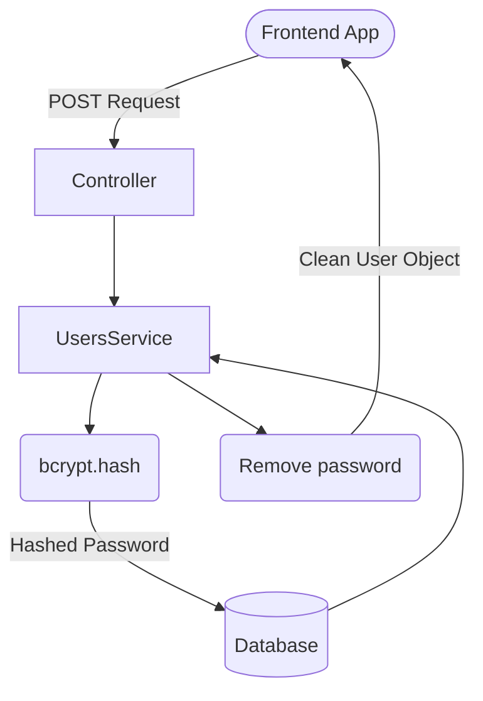

# Day 5: Database Visibility & Secure Registration 🔐🖥️

Today we moved from a "blind" backend to a visible one, and we implemented enterprise-grade security to protect our users' most sensitive data.

---

## 📊 The Security Flow

When a user registers, we intercept their password, run it through a cryptographic algorithm, and save the scrambled version to the database. When returning the user data to the frontend, we strip the password entirely.



---

## 🛠️ Step 1: Prisma Studio (The Command Center) 🖥️

Instead of relying solely on Postman to guess what is in our database, we used Prisma's built-in GUI to view, edit, and delete our data just like an Excel spreadsheet.

**Command:**
```powershell
npx prisma studio
```
*Runs locally on `http://localhost:5555`*

---

## 🛠️ Step 2: Installing the Scrambler (Bcrypt) 🛡️

We installed the industry-standard library for hashing passwords.

**Command:**
```powershell
npm install bcrypt
npm install -D @types/bcrypt
```

---

## 🛠️ Step 3: Securing the `UsersService` (The Core Logic)

We updated our service to ensure passwords are never saved in plain text and never leaked back to the client.

### Securing the `create` method:
```typescript
import * as bcrypt from 'bcrypt';

async create(createUserDto: CreateUserDto) {
  try {
    // 1. Hash the password! (10 is the security level / salt rounds)
    const hashedPassword = await bcrypt.hash(createUserDto.password, 10);

    // 2. Save with the hashed password
    const newUser = await this.prisma.user.create({
      data: {
        ...createUserDto,
        password: hashedPassword, 
      },
    });

    // 3. Security: Separate the password from the rest of the user data
    const { password, ...userWithoutPassword } = newUser;

    return userWithoutPassword; // 👈 Clean return
  } catch (error) { ... }
}
```

> **💡 Deep Explainer (Rest/Spread Destructuring)**:
> `const { password, ...userWithoutPassword } = newUser;`
> This is a JavaScript trick. It says: "Take the `password` field out of `newUser`, and put absolutely everything else into a new object called `userWithoutPassword`." This is the safest way to remove a property in TypeScript.

---

## 🛠️ Step 4: Plugging the Data Leaks

We realized that `findAll`, `findOne`, and `update` were still leaking the hashed passwords to the frontend. We plugged those leaks using the same destructuring trick.

### Securing `findAll`:
```typescript
async findAll() {
  const users = await this.prisma.user.findMany();
  // Map over the array and clean every single user
  return users.map(user => {
    const { password, ...userWithoutPassword } = user;
    return userWithoutPassword;
  });
}
```

### Securing `update` (With re-hashing!):
```typescript
async update(id: number, updateUserDto: UpdateUserDto) {
  try {
    // 1. If they provide a new password, hash it!
    if (updateUserDto.password) {
      updateUserDto.password = await bcrypt.hash(updateUserDto.password, 10);
    }

    // 2. Update the DB
    const updatedUser = await this.prisma.user.update({
      where: { id },
      data: updateUserDto,
    });

    // 3. Clean the return object
    const { password, ...userWithoutPassword } = updatedUser;
    return userWithoutPassword;

  } catch (error) { ... }
}
```

---

## 💡 Day 5 Key Takeaways

1. **Never store plain text passwords**: Even if you are the only admin, a DB breach means you leak your users' data.
2. **Never send passwords back in responses**: The frontend never needs the password back after a successful save.
3. **`bcrypt.hash(string, rounds)`**: The standard way to secure passwords. 10 rounds is the current recommended balance between security and speed.
4. **Destructuring**: `const { field, ...rest } = object` is the cleanest way to omit data in TypeScript.

---

## ✅ Day 5 Graduation 🎖️

Your backend is no longer a simple data store; it is a secure, enterprise-ready service.
You are now ready for **Day 6**: Implementing the Login system and issuing JWT (JSON Web Tokens)! 🎟️
