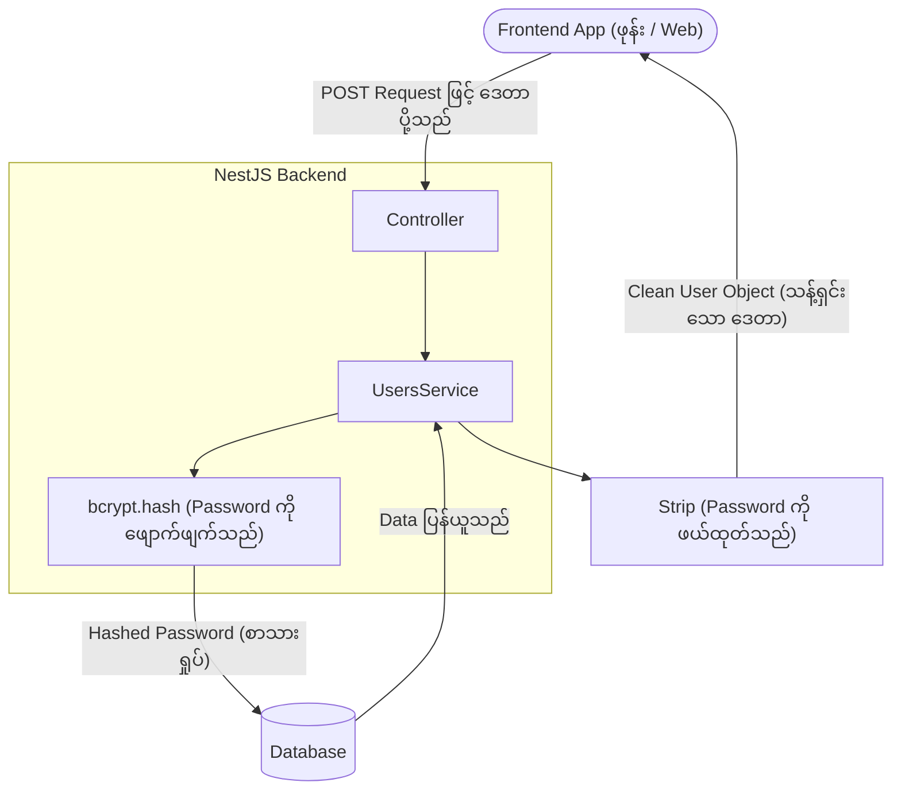

# Day 5: Database Visibility & Secure Registration 🔐🖥️

ဒီနေ့မှာတော့ မျက်ကန်းဖြစ်နေတဲ့ Backend ကြီးကို Database အမြင် (Visibility) ရအောင် ပြောင်းလဲလိုက်ပါတယ်။ ပြီးတော့ User တွေရဲ့ အရေးကြီးဆုံး Data (Password) ကို ကာကွယ်ဖို့အတွက် Enterprise-grade (ကုမ္ပဏီကြီးတွေအဆင့်) လုံခြုံရေးကိုပါ ထည့်သွင်းတည်ဆောက်သွားပါမယ်။

---

## 📊 The Security Flow
User တစ်ယောက်က အကောင့်လုပ် (Register) တဲ့အခါ၊ သူ့ရဲ့ Password ကို လမ်းခုလတ်ကနေ ဖြတ်ယူပြီး Cryptographic algorithm (သင်္ချာနည်းအရ လျှို့ဝှက်ကုဒ်ပြောင်းတဲ့စနစ်) နဲ့ ပြောင်းလဲလိုက်ပါတယ်။ အဲ့ဒီ ပြောင်းလဲထားတဲ့ စာသားရှုပ် (Hash) ကိုမှ Database ထဲမှာ သိမ်းဆည်းပါတယ်။
ပြီးတော့ User Data ကို Frontend ဆီ ပြန်ပို့တဲ့အခါတိုင်း၊ အဲ့ဒီ Password ဆိုတဲ့ Field ကြီးကို လုံးဝ ဖယ်ထုတ်ပစ် (Strip) လိုက်ပါတယ်။



---

## 🛠️ Step 1: Prisma Studio (The Command Center) 🖥️
Database ထဲမှာ ဘာတွေရှိနေလဲဆိုတာကို Postman ကနေ မှန်းဆနေမယ့်အစား၊ Prisma မှာ အလိုအလျောက် ပါလာတဲ့ GUI (Graphic User Interface) ကို သုံးပြီး Excel ဇယားလိုမျိုး အလွယ်တကူ ဝင်ကြည့်၊ ပြင်ဆင်၊ ဖျက်ပစ်လို့ ရပါတယ်။

**Command:**
```powershell
npx prisma studio
```
> *ဒါကို run လိုက်ရင် Browser မှာ `http://localhost:5555` အနေနဲ့ ပွင့်လာပါလိမ့်မယ်။*

---

## 🛠️ Step 2: Installing the Scrambler (Bcrypt) 🛡️
Password တွေကို ဖျောက်ဖျက်ဖို့ (Hashing လုပ်ဖို့) အတွက် လုပ်ငန်းခွင်မှာ စံသတ်မှတ်ချက် (Industry-standard) အဖြစ် သုံးလေ့ရှိတဲ့ `bcrypt` Library ကို Install လုပ်ပါမယ်။

**Command:**
```powershell
npm install bcrypt
npm install -D @types/bcrypt
```

---

## 🛠️ Step 3: Securing the `UsersService` (The Core Logic)
Password ကို Plain text (မြင်သာတဲ့ စာသား) အတိုင်း လုံးဝ မသိမ်းဆည်းဖို့နဲ့၊ Client ဆီကို ဘယ်တော့မှ ပြန်မပါသွားစေဖို့ Service ကို ပြင်ဆင်ပါမယ်။

### `create` Method ကို လုံခြုံအောင် ပြင်ဆင်ခြင်း:
```typescript
import * as bcrypt from 'bcrypt';

async create(createUserDto: CreateUserDto) {
  try {
    // 1. Password ကို Hash လုပ်ပါမယ်! 
    // (10 ဆိုတာ လုံခြုံရေးအဆင့် / Salt rounds ကို ဆိုလိုပါတယ်)
    const hashedPassword = await bcrypt.hash(
      createUserDto.password, 
      10
    );

    // 2. Hash လုပ်ပြီးသား Password နဲ့တကွ Database ထဲ သိမ်းဆည်းပါမယ်
    const newUser = await this.prisma.user.create({
      data: {
        ...createUserDto,
        password: hashedPassword, 
      },
    });

    // 3. Security (လုံခြုံရေးအရ): User data အကုန်လုံးထဲကနေ Password ကို ဖယ်ထုတ်လိုက်တာပါ
    const { password, ...userWithoutPassword } = newUser;

    return userWithoutPassword; // 👈 သန့်ရှင်းတဲ့ ဒေတာကိုပဲ ပြန်ပို့ပါတယ်
  } catch (error) { 
    /* Error handling ကို Day 4 မှာ ရှင်းပြခဲ့ပြီးပါပြီ */ 
  }
}
```

> **💡 Deep Explainer (Rest/Spread Destructuring)**:
> `const { password, ...userWithoutPassword } = newUser;`
> ဒါဟာ JavaScript ရဲ့ အလွန်မိုက်တဲ့ လှည့်ကွက်တစ်ခုပါ။ အဓိပ္ပါယ်က " `newUser` ထဲကနေ `password` ကို ဆွဲထုတ်လိုက်၊ ပြီးရင် ကျန်တဲ့ အရာအားလုံးကို `userWithoutPassword` ဆိုတဲ့ Object အသစ်လေးအနေနဲ့ စုစည်းလိုက်" လို့ ဆိုလိုတာပါ။ ဒါဟာ TypeScript မှာ Property တစ်ခုကို အလုံခြုံဆုံးနည်းလမ်းနဲ့ ဖယ်ထုတ်ပစ်တဲ့ နည်းလမ်းပဲ ဖြစ်ပါတယ်။

---

## 🛠️ Step 4: Plugging the Data Leaks (ဒေတာ ပေါက်ကြားမှုများကို ပိတ်ခြင်း)
`findAll`, `findOne` နဲ့ `update` တွေဟာ Hash လုပ်ထားတဲ့ Password တွေကို Frontend ဆီ ပြန်ပို့ (Leak ဖြစ်) နေသေးတာကို တွေ့ရပါတယ်။ ဒါကြောင့် ခုနက Destructuring နည်းလမ်းကိုပဲ သုံးပြီး အဲ့ဒီ အပေါက်တွေကို လိုက်ပိတ်ပါမယ်။

### `findAll` ကို လုံခြုံအောင် ပြင်ဆင်ခြင်း:
```typescript
async findAll() {
  const users = await this.prisma.user.findMany();
  // Array ကြီးတစ်ခုလုံးကို Map နဲ့ ပတ်ပြီး User တစ်ယောက်ချင်းစီတိုင်းရဲ့ Password တွေကို လိုက်ဖယ်ထုတ်ပါတယ်
  return users.map(user => {
    const { password, ...userWithoutPassword } = user;
    return userWithoutPassword;
  });
}
```

### `update` ကို လုံခြုံအောင် ပြင်ဆင်ခြင်း (Re-hashing ပါဝင်သည်):
```typescript
async update(id: number, updateUserDto: UpdateUserDto) {
  try {
    // 1. တကယ်လို့ Password အသစ် ပြောင်းမယ်ဆိုရင် အဲ့ဒါကိုပါ Hash ထပ်လုပ်ပေးရပါမယ်!
    if (updateUserDto.password) {
      updateUserDto.password = await bcrypt.hash(
        updateUserDto.password, 
        10
      );
    }

    // 2. Database ကို Update လုပ်ပါမယ်
    const updatedUser = await this.prisma.user.update({
      where: { id },
      data: updateUserDto,
    });

    // 3. ပြန်ပို့မယ့် Object ကို သန့်ရှင်းရေး (Clean) လုပ်ပါမယ်
    const { password, ...userWithoutPassword } = updatedUser;
    return userWithoutPassword;

  } catch (error) { 
    /* Error Handling */ 
  }
}
```

---

## 💡 Day 5 Key Takeaways (အဓိက မှတ်သားစရာများ)
1. **Plain text password တွေကို ဘယ်တော့မှ မသိမ်းဆည်းပါနဲ့**: ကိုယ်တစ်ယောက်တည်း Admin ဖြစ်နေပါစေဦး၊ Database အဖောက်ခံရရင် User တွေရဲ့ လျှို့ဝှက်ချက်တွေ အကုန် ပေါက်ကြားသွားပါလိမ့်မယ်။
2. **Response ပြန်ပို့တဲ့အခါ Password ကို ဘယ်တော့မှ ထည့်မပို့ပါနဲ့**: Database ထဲ အောင်မြင်စွာ သိမ်းပြီးသွားရင် Frontend က အဲ့ဒီ Password ကို ဘာမှ ဆက်လုပ်စရာ မလိုတော့ပါဘူး။
3. **`bcrypt.hash(string, rounds)`**: Password တွေကို လုံခြုံအောင်လုပ်တဲ့ စံသတ်မှတ်ချက် (Standard) နည်းလမ်းပါ။ 10 Rounds က လက်ရှိမှာ လုံခြုံရေးနဲ့ အမြန်နှုန်း (Speed) အချိုးအစား အမျှတဆုံးလို့ အကြံပြုထားပါတယ်။
4. **Destructuring**: `const { field, ...rest } = object` ဟာ TypeScript မှာ Data တွေကို ချန်လှပ်ခဲ့ချင်တဲ့အခါ သုံးရတဲ့ အရိုးရှင်းဆုံးနဲ့ အသပ်ရပ်ဆုံး နည်းလမ်း ဖြစ်ပါတယ်။

---

## ✅ Day 5 Graduation 🎖️
သင့်ရဲ့ Backend ဟာ ရိုးရှင်းတဲ့ Data သိုလှောင်ရုံလေး အဆင့်ကနေ၊ လုံခြုံစိတ်ချရတဲ့ Enterprise-ready (ကုမ္ပဏီကြီးတွေ သုံးလို့ရတဲ့အဆင့်) Service တစ်ခုအဖြစ် ပြောင်းလဲသွားပါပြီ။
အခုဆိုရင် နောက်ရက် **Day 6**: Login စနစ်ကို တည်ဆောက်ခြင်း နဲ့ JWT (JSON Web Tokens) တွေကို ထုတ်ပေးခြင်း ဆိုတဲ့ အဆင့်ကို ဆက်သွားဖို့ အဆင်သင့်ဖြစ်နေပါပြီ! 🎟️
