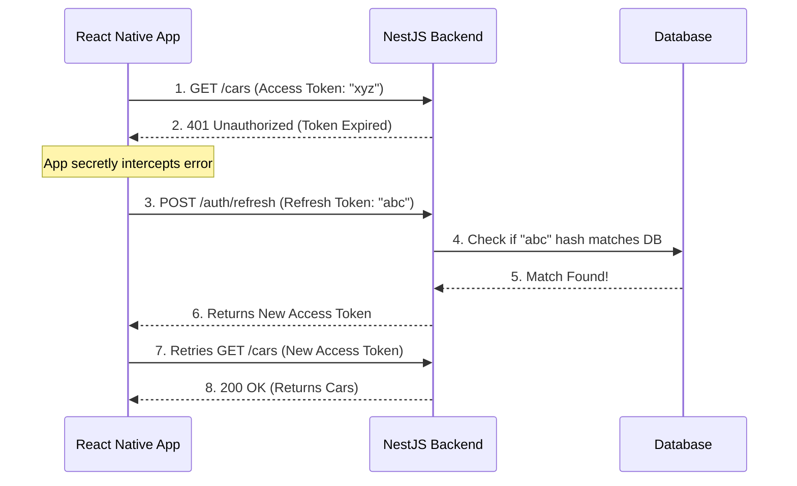

# Day 6: Enterprise Authentication (JWT & Refresh Tokens) 🎟️🛡️

Today we built a highly secure, enterprise-grade authentication system. We didn't just build a basic login; we built a dual-token architecture that balances maximum security with a seamless user experience.

---

## 🧠 Core Architecture Concepts (Masterclass)

Before looking at the code, it is critical to understand *why* we built it this way. Here are the answers to the core architectural questions we discussed:

### 1. What is the difference between Access and Refresh Tokens?
*   **Access Token (The VIP Pass):**
    *   **Lifespan:** Very short (e.g., 15 minutes).
    *   **Type:** Stateless.
    *   **How it works:** The server does *not* check the database. It only checks the cryptographic math of the token. This makes your API incredibly fast.
*   **Refresh Token (The Master Key):**
    *   **Lifespan:** Very long (e.g., 7 days).
    *   **Type:** Stateful.
    *   **How it works:** A hash of this token is saved in the Database. When the Access Token dies, the user sends this to get a new one.

### 2. Where are these tokens stored?
*   **On the Server:** The server stores **nothing** about the Access Token. It only stores a *hashed copy* of the Refresh Token in the database.
*   **On the Client (React Native/Browser):** The client holds **both** the raw Access Token and the raw Refresh Token. In React Native, these are stored in a secure vault (like `SecureStore`).

### 3. How does the "Silent Refresh" work without the user knowing?
Users don't manually click "Refresh". The Frontend handles this automatically using an **Interceptor** (like Axios).



### 4. Why does `Get All Users` still work immediately after I click Logout?
Because the Access Token is **stateless**, the server cannot manually cancel it. Hitting `/logout` only deletes the *Refresh Token* from the database. 
*   **Server-Side:** `/logout` stops the user from getting *new* access tokens.
*   **Client-Side:** When a user clicks "Logout", the React Native app deletes the Access Token from the phone's memory. This is what truly stops them from accessing data!

### 5. What are the industry standards for Token Lifespans (`expiresIn`)?
*   **Banking/Healthcare (High Security):** Access: `5m-15m` | Refresh: `30m-1h` (Annoying, but safe).
*   **SaaS/Dashboards (Standard):** Access: `15m-1h` | Refresh: `7d-30d` (Good balance).
*   **Social Media (Low Friction):** Access: `1h-1d` | Refresh: `6 months - Never` (Keeps users scrolling).

---

## 🛠️ Step-by-Step Implementation

### Step 1: Install Dependencies
```powershell
npm install @nestjs/passport passport @nestjs/jwt passport-jwt
npm install -D @types/passport-jwt
```

### Step 2: Update the Database
We added an optional `refreshToken` column to `schema.prisma` to allow the server to remember the user's active session.
```prisma
model User {
  id           Int       @id @default(autoincrement())
  email        String    @unique
  name         String?
  password     String
  refreshToken String?   // 👈 The new field
  role         Role      @default(USER)
  bookings     Booking[]
  createdAt    DateTime  @default(now())
  updatedAt    DateTime  @updatedAt
}
```
*Run `npx prisma db push` and `npx prisma generate` after updating.*

---

### Step 3: Users Service Updates (`src/users/users.service.ts`)
We added the logic to actually save and delete the token hash from the database.

> [!NOTE] 
> **Deep Explainer: Why hash the Refresh Token?**
> We hash the refresh token before saving it to the DB just like a password. If a hacker steals your entire database, they still cannot use the refresh tokens to generate new access tokens because they only have the hashes, not the raw tokens!

```typescript
// Save the refresh token (Hashed for security)
async updateRefreshToken(userId: number, refreshToken: string) {
    const hashedRefreshToken = await bcrypt.hash(refreshToken, 10);
    return this.prisma.user.update({
        where: { id: userId },
        data: { refreshToken: hashedRefreshToken },
    });
}

// Delete the refresh token (For Logout)
async removeRefreshToken(userId: number) {
    return this.prisma.user.update({
        where: { id: userId },
        data: { refreshToken: null },
    });
}
```

---

### Step 4: Auth Module Configuration (`src/auth/auth.module.ts`)
We configured the JWT module to create the tokens.

```typescript
import { Module } from '@nestjs/common';
import { AuthController } from './auth.controller';
import { AuthService } from './auth.service';
import { UsersModule } from 'src/users/users.module';
import { JwtModule } from '@nestjs/jwt';
import { JwtStrategy } from './jwt.strategy';
import { JwtRefreshStrategy } from './jwt-refresh.strategy';

@Module({
  imports: [
    UsersModule, // 👈 Must export UsersService first!
    JwtModule.register({
      global: true, 
      secret: 'MY_SUPER_SECRET_KEY_123', 
      signOptions: { expiresIn: '15m' }, // 👈 Default expiration
    }),
  ],
  controllers: [AuthController],
  providers: [AuthService, JwtStrategy, JwtRefreshStrategy], // 👈 Register both Bouncers
})
export class AuthModule { }
```

---

### Step 5: The Auth Service (`src/auth/auth.service.ts`)
This is the "Brain" of the operation. It generates tokens, verifies passwords, and handles the refresh logic.

```typescript
// Helper method to generate both tokens
async generateTokens(userId: number, email: string, role: string) {
    const payload = { sub: userId, email: email, role: role };

    // 💡 TIP: Promise.all runs both signAsync tasks simultaneously for better performance!
    const [accessToken, refreshToken] = await Promise.all([
        this.jwtService.signAsync(payload, {
            secret: 'MY_SUPER_SECRET_KEY_123',
            expiresIn: '15m', // Fast expiration
        }),
        this.jwtService.signAsync(payload, {
            secret: 'MY_SUPER_REFRESH_KEY_123', 
            expiresIn: '7d', // Long expiration
        }),
    ]);
    return { accessToken, refreshToken };
}

// The Login Logic
async login(loginDto: LoginDto) {
    const user = await this.usersService.findByEmailForAuth(loginDto.email);
    if (!user) throw new UnauthorizedException('Invalid email or password');

    const isPasswordValid = await bcrypt.compare(loginDto.password, user.password);
    if (!isPasswordValid) throw new UnauthorizedException('Invalid email or password');

    // Generate BOTH tokens
    const tokens = await this.generateTokens(user.id, user.email, user.role);

    // Save refresh token hash to DB
    await this.usersService.updateRefreshToken(user.id, tokens.refreshToken);

    const { password, refreshToken, ...userWithoutSecrets } = user;
    return { ...tokens, user: userWithoutSecrets };
}

// The Refresh Logic
async refreshTokens(userId: number, providedRefreshToken: string) {
    const user = await this.usersService.findOne(userId);
    if (!user || !user.refreshToken) throw new ForbiddenException('Access Denied');

    const refreshTokenMatches = await bcrypt.compare(providedRefreshToken, user.refreshToken);
    if (!refreshTokenMatches) throw new ForbiddenException('Access Denied');

    const tokens = await this.generateTokens(user.id, user.email, user.role);
    await this.usersService.updateRefreshToken(user.id, tokens.refreshToken);

    return tokens;
}
```

---

### Step 6: The Bouncers (Strategies & Guards)

**1. The Access Token Bouncer (`src/auth/jwt.strategy.ts`)**
Protects standard routes. Uses the standard secret.
```typescript
@Injectable()
export class JwtStrategy extends PassportStrategy(Strategy) {
  constructor() {
    super({
      jwtFromRequest: ExtractJwt.fromAuthHeaderAsBearerToken(),
      ignoreExpiration: false,
      secretOrKey: 'MY_SUPER_SECRET_KEY_123',
    });
  }
  async validate(payload: any) {
    return { userId: payload.sub, email: payload.email, role: payload.role };
  }
}
```

**2. The Refresh Token Bouncer (`src/auth/jwt-refresh.strategy.ts`)**
Only used for the `/auth/refresh` route. Uses the refresh secret.
```typescript
@Injectable()
export class JwtRefreshStrategy extends PassportStrategy(Strategy, 'jwt-refresh') {
  constructor() {
    super({
      jwtFromRequest: ExtractJwt.fromAuthHeaderAsBearerToken(),
      ignoreExpiration: false,
      secretOrKey: 'MY_SUPER_REFRESH_KEY_123',
    });
  }
  async validate(payload: any) {
    return { userId: payload.sub, email: payload.email, role: payload.role };
  }
}
```

*(Each strategy gets its own Guard file: `jwt.guard.ts` and `jwt-refresh.guard.ts`)*

---

### Step 7: The Auth Controller (`src/auth/auth.controller.ts`)
We exposed three endpoints, protecting two of them with our new Guards.

```typescript
@Controller('auth')
export class AuthController {
    constructor(private readonly authService: AuthService) { }

    @Post('login')
    @HttpCode(HttpStatus.OK)
    login(@Body() loginDto: LoginDto) {
        return this.authService.login(loginDto);
    }

    // Guarded by the Refresh Bouncer
    @UseGuards(JwtRefreshAuthGuard)
    @Post('refresh')
    @HttpCode(HttpStatus.OK)
    refreshTokens(@Request() req: any) {
        const userId = req.user.userId;
        
        // 💡 TIP: The token is sent in the header as "Bearer eyJhb...". 
        // We use .replace() to strip the word "Bearer " so we only have the raw token!
        const refreshToken = req.headers.authorization.replace('Bearer ', '');
        
        return this.authService.refreshTokens(userId, refreshToken);
    }

    // Guarded by the Standard Access Bouncer
    @UseGuards(JwtAuthGuard)
    @Post('logout')
    @HttpCode(HttpStatus.OK)
    logout(@Request() req: any) {
        return this.authService.logout(req.user.userId);
    }
}
```

---

## 🧪 Postman Testing Guide

1.  **Login:** `POST /auth/login` -> Returns `{ accessToken, refreshToken, user }`.
2.  **Access Protected Route:** `GET /users` -> Use `accessToken` in Bearer Token. Fails after 15m.
3.  **Refresh:** `POST /auth/refresh` -> Use `refreshToken` in Bearer Token. Returns new tokens.
4.  **Logout:** `POST /auth/logout` -> Use `accessToken` in Bearer Token. Deletes refresh token from DB.
5.  **Prove Logout:** Try `/auth/refresh` again. It will fail (`403 Forbidden`) because the DB is cleared.

---

## ✅ Day 6 Graduation 🎖️
You have successfully implemented an advanced authentication architecture that rivals senior-level production applications. You are now ready for **Day 7: Route Guards & Chat**, where we will lock down the "Rent Car" route and begin working with WebSockets (`Socket.io`)!
