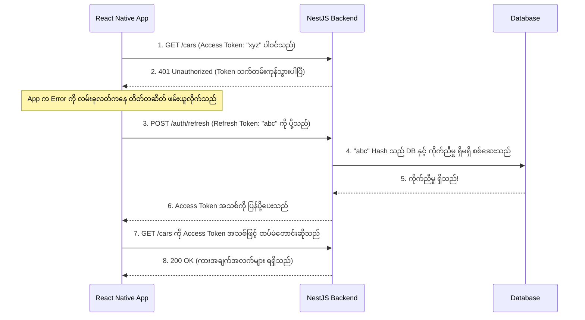

# Day 6: Enterprise Authentication (JWT & Refresh Tokens) 🎟️🛡️

ဒီနေ့မှာတော့ Enterprise-grade (ကုမ္ပဏီကြီးတွေသုံးတဲ့အဆင့်) အလွန်လုံခြုံတဲ့ Authentication စနစ်ကို တည်ဆောက်သွားပါမယ်။ ရိုးရှင်းတဲ့ Login စနစ်လောက်ပဲ တည်ဆောက်မှာမဟုတ်ဘဲ၊ လုံခြုံရေးအမြင့်ဆုံးနဲ့ User Experience အကောင်းဆုံး ဖြစ်စေမယ့် **Token နှစ်ခုစနစ် (Dual-token architecture)** ကိုပါ တည်ဆောက်သွားမှာ ဖြစ်ပါတယ်။

---

## 🧠 Core Architecture Concepts (အဓိက တည်ဆောက်ပုံ သဘောတရားများ - Masterclass)

Code တွေကို မကြည့်ခင်မှာ၊ ဒီစနစ်ကို *ဘာကြောင့်* ဒီလိုတည်ဆောက်ရသလဲ ဆိုတာ နားလည်ဖို့ အလွန်အရေးကြီးပါတယ်။ အောက်ပါအချက်တွေကတော့ ကျွန်တော်တို့ ဆွေးနွေးခဲ့တဲ့ အဓိက မေးခွန်းတွေရဲ့ အဖြေတွေပဲ ဖြစ်ပါတယ်။

### 1. Access Token နဲ့ Refresh Token ဘာကွာသလဲ?
*   **Access Token (The VIP Pass - အထူးခွင့်ပြုကတ်):**
    *   **သက်တမ်း (Lifespan):** အလွန်တိုတောင်းပါတယ် (ဥပမာ - ၁၅ မိနစ်)။
    *   **အမျိုးအစား (Type):** Stateless (မှတ်သားထားခြင်း မရှိပါ)။
    *   **အလုပ်လုပ်ပုံ:** Server က Database ကို သွားစစ်နေမှာ *မဟုတ်ပါဘူး*။ Token ရဲ့ Cryptographic သင်္ချာနည်းလမ်း မှန်မမှန်ကိုပဲ စစ်ဆေးတာပါ။ ဒါကြောင့် သင့်ရဲ့ API က အင်မတန် မြန်ဆန်နေမှာပါ။
*   **Refresh Token (The Master Key - မာစတာသော့):**
    *   **သက်တမ်း (Lifespan):** အလွန်ရှည်လျားပါတယ် (ဥပမာ - ၇ ရက်)။
    *   **အမျိုးအစား (Type):** Stateful (မှတ်သားထားပါတယ်)။
    *   **အလုပ်လုပ်ပုံ:** ဒီ Token ရဲ့ Hash (စာသားရှုပ်) ကို Database ထဲမှာ သိမ်းဆည်းထားပါတယ်။ Access Token သက်တမ်းကုန်သွားတဲ့အခါ၊ User က အသစ်တစ်ခု ပြန်တောင်းဖို့ ဒီ Refresh Token ကို ပို့ပေးရပါတယ်။

### 2. ဒီ Token တွေကို ဘယ်မှာ သိမ်းဆည်းသလဲ?
*   **Server ပေါ်တွင်:** Server ဟာ Access Token နဲ့ ပတ်သက်ပြီး **ဘာကိုမှ** မသိမ်းဆည်းထားပါဘူး။ Database ထဲမှာ Refresh Token ရဲ့ *Hash လုပ်ထားတဲ့ မိတ္တူ* ကိုပဲ သိမ်းဆည်းထားတာပါ။
*   **Client ပေါ်တွင် (React Native/Browser):** Client ကတော့ Access Token ရော Refresh Token ကိုပါ အကြမ်းထည် (Raw) အတိုင်း **နှစ်ခုစလုံး** သိမ်းဆည်းထားရပါတယ်။ React Native မှာဆိုရင် အလွန်လုံခြုံတဲ့ Vault တွေ (ဥပမာ `SecureStore` လိုမျိုး) ထဲမှာ သိမ်းဆည်းပါတယ်။

### 3. "Silent Refresh (တိတ်တဆိတ် Refresh လုပ်ခြင်း)" ဟာ User မသိဘဲ ဘယ်လိုအလုပ်လုပ်သလဲ?
User တွေက "Refresh" ဆိုတဲ့ ခလုတ်ကို ကိုယ်တိုင် နှိပ်စရာ မလိုပါဘူး။ Frontend က **Interceptor** (ဥပမာ - Axios Interceptor) ကို သုံးပြီး အလိုအလျောက် နောက်ကွယ်ကနေ လုပ်ဆောင်ပေးသွားတာပါ။



### 4. Logout နှိပ်ပြီးတာတောင် ဘာကြောင့် `Get All Users` က ချက်ချင်း အလုပ်လုပ်နေသေးတာလဲ?
ဘာဖြစ်လို့လဲဆိုတော့ Access Token ဟာ **Stateless** ဖြစ်တဲ့အတွက်၊ Server ကနေ အဲ့ဒီ Token ကို ကိုယ်တိုင် ဖျက်ပစ် (Cancel) လို့ မရလို့ပါ။ `/logout` ကို ခေါ်လိုက်တာဟာ Database ထဲက *Refresh Token* ကိုပဲ ဖျက်ပစ်လိုက်တာ ဖြစ်ပါတယ်။
*   **Server ဘက်တွင်:** `/logout` လုပ်လိုက်တာဟာ User ကို Access Token *အသစ်တွေ* ထပ်မတောင်းနိုင်အောင် တားဆီးလိုက်တာပါ။
*   **Client ဘက်တွင်:** User က "Logout" ကို နှိပ်လိုက်တာနဲ့ React Native app က ဖုန်းရဲ့ Memory ထဲမှာရှိတဲ့ Access Token ကို ဖျက်ပစ်လိုက်ပါတယ်။ ဒါကမှသာ Data တွေကို ဆက်ယူလို့မရအောင် အမှန်တကယ် တားဆီးပေးလိုက်တာပါ။

### 5. Token သက်တမ်း (`expiresIn`) တွေအတွက် လုပ်ငန်းခွင် စံသတ်မှတ်ချက်တွေက ဘာတွေလဲ?
*   **ဘဏ်လုပ်ငန်း/ကျန်းမာရေးစောင့်ရှောက်မှု (High Security):** Access: `5m-15m` | Refresh: `30m-1h` (နည်းနည်းတော့ အလုပ်ရှုပ်ပေမယ့်၊ လုံခြုံရေးအတွက် အကောင်းဆုံးပါ)။
*   **SaaS/Dashboards (Standard):** Access: `15m-1h` | Refresh: `7d-30d` (လုံခြုံရေးနဲ့ အသုံးပြုရလွယ်ကူမှု အချိုးအစား မျှတပါတယ်)။
*   **Social Media (Low Friction):** Access: `1h-1d` | Refresh: `၆ လ မှ အမြဲတမ်း` (User တွေကို အမြဲတမ်း သုံးနေစေချင်လို့ပါ)။

---

## 🛠️ Step-by-Step Implementation (အဆင့်လိုက် တည်ဆောက်ခြင်း)

### Step 1: Install Dependencies (လိုအပ်သော Library များ သွင်းခြင်း)
```powershell
npm install @nestjs/passport passport @nestjs/jwt passport-jwt
npm install -D @types/passport-jwt
```

### Step 2: Update the Database (Database ကို ပြင်ဆင်ခြင်း)
User ရဲ့ လက်ရှိ Session ကို Server က မှတ်သားထားနိုင်ဖို့အတွက် `schema.prisma` ထဲမှာ `refreshToken` ဆိုတဲ့ Optional column တစ်ခုကို ထပ်ထည့်ခဲ့ပါတယ်။

```prisma
model User {
  id           Int       @id @default(autoincrement())
  email        String    @unique
  name         String?
  password     String
  refreshToken String?   // 👈 ထပ်ထည့်လိုက်တဲ့ Field အသစ်
  role         Role      @default(USER)
  bookings     Booking[]
  createdAt    DateTime  @default(now())
  updatedAt    DateTime  @updatedAt
}
```
> *ပြင်ဆင်ပြီးတိုင်း `npx prisma db push` နဲ့ `npx prisma generate` ကို ပြန် run ပေးပါ။*

---

### Step 3: Users Service Updates (`src/users/users.service.ts`)
Token hash ကို Database ထဲမှာ အမှန်တကယ် သိမ်းဆည်းဖို့နဲ့ ဖျက်ပစ်ဖို့အတွက် Logic တွေကို ထပ်ထည့်ပါမယ်။

> **💡 Deep Explainer: Refresh Token ကို ဘာကြောင့် Hash လုပ်ရတာလဲ?**
> Refresh token ကို DB ထဲ မသိမ်းခင်မှာ Password လိုမျိုးပဲ Hash လုပ်ထားပါတယ်။ တကယ်လို့ Hacker တစ်ယောက်က သင့်ရဲ့ Database ကြီးတစ်ခုလုံးကို ခိုးယူသွားနိုင်ခဲ့ရင်တောင်၊ သူတို့ရသွားမှာက Hash တွေပဲ ဖြစ်ပြီး အကြမ်းထည် Token အစစ်တွေ မဟုတ်တဲ့အတွက်၊ Access Token အသစ်တွေကို သူတို့ ဘယ်လိုမှ ထုတ်ယူနိုင်မှာ မဟုတ်ပါဘူး!

```typescript
// Refresh token ကို သိမ်းဆည်းခြင်း (လုံခြုံရေးအတွက် Hash လုပ်ထားပါတယ်)
async updateRefreshToken(userId: number, refreshToken: string) {
    const hashedRefreshToken = await bcrypt.hash(refreshToken, 10);
    return this.prisma.user.update({
        where: { id: userId },
        data: { refreshToken: hashedRefreshToken },
    });
}

// Refresh token ကို ဖျက်ပစ်ခြင်း (Logout အတွက်ပါ)
async removeRefreshToken(userId: number) {
    return this.prisma.user.update({
        where: { id: userId },
        data: { refreshToken: null },
    });
}
```

---

### Step 4: Auth Module Configuration (`src/auth/auth.module.ts`)
Token တွေကို ဖန်တီးပေးဖို့အတွက် JWT module ကို Configure လုပ်ပါမယ်။

```typescript
import { Module } from '@nestjs/common';
import { AuthController } from './auth.controller';
import { AuthService } from './auth.service';
import { UsersModule } from 'src/users/users.module';
import { JwtModule } from '@nestjs/jwt';
import { JwtStrategy } from './jwt.strategy';
import { JwtRefreshStrategy } from './jwt-refresh.strategy';

@Module({
  imports: [
    UsersModule, // 👈 UsersService ကို အရင် Export လုပ်ပေးထားရပါမယ်!
    JwtModule.register({
      global: true, 
      secret: 'MY_SUPER_SECRET_KEY_123', 
      signOptions: { expiresIn: '15m' }, // 👈 ပုံမှန် သက်တမ်းကုန်မယ့်အချိန်
    }),
  ],
  controllers: [AuthController],
  providers: [AuthService, JwtStrategy, JwtRefreshStrategy], // 👈 Bouncer နှစ်ယောက်လုံးကို စာရင်းသွင်းလိုက်ပါ
})
export class AuthModule { }
```

---

### Step 5: The Auth Service (`src/auth/auth.service.ts`)
ဒီနေရာကတော့ "ဦးနှောက်" ပါပဲ။ သူက Token တွေကို ဖန်တီးပေးတယ်၊ Password တွေကို စစ်ဆေးပေးတယ်၊ ပြီးတော့ Refresh လုပ်တဲ့ Logic တွေကိုလည်း ကိုင်တွယ်ပေးပါတယ်။

```typescript
// Token နှစ်ခုလုံးကို ဖန်တီးပေးမယ့် အကူ (Helper) method ပါ
async generateTokens(userId: number, email: string, role: string) {
    const payload = { sub: userId, email: email, role: role };

    // 💡 TIP: Promise.all ဟာ signAsync အလုပ်နှစ်ခုလုံးကို တစ်ပြိုင်နက်တည်း 
    // အလုပ်လုပ်ခိုင်းတဲ့အတွက် Performance ပိုကောင်းစေပါတယ်!
    const [accessToken, refreshToken] = await Promise.all([
        this.jwtService.signAsync(payload, {
            secret: 'MY_SUPER_SECRET_KEY_123',
            expiresIn: '15m', // အမြန်သက်တမ်းကုန်ဆုံးချိန်
        }),
        this.jwtService.signAsync(payload, {
            secret: 'MY_SUPER_REFRESH_KEY_123', 
            expiresIn: '7d', // အကြာကြီးခံမယ့် သက်တမ်း
        }),
    ]);
    return { accessToken, refreshToken };
}

// Login Logic (အကောင့်ဝင်ခြင်း)
async login(loginDto: LoginDto) {
    const user = await this.usersService.findByEmailForAuth(loginDto.email);
    if (!user) throw new UnauthorizedException('Invalid email or password');

    const isPasswordValid = await bcrypt.compare(
      loginDto.password, 
      user.password
    );
    if (!isPasswordValid) throw new UnauthorizedException('Invalid email or password');

    // Token နှစ်ခုစလုံးကို ဖန်တီးပါ
    const tokens = await this.generateTokens(user.id, user.email, user.role);

    // DB ထဲကို Refresh token hash ထည့်သိမ်းပါ
    await this.usersService.updateRefreshToken(user.id, tokens.refreshToken);

    const { password, refreshToken, ...userWithoutSecrets } = user;
    return { ...tokens, user: userWithoutSecrets };
}

// Refresh Logic (သက်တမ်းတိုးခြင်း)
async refreshTokens(userId: number, providedRefreshToken: string) {
    const user = await this.usersService.findOne(userId);
    if (!user || !user.refreshToken) throw new ForbiddenException('Access Denied');

    const refreshTokenMatches = await bcrypt.compare(
      providedRefreshToken, 
      user.refreshToken
    );
    if (!refreshTokenMatches) throw new ForbiddenException('Access Denied');

    const tokens = await this.generateTokens(user.id, user.email, user.role);
    await this.usersService.updateRefreshToken(user.id, tokens.refreshToken);

    return tokens;
}
```

---

### Step 6: The Bouncers (Strategies & Guards - တံခါးစောင့်များ)

**1. The Access Token Bouncer (`src/auth/jwt.strategy.ts`)**
သာမန် Route တွေကို ကာကွယ်ပေးပါတယ်။ သာမန် (Standard) secret key ကို သုံးပါတယ်။

```typescript
@Injectable()
export class JwtStrategy extends PassportStrategy(Strategy) {
  constructor() {
    super({
      jwtFromRequest: ExtractJwt.fromAuthHeaderAsBearerToken(),
      ignoreExpiration: false,
      secretOrKey: 'MY_SUPER_SECRET_KEY_123',
    });
  }
  async validate(payload: any) {
    return { userId: payload.sub, email: payload.email, role: payload.role };
  }
}
```

**2. The Refresh Token Bouncer (`src/auth/jwt-refresh.strategy.ts`)**
`/auth/refresh` လမ်းကြောင်း တစ်ခုအတွက်ပဲ သုံးပါတယ်။ Refresh secret key ကို သုံးပါတယ်။

```typescript
@Injectable()
export class JwtRefreshStrategy extends PassportStrategy(Strategy, 'jwt-refresh') {
  constructor() {
    super({
      jwtFromRequest: ExtractJwt.fromAuthHeaderAsBearerToken(),
      ignoreExpiration: false,
      secretOrKey: 'MY_SUPER_REFRESH_KEY_123',
    });
  }
  async validate(payload: any) {
    return { userId: payload.sub, email: payload.email, role: payload.role };
  }
}
```

*(Strategy တစ်ခုချင်းစီအတွက် ကိုယ်ပိုင် Guard ဖိုင်လေးတွေ ရှိပါတယ်: `jwt.guard.ts` နဲ့ `jwt-refresh.guard.ts`)*

---

### Step 7: The Auth Controller (`src/auth/auth.controller.ts`)
Endpoint သုံးခုကို ဖွင့်ပေးခဲ့ပြီး၊ အဲ့ဒီအထဲက နှစ်ခုကိုတော့ ကျွန်တော်တို့ရဲ့ Guard အသစ်တွေနဲ့ ကာကွယ်ထားပါတယ်။

```typescript
@Controller('auth')
export class AuthController {
    constructor(private readonly authService: AuthService) { }

    @Post('login')
    @HttpCode(HttpStatus.OK)
    login(@Body() loginDto: LoginDto) {
        return this.authService.login(loginDto);
    }

    // Refresh Bouncer ဖြင့် ကာကွယ်ထားသည်
    @UseGuards(JwtRefreshAuthGuard)
    @Post('refresh')
    @HttpCode(HttpStatus.OK)
    refreshTokens(@Request() req: any) {
        const userId = req.user.userId;
        
        // 💡 TIP: Token ဟာ Header ထဲမှာ "Bearer eyJhb..." ဆိုတဲ့ ပုံစံနဲ့ ပါလာပါတယ်။
        // "Bearer " ဆိုတဲ့ စာသားကို .replace() သုံးပြီး ဖယ်ထုတ်လိုက်တဲ့အတွက် Raw token သီးသန့်ကိုပဲ ရရှိသွားပါတယ်။
        const refreshToken = req.headers.authorization.replace('Bearer ', '');
        
        return this.authService.refreshTokens(userId, refreshToken);
    }

    // သာမန် Access Bouncer ဖြင့် ကာကွယ်ထားသည်
    @UseGuards(JwtAuthGuard)
    @Post('logout')
    @HttpCode(HttpStatus.OK)
    logout(@Request() req: any) {
        return this.authService.logout(req.user.userId);
    }
}
```

---

## 🧪 Postman Testing Guide (Postman ဖြင့် စမ်းသပ်ခြင်း)

1.  **Login ဝင်မည်:** `POST /auth/login` -> `{ accessToken, refreshToken, user }` တွေကို ပြန်ပေးပါမယ်။
2.  **ကာကွယ်ထားသော လမ်းကြောင်းကို ဝင်မည်:** `GET /users` -> Bearer Token နေရာမှာ `accessToken` ကို ထည့်သုံးပါ။ ၁၅ မိနစ် ကြာတဲ့အခါ ကျရှုံး (Fail) သွားပါလိမ့်မယ်။
3.  **Refresh (သက်တမ်းတိုးမည်):** `POST /auth/refresh` -> Bearer Token နေရာမှာ `refreshToken` ကို ထည့်သုံးပါ။ Token အသစ်တွေကို ပြန်ပေးပါလိမ့်မယ်။
4.  **Logout (အကောင့်ထွက်မည်):** `POST /auth/logout` -> Bearer Token နေရာမှာ `accessToken` ကို ထည့်သုံးပါ။ DB ထဲက Refresh token ကို ဖျက်ပစ်ပါလိမ့်မယ်။
5.  **Logout မှန်/မမှန် စစ်ဆေးမည်:** `/auth/refresh` ကို နောက်တစ်ကြိမ် ထပ်ခေါ်ကြည့်ပါ။ DB မှာ Data မရှိတော့တဲ့အတွက် Fail (`403 Forbidden`) ဖြစ်သွားတာကို တွေ့ရပါလိမ့်မယ်။

---

## ✅ Day 6 Graduation 🎖️
သင်ဟာ Production အဆင့် (အပြင်မှာ တကယ်သုံးတဲ့အဆင့်) Application တွေမှာ Senior တွေ တည်ဆောက်လေ့ရှိတဲ့ အဆင့်မြင့် Authentication Architecture ကို အောင်မြင်စွာ တည်ဆောက်နိုင်ခဲ့ပါပြီ။ 
အခုဆိုရင် နောက်ရက် **Day 7: Route Guards & Chat** ကို ဆက်သွားဖို့ အဆင်သင့် ဖြစ်နေပါပြီ။ Day 7 မှာတော့ "Rent Car (ကားငှားရန်)" လမ်းကြောင်းကို Lock ချပြီး `Socket.io` (WebSockets) ကို စတင်အသုံးပြုသွားမှာ ဖြစ်ပါတယ်! 🚀
