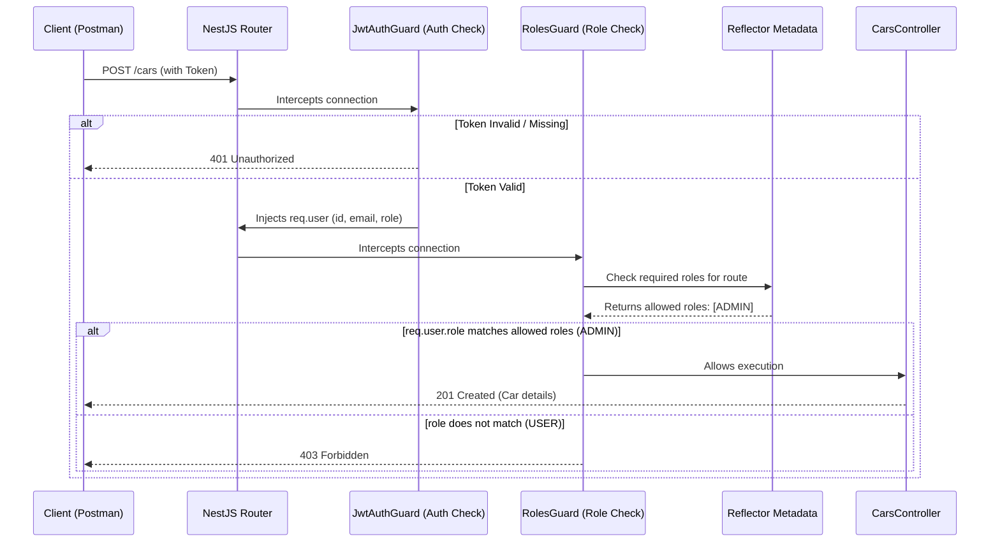
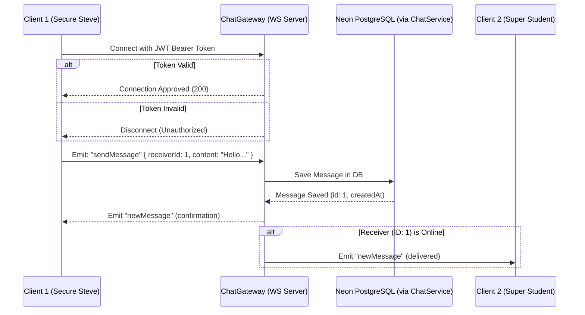

# Day 7: Route Guards & Real-Time WebSocket Chat 🎟️💬

Today, we secured our API endpoints with Role-Based Access Control (RBAC) and implemented a persistent, authenticated, real-time messaging gateway using WebSockets (`Socket.io`).

---

## 🧠 Core Architecture Concepts (Masterclass)

Before looking at the code, it is critical to understand the architecture behind route guards, security context injection, and WebSocket protocol differences.

### 1. How Role-Based Access Control (RBAC) Works in NestJS
To protect specific actions (like adding a new car), we use a three-step security pipeline:
1. **The Role Enum:** We define user roles (`USER` and `ADMIN`) in our database schema.
2. **The Roles Decorator (`@Roles`):** A custom metadata tagger that attaches authorized roles to controllers or routes.
3. **The Roles Guard (`RolesGuard`):** A custom guard that checks the user's validated JWT payload, reads the reflector metadata from the current route, and allows/denies entry.



---

### 2. WebSockets vs. HTTP: Why Socket.io?
*   **HTTP (Request/Response):** The client must constantly ask the server: *"Is there a new message?"* (polling). This wastes network bandwidth, server resources, and client battery life.
*   **WebSockets (Bi-directional Pipe):** A single persistent connection is kept open. Both client and server can push data to each other instantly. 
*   **Socket.IO:** We use Socket.IO over raw WebSockets because it handles reconnection, automatic fallback to HTTP polling if connections drop, and simplifies event-driven communication (e.g. `client.emit('event')`).



---

## 🛠️ Step-by-Step Implementation

## 📚 Section 1: Route Guards & Access Controls (RBAC)

### Step 1.1: Create `@Roles()` Decorator (`src/auth/roles.decorator.ts`)
This decorator allows us to attach specific roles to route handlers. It writes metadata under the custom key `'roles'`.
```typescript
import { SetMetadata } from '@nestjs/common';
import { Role } from '@prisma/client';

export const ROLES_KEY = 'roles';
export const Roles = (...roles: Role[]) => SetMetadata(ROLES_KEY, roles);
```

### Step 1.2: Create the `RolesGuard` (`src/auth/roles.guard.ts`)
The `RolesGuard` reads route metadata using NestJS's `Reflector` helper and compares it against the authenticated user payload.
```typescript
import { Injectable, CanActivate, ExecutionContext } from '@nestjs/common';
import { Reflector } from '@nestjs/core';
import { Role } from '@prisma/client';
import { ROLES_KEY } from './roles.decorator';

@Injectable()
export class RolesGuard implements CanActivate {
    constructor(private reflector: Reflector) { }

    canActivate(context: ExecutionContext): boolean {
        // 1. Read the roles metadata from the endpoint class or method
        const requiredRoles = this.reflector.getAllAndOverride<Role[]>(ROLES_KEY, [
            context.getHandler(),
            context.getClass(),
        ]);

        // 2. If no roles are required on this endpoint, let anyone in!
        if (!requiredRoles) {
            return true;
        }

        // 3. Extract the request object
        const { user } = context.switchToHttp().getRequest();

        // 4. If there is no user attached to the request, block it
        if (!user) {
            return false;
        }

        // 5. Check if the user's role matches one of the required roles
        return requiredRoles.some((role) => user.role === role);
    }
}
```

### Step 1.3: Secure Cars Routes (`src/cars/cars.controller.ts`)
We updated `CarsController` to restrict inventory changes to admins:
*   `GET /cars` is left open for everyone to browse.
*   `POST`, `PATCH`, and `DELETE` requests require the user to be logged in as an `ADMIN`.

```typescript
import { Controller, Get, Post, Body, Patch, Param, Delete } from '@nestjs/common';
import { CarsService } from './cars.service';
import { CreateCarDto } from './dto/create-car.dto';
import { UpdateCarDto } from './dto/update-car.dto';

import { UseGuards } from '@nestjs/common';
import { JwtAuthGuard } from '../auth/jwt.guard';
import { RolesGuard } from '../auth/roles.guard';
import { Roles } from '../auth/roles.decorator';
import { Role } from '@prisma/client';

@Controller('cars')
export class CarsController {
  constructor(private readonly carsService: CarsService) { }

  @Post()
  @UseGuards(JwtAuthGuard, RolesGuard)
  @Roles(Role.ADMIN) // Tag as Admin-only
  create(@Body() createCarDto: CreateCarDto) {
    return this.carsService.create(createCarDto);
  }

  @Get()
  findAll() {
    return this.carsService.findAll();
  }

  @Get(':id')
  findOne(@Param('id') id: string) {
    return this.carsService.findOne(+id);
  }

  @Patch(':id')
  @UseGuards(JwtAuthGuard, RolesGuard)
  @Roles(Role.ADMIN) // Tag as Admin-only
  update(@Param('id') id: string, @Body() updateCarDto: UpdateCarDto) {
    return this.carsService.update(+id, updateCarDto);
  }

  @Delete(':id')
  @UseGuards(JwtAuthGuard, RolesGuard)
  @Roles(Role.ADMIN) // Tag as Admin-only
  remove(@Param('id') id: string) {
    return this.carsService.remove(+id);
  }
}
```

### Step 1.4: Securing Bookings (`src/bookings/bookings.controller.ts` & `bookings.service.ts`)
We locked down bookings so users can only manage their own reservations:
1.  **Creation Security:** When booking a car, regular `USER`s cannot specify a different `userId` in the body to exploit other accounts. The controller automatically overrides their request payload to force their own authenticated `userId`. `ADMIN`s, however, can book on behalf of other users.
2.  **Filter Search Security:** Standard users requesting the booking list will only get bookings matching their `userId`. Admins receive all bookings.

#### Controller Code:
```typescript
import { Controller, Get, Post, Body, UseGuards, Request } from '@nestjs/common';
import { BookingsService } from './bookings.service';
import { CreateBookingDto } from './dto/create-booking.dto';
import { JwtAuthGuard } from '../auth/jwt.guard';

@Controller('bookings')
@UseGuards(JwtAuthGuard) // Protect ALL routes in this controller
export class BookingsController {
    constructor(private readonly bookingsService: BookingsService) { }

    @Post()
    create(@Body() createBookingDto: CreateBookingDto, @Request() req: any) {
        // Security: Extract userId from the authenticated token.
        // If ADMIN, allow booking on behalf of others (use body userId if provided).
        // If USER, always force their own userId.
        const user = req.user;
        const userIdToUse = user.role === 'ADMIN'
            ? (createBookingDto.userId || user.userId)
            : user.userId;

        return this.bookingsService.create({
            ...createBookingDto,
            userId: userIdToUse,
        });
    }

    @Get()
    findAll(@Request() req: any) {
        // Pass the authenticated user info to the service for role-based filtering
        return this.bookingsService.findAll(req.user);
    }
}
```

#### Service Code:
```typescript
import { Injectable, ConflictException } from '@nestjs/common';
import { PrismaService } from '../prisma/prisma.service';
import { CreateBookingDto } from './dto/create-booking.dto';

@Injectable()
export class BookingsService {
    constructor(private prisma: PrismaService) { }

    async create(createBookingDto: CreateBookingDto) {
        const { carId, startDate, endDate } = createBookingDto;
        // 1. Check if the car is already booked during these dates (Overlap check)
        const existingBooking = await this.prisma.booking.findFirst({
            where: {
                carId: carId,
                AND: [
                    { startDate: { lte: new Date(endDate) } },
                    { endDate: { gte: new Date(startDate) } },
                ],
            },
        });
        if (existingBooking) {
            throw new ConflictException('This car is already booked for the selected dates! 🚫');
        }
        // 2. If no conflict, create the booking
        return this.prisma.booking.create({
            data: createBookingDto,
            include: { car: true, user: true },
        });
    }

    async findAll(user: { userId: number; role: string }) {
        // RBAC: Regular USERs can only see their own bookings. ADMINs see everything.
        if (user.role === 'ADMIN') {
            return this.prisma.booking.findMany({
                include: { car: true, user: true },
            });
        }
        return this.prisma.booking.findMany({
            where: {
                userId: user.userId, // Filter by the authenticated user's ID
            },
            include: { car: true, user: true },
        });
    }
}
```

---

## 💬 Section 2: Real-Time WebSockets Chat

### Step 2.1: Add the `Message` Model (`prisma/schema.prisma`)
We defined a `Message` entity with self-referential relations linking to the sender and receiver users:
```prisma
model User {
  id               Int       @id @default(autoincrement())
  email            String    @unique
  name             String?
  password         String
  refreshToken     String?
  role             Role      @default(USER)
  bookings         Booking[]
  sentMessages     Message[] @relation("SentMessages")
  receivedMessages Message[] @relation("ReceivedMessages")
  createdAt        DateTime  @default(now())
  updatedAt        DateTime  @updatedAt
}

model Message {
  id         Int      @id @default(autoincrement())
  content    String
  createdAt  DateTime @default(now())

  senderId   Int
  sender     User     @relation("SentMessages", fields: [senderId], references: [id])

  receiverId Int
  receiver   User     @relation("ReceivedMessages", fields: [receiverId], references: [id])
}
```
*Run `npx prisma db push` to generate the Client types and sync Neon tables.*

### Step 2.2: Implement `ChatService` (`src/chat/chat.service.ts`)
Handles saving chat messages to the database and fetching conversation logs between two users.
```typescript
import { Injectable } from '@nestjs/common';
import { PrismaService } from 'src/prisma/prisma.service';

@Injectable()
export class ChatService {
    constructor(private readonly prisma: PrismaService) { }

    // 1. Save a new chat message to Neon PostgreSQL
    async saveMessage(senderId: number, receiverId: number, content: string) {
        return this.prisma.message.create({
            data: {
                content,
                senderId,
                receiverId,
            },
            include: {
                sender: {
                    select: {
                        id: true,
                        email: true,
                        name: true,
                    },
                },
            },
        });
    }

    // 2. Fetch all messages between user1 and user2, ordered by time
    async getChatHistory(userId1: number, userId2: number) {
        return this.prisma.message.findMany({
            where: {
                OR: [
                    { senderId: userId1, receiverId: userId2 },
                    { senderId: userId2, receiverId: userId1 },
                ],
            },
            orderBy: {
                createdAt: 'asc',
            },
            include: {
                sender: {
                    select: {
                        id: true,
                        email: true,
                        name: true,
                    },
                },
                receiver: {
                    select: {
                        id: true,
                        email: true,
                        name: true,
                    },
                },
            },
        });
    }
}
```

### Step 2.3: Implement `ChatGateway` (`src/chat/chat.gateway.ts`)
Manages Socket.io connections, authenticates connections using JWT tokens, tracks online status, and broadcasts messages.
```typescript
import {
    WebSocketGateway,
    SubscribeMessage,
    MessageBody,
    ConnectedSocket,
    OnGatewayConnection,
    OnGatewayDisconnect,
    WebSocketServer,
} from '@nestjs/websockets';
import { Server, Socket } from 'socket.io';
import { JwtService } from '@nestjs/jwt';
import { ChatService } from './chat.service';
import { UnauthorizedException } from '@nestjs/common';

@WebSocketGateway({
    cors: {
        origin: '*',
    },
})
export class ChatGateway implements OnGatewayConnection, OnGatewayDisconnect {
    @WebSocketServer()
    server: Server;

    // Track online users: Map<userId (number), socketId (string)>
    private activeConnections = new Map<number, string>();

    constructor(
        private readonly jwtService: JwtService,
        private readonly chatService: ChatService,
    ) { }

    // Authenticate user on socket connection
    async handleConnection(client: Socket) {
        try {
            const authHeader =
                client.handshake.headers.authorization ||
                client.handshake.auth?.token ||
                client.handshake.query?.token;

            if (!authHeader) {
                console.log('WebSocket Connection Rejected: No authentication token found.');
                client.disconnect();
                return;
            }

            // Handle both raw token or 'Bearer <token>' format
            const token = typeof authHeader === 'string' && authHeader.startsWith('Bearer ')
                ? authHeader.replace('Bearer ', '')
                : authHeader;

            // Verify and decode JWT token (secret matches Day 6 configuration)
            const payload = await this.jwtService.verifyAsync(token, {
                secret: 'MY_SUPER_SECRET_KEY_123',
            });

            // Save user details to socket data object
            client.data.user = {
                userId: payload.sub,
                email: payload.email,
                role: payload.role,
            };

            // Store in our active connections tracker
            this.activeConnections.set(payload.sub, client.id);
            console.log(`WebSocket Connected: ${payload.email} (${client.id})`);
        } catch (err) {
            console.log('WebSocket Connection Rejected: Invalid token.', err.message);
            client.disconnect();
        }
    }

    // Clean up on client disconnect
    handleDisconnect(client: Socket) {
        if (client.data.user) {
            this.activeConnections.delete(client.data.user.userId);
            console.log(`WebSocket Disconnected: ${client.data.user.email}`);
        }
    }

    // Listen for the "sendMessage" event from client
    @SubscribeMessage('sendMessage')
    async handleMessage(
        @MessageBody() data: { receiverId: number; content: string },
        @ConnectedSocket() client: Socket,
    ) {
        const sender = client.data.user;
        if (!sender) {
            throw new UnauthorizedException('Socket client not authenticated.');
        }

        // 1. Save message to PostgreSQL DB
        const message = await this.chatService.saveMessage(
            sender.userId,
            data.receiverId,
            data.content,
        );

        const formattedMessage = {
            id: message.id,
            content: message.content,
            createdAt: message.createdAt,
            senderId: message.senderId,
            receiverId: message.receiverId,
            sender: {
                id: message.sender.id,
                email: message.sender.email,
                name: message.sender.name,
            },
        };

        // 2. Deliver message to receiver if they are online
        const receiverSocketId = this.activeConnections.get(data.receiverId);
        if (receiverSocketId) {
            this.server.to(receiverSocketId).emit('newMessage', formattedMessage);
        }

        // 3. Send message back to sender's own app instance as confirmation
        client.emit('newMessage', formattedMessage);

        return formattedMessage;
    }
}
```

### Step 2.4: Implement `ChatController` (`src/chat/chat.controller.ts`)
Exposes a REST API to fetch historic message logs between the authenticated user and another participant.
```typescript
import { Controller, Get, Param, UseGuards, Request, ParseIntPipe } from '@nestjs/common';
import { JwtAuthGuard } from 'src/auth/jwt.guard';
import { ChatService } from './chat.service';

@UseGuards(JwtAuthGuard)
@Controller('chat')
export class ChatController {
    constructor(private readonly chatService: ChatService) { }

    // Fetch chat history between the logged-in user and another user
    @Get('history/:userId')
    async getHistory(
        @Param('userId', ParseIntPipe) chatPartnerId: number,
        @Request() req: any,
    ) {
        const currentUser = req.user;

        // Returns history between the current authenticated user and the requested partner ID
        return this.chatService.getChatHistory(currentUser.userId, chatPartnerId);
    }
}
```

### Step 2.5: Connect the Module and Register (`src/chat/chat.module.ts`)
Ties these controllers, services, and gateways together.
```typescript
import { Module } from '@nestjs/common';
import { ChatService } from './chat.service';
import { ChatGateway } from './chat.gateway';
import { ChatController } from './chat.controller';
import { PrismaModule } from 'src/prisma/prisma.module';

@Module({
    imports: [PrismaModule], // Allow database operations
    controllers: [ChatController],
    providers: [ChatService, ChatGateway],
    exports: [ChatService], // Export so other modules (like notifications) can use it later
})
export class ChatModule { }
```

---

## 🧪 Postman Testing Guide

### 1. Register a test user
*   **Method:** `POST`
*   **URL:** `http://localhost:3000/users`
*   **Body (JSON):**
    ```json
    {
      "email": "hacker_proof@test.com",
      "name": "Secure Steve",
      "password": "securepassword123"
    }
    ```

### 2. Login to receive an Access Token
*   **Method:** `POST`
*   **URL:** `http://localhost:3000/auth/login`
*   **Body (JSON):**
    ```json
    {
      "email": "hacker_proof@test.com",
      "password": "securepassword123"
    }
    ```
*   *Copy the returned `accessToken`!*

### 3. Open Socket.IO Request in Postman
1.  Click **New** -> **Socket.IO** (Do not select Raw WebSocket).
2.  Set URL to: `http://localhost:3000`
3.  Under the **Headers** tab, add:
    *   **Key:** `Authorization`
    *   **Value:** `Bearer <your_copied_access_token>`
4.  Click **Connect** (You should connect successfully).

### 4. Listen and Send Messages
1.  Go to the **Listeners** tab in Postman and add a listener for event: `newMessage`.
2.  Go to the **Message** tab, set event to `sendMessage`, set format to **JSON**, and transmit:
    ```json
    {
      "receiverId": 1,
      "content": "Hello! Is the Toyota Camry available next week?"
    }
    ```
3.  Click **Send**.
4.  *Expected:* The `newMessage` logger displays the newly created message database row.

### 5. Fetch Chat History via REST API
*   **Method:** `GET`
*   **URL:** `http://localhost:3000/chat/history/1` (replacing `1` with the receiver's user ID)
*   **Headers:** `Authorization: Bearer <your_access_token>`
*   *Expected:* Returns a list array containing Steve's message to User 1.

---

## 🎉 Day 7 Graduation!
You have successfully implemented a secure role-based access control framework and connected a durable real-time chat application using authenticated WebSockets.

Ready for Day 8: Push Notifications? 📲
