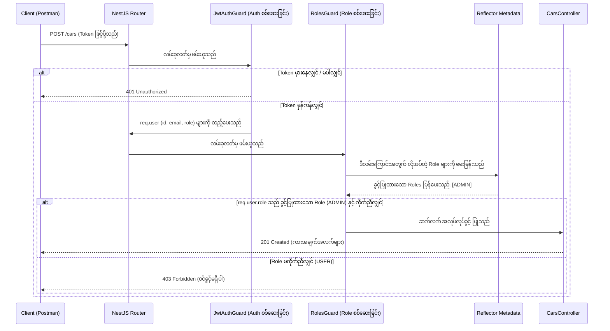
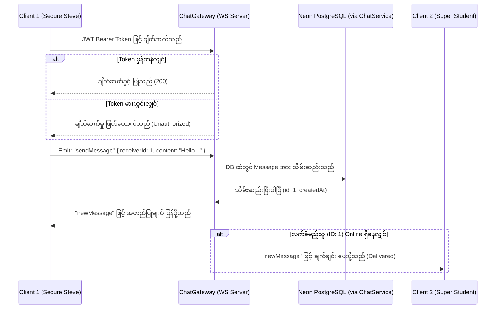

# Day 7: Route Guards & Real-Time WebSocket Chat 🎟️💬

ဒီနေ့မှာတော့ ကျွန်တော်တို့ရဲ့ API လမ်းကြောင်းတွေကို ရာထူးအလိုက် ကန့်သတ်တဲ့စနစ် Role-Based Access Control (RBAC) နဲ့ လုံခြုံအောင် လုပ်ခဲ့ပါတယ်။ ဒါ့အပြင် WebSockets (`Socket.io`) ကို သုံးပြီး အချိန်နဲ့တစ်ပြေးညီ (Real-time) အလုပ်လုပ်တဲ့၊ လုံခြုံရေးအပြည့်ရှိတဲ့ Chat messaging စနစ်ကိုလည်း အောင်မြင်စွာ တည်ဆောက်နိုင်ခဲ့ပါတယ်။

---

## 🧠 Core Architecture Concepts (အဓိက တည်ဆောက်ပုံ သဘောတရားများ - Masterclass)

Code တွေကို မကြည့်ခင်မှာ၊ Route guards တွေ၊ Security ပိုင်းတွေနဲ့ WebSocket protocol တွေရဲ့ အဓိက ကွာခြားချက်တွေကို နားလည်ထားဖို့ အလွန်အရေးကြီးပါတယ်။

### 1. NestJS တွင် Role-Based Access Control (RBAC) အလုပ်လုပ်ပုံ
လုပ်ဆောင်ချက် အချို့ (ဥပမာ - ကားအသစ်ထည့်ခြင်း) ကို ကာကွယ်ဖို့အတွက် လုံခြုံရေး အဆင့် ၃ ဆင့်ပါတဲ့ စနစ်ကို သုံးပါတယ်:
1. **The Role Enum:** Database မှာ User တွေရဲ့ ရာထူး (`USER` နဲ့ `ADMIN`) ကို သတ်မှတ်ပါတယ်။
2. **The Roles Decorator (`@Roles`):** ဘယ်လမ်းကြောင်းမှာ ဘယ်ရာထူးတွေပဲ ဝင်ခွင့်ရှိတယ်ဆိုတာကို သတ်မှတ်ပေးတဲ့ (Metadata တပ်ပေးတဲ့) ကိုယ်ပိုင် Decorator လေးတစ်ခုပါ။
3. **The Roles Guard (`RolesGuard`):** User ရဲ့ JWT token ကို စစ်ဆေးပြီး၊ လက်ရှိသွားမယ့် လမ်းကြောင်းမှာ လိုအပ်တဲ့ ရာထူးနဲ့ ကိုက်ညီမှု ရှိ/မရှိ စစ်ဆေးကာ ဝင်ခွင့် ပြု/မပြု ဆုံးဖြတ်ပေးတဲ့ Guard ဖြစ်ပါတယ်။



---

### 2. WebSockets vs. HTTP: ဘာလို့ Socket.io ကို သုံးတာလဲ?
*   **HTTP (Request/Response):** Client ဘက်ကနေ Server ဆီကို *"Message အသစ် ရောက်ပြီလား?"* ဆိုပြီး အမြဲတမ်း မေးနေရပါတယ် (Polling)။ ဒါက Network data တွေ၊ Server ရဲ့ အင်အားတွေနဲ့ ဖုန်းဘက်ထရီတွေကို အလကား ကုန်ဆုံးစေပါတယ်။
*   **WebSockets (Bi-directional Pipe):** လမ်းကြောင်းကို အမြဲတမ်း ဖွင့်ထားပေးတဲ့ စနစ်ပါ။ Client ရော Server ပါ အချက်အလက်တွေကို တစ်ဖက်နဲ့တစ်ဖက် ချက်ချင်း (Instantly) တွန်းပို့လို့ ရပါတယ်။
*   **Socket.IO:** ရိုးရိုး WebSockets အစား Socket.IO ကို ဘာလို့သုံးလဲဆိုရင်၊ သူက လိုင်းကျသွားရင် ပြန်ချိတ်ပေးတာတွေ၊ WebSockets သုံးလို့မရတဲ့ အခြေအနေမျိုးမှာ HTTP polling ကို အလိုအလျောက် ပြောင်းလဲအသုံးပြုပေးတာတွေနဲ့ Event-driven (ဥပမာ `client.emit('event')`) ပုံစံမျိုး ရေးရတာ ပိုလွယ်ကူလို့ ဖြစ်ပါတယ်။



---

## 🛠️ Step-by-Step Implementation (အဆင့်လိုက် တည်ဆောက်ခြင်း)

## 📚 Section 1: Route Guards & Access Controls (RBAC)

### Step 1.1: Create `@Roles()` Decorator (`src/auth/roles.decorator.ts`)
ဒီ Decorator လေးက Route တွေမှာ ဘယ်ရာထူးတွေ ဝင်ခွင့်ရှိလဲဆိုတာကို သတ်မှတ်ပေးပါတယ်။ သူက `'roles'` ဆိုတဲ့ Key နဲ့ Metadata တွေကို ရေးမှတ်ပေးတာပါ။
```typescript
import { SetMetadata } from '@nestjs/common';
import { Role } from '@prisma/client';

export const ROLES_KEY = 'roles';
export const Roles = (...roles: Role[]) => SetMetadata(ROLES_KEY, roles);
```

### Step 1.2: Create the `RolesGuard` (`src/auth/roles.guard.ts`)
`RolesGuard` ဟာ NestJS ရဲ့ `Reflector` ကို သုံးပြီး Route မှာ တပ်ထားတဲ့ Metadata တွေကို ဖတ်ယူကာ၊ လက်ရှိ ဝင်ရောက်လာတဲ့ User ရဲ့ Role နဲ့ ကိုက်ညီမှု ရှိ/မရှိ စစ်ဆေးပေးပါတယ်။
```typescript
import { Injectable, CanActivate, ExecutionContext } from '@nestjs/common';
import { Reflector } from '@nestjs/core';
import { Role } from '@prisma/client';
import { ROLES_KEY } from './roles.decorator';

@Injectable()
export class RolesGuard implements CanActivate {
    constructor(private reflector: Reflector) { }

    canActivate(context: ExecutionContext): boolean {
        // 1. Method သို့မဟုတ် Class မှာ တပ်ထားတဲ့ Roles Metadata ကို ဖတ်ပါမယ်
        const requiredRoles = this.reflector.getAllAndOverride<Role[]>(ROLES_KEY, [
            context.getHandler(),
            context.getClass(),
        ]);

        // 2. တကယ်လို့ Role မတောင်းထားဘူးဆိုရင်၊ မည်သူမဆို ဝင်ခွင့်ရှိပါတယ်!
        if (!requiredRoles) {
            return true;
        }

        // 3. Request object ကို ဆွဲထုတ်ပါမယ်
        const { user } = context.switchToHttp().getRequest();

        // 4. User အချက်အလက် မပါလာဘူးဆိုရင် ပိတ်ပင်ပါမယ်
        if (!user) {
            return false;
        }

        // 5. User ရဲ့ Role ဟာ တောင်းဆိုထားတဲ့ Role တွေထဲက တစ်ခုခုနဲ့ ကိုက်ညီမှု ရှိမရှိ စစ်ဆေးပါမယ်
        return requiredRoles.some((role) => user.role === role);
    }
}
```

### Step 1.3: Secure Cars Routes (`src/cars/cars.controller.ts`)
ကားစာရင်းတွေကို ပြင်ဆင်တာ၊ ဖျက်တာတွေကို Admin သီးသန့် လုပ်လို့ရအောင် `CarsController` ကို ပြင်ဆင်ခဲ့ပါတယ်။
*   `GET /cars` ကိုတော့ မည်သူမဆို ကြည့်လို့ရအောင် ဖွင့်ထားပေးပါတယ်။
*   `POST`, `PATCH`, နဲ့ `DELETE` တွေကိုတော့ `ADMIN` အဖြစ် လော့ဂ်အင် ဝင်ထားမှသာ ခွင့်ပြုထားပါတယ်။

```typescript
import { 
  Controller, Get, Post, Body, Patch, Param, Delete 
} from '@nestjs/common';
import { CarsService } from './cars.service';
import { CreateCarDto } from './dto/create-car.dto';
import { UpdateCarDto } from './dto/update-car.dto';

import { UseGuards } from '@nestjs/common';
import { JwtAuthGuard } from '../auth/jwt.guard';
import { RolesGuard } from '../auth/roles.guard';
import { Roles } from '../auth/roles.decorator';
import { Role } from '@prisma/client';

@Controller('cars')
export class CarsController {
  constructor(private readonly carsService: CarsService) { }

  @Post()
  @UseGuards(JwtAuthGuard, RolesGuard)
  @Roles(Role.ADMIN) // Admin သီးသန့်ဖြစ်ကြောင်း သတ်မှတ်သည်
  create(@Body() createCarDto: CreateCarDto) {
    return this.carsService.create(createCarDto);
  }

  @Get()
  findAll() {
    return this.carsService.findAll();
  }

  @Get(':id')
  findOne(@Param('id') id: string) {
    return this.carsService.findOne(+id);
  }

  @Patch(':id')
  @UseGuards(JwtAuthGuard, RolesGuard)
  @Roles(Role.ADMIN) // Admin သီးသန့်
  update(@Param('id') id: string, @Body() updateCarDto: UpdateCarDto) {
    return this.carsService.update(+id, updateCarDto);
  }

  @Delete(':id')
  @UseGuards(JwtAuthGuard, RolesGuard)
  @Roles(Role.ADMIN) // Admin သီးသန့်
  remove(@Param('id') id: string) {
    return this.carsService.remove(+id);
  }
}
```

### Step 1.4: Securing Bookings (`src/bookings/bookings.controller.ts` & `bookings.service.ts`)
User တွေအနေနဲ့ ကိုယ်တိုင် ဘိုကင် (Booking) လုပ်ထားတဲ့ အရာတွေကိုပဲ စီမံလို့ရအောင် Lock ချခဲ့ပါတယ်။
1.  **Creation Security:** ကားငှားတဲ့အခါ ရိုးရိုး `USER` တွေက တခြားသူတွေရဲ့ `userId` ကို အသုံးချပြီး ငှားလို့မရအောင် ကာကွယ်ထားပါတယ်။ Controller ဟာ User ပေးပို့လိုက်တဲ့ အချက်အလက်ထဲက `userId` ကို အသုံးမပြုဘဲ၊ Token ထဲမှာ ပါလာတဲ့ အစစ်အမှန် `userId` ကိုသာ အတင်းအကျပ် အစားထိုး အသုံးပြုပါတယ်။ ဒါပေမယ့် `ADMIN` တွေကတော့ တခြားသူတွေ ကိုယ်စား ဝင်ရောက်ငှားရမ်းပေးခွင့် ရှိပါတယ်။
2.  **Filter Search Security:** ရိုးရိုး User တွေက ဘိုကင်စာရင်း တောင်းတဲ့အခါ သူတို့ရဲ့ `userId` နဲ့ သက်ဆိုင်တဲ့ စာရင်းကိုပဲ ရရှိပါမယ်။ Admin တွေကတော့ စာရင်းအားလုံးကို မြင်တွေ့ရမှာ ဖြစ်ပါတယ်။

#### Controller Code:
```typescript
import { 
  Controller, Get, Post, Body, UseGuards, Request 
} from '@nestjs/common';
import { BookingsService } from './bookings.service';
import { CreateBookingDto } from './dto/create-booking.dto';
import { JwtAuthGuard } from '../auth/jwt.guard';

@Controller('bookings')
@UseGuards(JwtAuthGuard) // ဒီ Controller ထဲက Route အားလုံးကို ကာကွယ်ထားပါသည်
export class BookingsController {
    constructor(private readonly bookingsService: BookingsService) { }

    @Post()
    create(@Body() createBookingDto: CreateBookingDto, @Request() req: any) {
        // Security: စစ်မှန်သော Token ထဲမှ userId ကို ဆွဲထုတ်ပါသည်
        // ADMIN ဆိုလျှင် တခြားသူကိုယ်စား ဘိုကင်လုပ်ခွင့် ပြုပါမည် (Body ထဲမှ userId ကို သုံးမည်)
        // USER ဆိုလျှင် မိမိကိုယ်ပိုင် userId ကိုသာ အတင်းအကျပ် အသုံးပြုစေမည်
        const user = req.user;
        const userIdToUse = user.role === 'ADMIN'
            ? (createBookingDto.userId || user.userId)
            : user.userId;

        return this.bookingsService.create({
            ...createBookingDto,
            userId: userIdToUse,
        });
    }

    @Get()
    findAll(@Request() req: any) {
        // Role အလိုက် Filter လုပ်ပေးနိုင်ရန် Authenticated user အချက်အလက်များကို Service ထံ ပို့ပေးပါသည်
        return this.bookingsService.findAll(req.user);
    }
}
```

#### Service Code:
```typescript
import { Injectable, ConflictException } from '@nestjs/common';
import { PrismaService } from '../prisma/prisma.service';
import { CreateBookingDto } from './dto/create-booking.dto';

@Injectable()
export class BookingsService {
    constructor(private prisma: PrismaService) { }

    async create(createBookingDto: CreateBookingDto) {
        const { carId, startDate, endDate } = createBookingDto;
        // 1. ရက်ထပ်နေခြင်း ရှိ/မရှိ စစ်ဆေးပါမယ်
        const existingBooking = await this.prisma.booking.findFirst({
            where: {
                carId: carId,
                AND: [
                    { startDate: { lte: new Date(endDate) } },
                    { endDate: { gte: new Date(startDate) } },
                ],
            },
        });
        if (existingBooking) {
            throw new ConflictException(
                'This car is already booked for the selected dates! 🚫'
            );
        }
        // 2. ရက်မထပ်ဘူးဆိုရင် Booking အသစ် ဖန်တီးပါမယ်
        return this.prisma.booking.create({
            data: createBookingDto,
            include: { car: true, user: true },
        });
    }

    async findAll(user: { userId: number; role: string }) {
        // RBAC: ရိုးရိုး USER က မိမိ Bookings ကိုသာ မြင်ရမည်။ ADMIN က အားလုံးကို မြင်ရမည်။
        if (user.role === 'ADMIN') {
            return this.prisma.booking.findMany({
                include: { car: true, user: true },
            });
        }
        return this.prisma.booking.findMany({
            where: {
                userId: user.userId, // Authenticated user ၏ ID ဖြင့်သာ စစ်ထုတ်ပါသည်
            },
            include: { car: true, user: true },
        });
    }
}
```

---

## 💬 Section 2: Real-Time WebSockets Chat

### Step 2.1: Add the `Message` Model (`prisma/schema.prisma`)
`Message` ကို Database ထဲ သိမ်းဖို့အတွက်၊ ပို့သူ (Sender) နဲ့ လက်ခံသူ (Receiver) နှစ်ယောက်လုံးကို ချိတ်ဆက်ပေးမယ့် `Message` Model အသစ်ကို ထည့်သွင်းခဲ့ပါတယ်။
```prisma
model User {
  id               Int       @id @default(autoincrement())
  email            String    @unique
  name             String?
  password         String
  refreshToken     String?
  role             Role      @default(USER)
  bookings         Booking[]
  sentMessages     Message[] @relation("SentMessages")
  receivedMessages Message[] @relation("ReceivedMessages")
  createdAt        DateTime  @default(now())
  updatedAt        DateTime  @updatedAt
}

model Message {
  id         Int      @id @default(autoincrement())
  content    String
  createdAt  DateTime @default(now())

  senderId   Int
  sender     User     @relation("SentMessages", fields: [senderId], references: [id])

  receiverId Int
  receiver   User     @relation("ReceivedMessages", fields: [receiverId], references: [id])
}
```
> *ပြင်ဆင်ပြီးတိုင်း `npx prisma db push` ကို run ပေးပါ။*

### Step 2.2: Implement `ChatService` (`src/chat/chat.service.ts`)
Chat message တွေကို Database ထဲ သိမ်းဆည်းဖို့နဲ့၊ User နှစ်ယောက်ကြားက Chat history (စကားပြောမှတ်တမ်း) တွေကို ပြန်ဆွဲထုတ်ပေးဖို့ တာဝန်ယူပါတယ်။
```typescript
import { Injectable } from '@nestjs/common';
import { PrismaService } from 'src/prisma/prisma.service';

@Injectable()
export class ChatService {
    constructor(private readonly prisma: PrismaService) { }

    // 1. Chat message အသစ်ကို Database တွင် သိမ်းဆည်းမည်
    async saveMessage(senderId: number, receiverId: number, content: string) {
        return this.prisma.message.create({
            data: {
                content,
                senderId,
                receiverId,
            },
            include: {
                sender: {
                    select: {
                        id: true,
                        email: true,
                        name: true,
                    },
                },
            },
        });
    }

    // 2. User 1 နဲ့ User 2 ကြားက Message တွေကို အချိန်အလိုက် ပြန်စီပြီး ဆွဲထုတ်ပေးမည်
    async getChatHistory(userId1: number, userId2: number) {
        return this.prisma.message.findMany({
            where: {
                OR: [
                    { senderId: userId1, receiverId: userId2 },
                    { senderId: userId2, receiverId: userId1 },
                ],
            },
            orderBy: {
                createdAt: 'asc',
            },
            include: {
                sender: {
                    select: {
                        id: true,
                        email: true,
                        name: true,
                    },
                },
                receiver: {
                    select: {
                        id: true,
                        email: true,
                        name: true,
                    },
                },
            },
        });
    }
}
```

### Step 2.3: Implement `ChatGateway` (`src/chat/chat.gateway.ts`)
Socket.io ချိတ်ဆက်မှုတွေကို စီမံပေးတယ်၊ ချိတ်ဆက်လာတဲ့ JWT Token တွေကို စစ်ဆေးတယ်၊ Online ရှိနေတဲ့ သူတွေကို မှတ်သားထားပြီး Message တွေကို လိုက်ပို့ပေးပါတယ်။
```typescript
import {
    WebSocketGateway,
    SubscribeMessage,
    MessageBody,
    ConnectedSocket,
    OnGatewayConnection,
    OnGatewayDisconnect,
    WebSocketServer,
} from '@nestjs/websockets';
import { Server, Socket } from 'socket.io';
import { JwtService } from '@nestjs/jwt';
import { ChatService } from './chat.service';
import { UnauthorizedException } from '@nestjs/common';

@WebSocketGateway({
    cors: {
        origin: '*',
    },
})
export class ChatGateway implements OnGatewayConnection, OnGatewayDisconnect {
    @WebSocketServer()
    server: Server;

    // Online ရှိနေသော User များကို မှတ်သားထားရန်: Map<userId (number), socketId (string)>
    private activeConnections = new Map<number, string>();

    constructor(
        private readonly jwtService: JwtService,
        private readonly chatService: ChatService,
    ) { }

    // Socket လာချိတ်တဲ့အခါ Token ကို စစ်ဆေးပါမည်
    async handleConnection(client: Socket) {
        try {
            const authHeader =
                client.handshake.headers.authorization ||
                client.handshake.auth?.token ||
                client.handshake.query?.token;

            if (!authHeader) {
                console.log('WebSocket ဝင်ခွင့် ငြင်းပယ်သည်: Token မတွေ့ရှိပါ။');
                client.disconnect();
                return;
            }

            // 'Bearer <token>' ပုံစံရော၊ Raw token အကြမ်းထည်ရော နှစ်ခုစလုံးကို လက်ခံပေးပါသည်
            const token = typeof authHeader === 'string' && authHeader.startsWith('Bearer ')
                ? authHeader.replace('Bearer ', '')
                : authHeader;

            // JWT Token ကို စစ်ဆေးပါမည် (Secret key က Day 6 နဲ့ တူရပါမယ်)
            const payload = await this.jwtService.verifyAsync(token, {
                secret: 'MY_SUPER_SECRET_KEY_123',
            });

            // User ရဲ့ အချက်အလက်တွေကို Socket object ထဲမှာ ခေတ္တသိမ်းထားပါမည်
            client.data.user = {
                userId: payload.sub,
                email: payload.email,
                role: payload.role,
            };

            // Active Connections ထဲမှာ မှတ်သားထားပါမည်
            this.activeConnections.set(payload.sub, client.id);
            console.log(`WebSocket Connected: ${payload.email} (${client.id})`);
        } catch (err) {
            console.log('WebSocket ဝင်ခွင့် ငြင်းပယ်သည်: Token မှားယွင်းနေပါသည်။', err.message);
            client.disconnect();
        }
    }

    // Client လိုင်းကျသွားတဲ့အခါ မှတ်သားထားတာတွေ ပြန်ဖျက်ပါမည်
    handleDisconnect(client: Socket) {
        if (client.data.user) {
            this.activeConnections.delete(client.data.user.userId);
            console.log(`WebSocket Disconnected: ${client.data.user.email}`);
        }
    }

    // Client ဆီမှ "sendMessage" ဆိုသော Event ကို နားထောင်နေပါမည်
    @SubscribeMessage('sendMessage')
    async handleMessage(
        @MessageBody() data: { receiverId: number; content: string },
        @ConnectedSocket() client: Socket,
    ) {
        const sender = client.data.user;
        if (!sender) {
            throw new UnauthorizedException('Socket ကို Authenticate လုပ်မထားပါ။');
        }

        // 1. Message ကို DB ထဲတွင် သိမ်းပါမည်
        const message = await this.chatService.saveMessage(
            sender.userId,
            data.receiverId,
            data.content,
        );

        const formattedMessage = {
            id: message.id,
            content: message.content,
            createdAt: message.createdAt,
            senderId: message.senderId,
            receiverId: message.receiverId,
            sender: {
                id: message.sender.id,
                email: message.sender.email,
                name: message.sender.name,
            },
        };

        // 2. လက်ခံမည့်သူက Online ရှိနေလျှင် သူ၏ Socket ဆီသို့ Message ပို့ပါမည်
        const receiverSocketId = this.activeConnections.get(data.receiverId);
        if (receiverSocketId) {
            this.server.to(receiverSocketId).emit('newMessage', formattedMessage);
        }

        // 3. ပို့လိုက်တဲ့သူဆီကိုလည်း အတည်ပြုချက်အနေနဲ့ ပြန်ပို့ပေးပါမည်
        client.emit('newMessage', formattedMessage);

        return formattedMessage;
    }
}
```

### Step 2.4: Implement `ChatController` (`src/chat/chat.controller.ts`)
Chat history တွေကို Frontend ကနေ လှမ်းယူလို့ရအောင် REST API တစ်ခု ဖွင့်ပေးထားပါတယ်။
```typescript
import { 
  Controller, Get, Param, UseGuards, Request, ParseIntPipe 
} from '@nestjs/common';
import { JwtAuthGuard } from 'src/auth/jwt.guard';
import { ChatService } from './chat.service';

@UseGuards(JwtAuthGuard)
@Controller('chat')
export class ChatController {
    constructor(private readonly chatService: ChatService) { }

    // လက်ရှိ User နဲ့ အခြား User တစ်ယောက်ကြားက Chat History ကို ယူပါမည်
    @Get('history/:userId')
    async getHistory(
        @Param('userId', ParseIntPipe) chatPartnerId: number,
        @Request() req: any,
    ) {
        const currentUser = req.user;

        // Service ထံမှတဆင့် History များကို ဆွဲထုတ်ပါသည်
        return this.chatService.getChatHistory(
          currentUser.userId, 
          chatPartnerId
        );
    }
}
```

### Step 2.5: Connect the Module and Register (`src/chat/chat.module.ts`)
Controllers, services နဲ့ gateways အားလုံးကို တစ်နေရာတည်း စုစည်းပေးလိုက်ပါတယ်။
```typescript
import { Module } from '@nestjs/common';
import { ChatService } from './chat.service';
import { ChatGateway } from './chat.gateway';
import { ChatController } from './chat.controller';
import { PrismaModule } from 'src/prisma/prisma.module';

@Module({
    imports: [PrismaModule], // Database အသုံးပြုခွင့်ပေးသည်
    controllers: [ChatController],
    providers: [ChatService, ChatGateway],
    exports: [ChatService], // နောက်ပိုင်း Notification တွေမှာ သုံးလို့ရအောင် Export လုပ်ထားပါသည်
})
export class ChatModule { }
```

---

## 🧪 Postman Testing Guide (Postman ဖြင့် စမ်းသပ်ခြင်း)

### 1. Register a test user (စမ်းသပ်ရန် User အသစ် လုပ်မည်)
*   **Method:** `POST`
*   **URL:** `http://localhost:3000/users`
*   **Body (JSON):**
    ```json
    {
      "email": "hacker_proof@test.com",
      "name": "Secure Steve",
      "password": "securepassword123"
    }
    ```

### 2. Login to receive an Access Token (လော့ဂ်အင်ဝင်မည်)
*   **Method:** `POST`
*   **URL:** `http://localhost:3000/auth/login`
*   **Body (JSON):**
    ```json
    {
      "email": "hacker_proof@test.com",
      "password": "securepassword123"
    }
    ```
*   *ပြန်ရလာတဲ့ `accessToken` ကို Copy ကူးထားပါ!*

### 3. Open Socket.IO Request in Postman (Postman တွင် Socket.IO ကို ဖွင့်မည်)
1.  **New** -> **Socket.IO** ကို နှိပ်ပါ (Raw WebSocket ကို မရွေးပါနဲ့)။
2.  URL နေရာတွင်: `http://localhost:3000` လို့ ထည့်ပါ။
3.  **Headers** tab အောက်မှာ အောက်ပါအတိုင်း ထည့်ပါ:
    *   **Key:** `Authorization`
    *   **Value:** `Bearer <သင့်ရဲ့_access_token>`
4.  **Connect** ခလုတ်ကို နှိပ်ပါ (အောင်မြင်စွာ ချိတ်ဆက်သွားတာကို တွေ့ရပါမယ်)။

### 4. Listen and Send Messages (Message ပို့/ယူ စမ်းသပ်မည်)
1.  Postman ရဲ့ **Listeners** tab မှာ `newMessage` ဆိုတဲ့ Event လေးကို ထည့်ပေးပါ။
2.  **Message** tab ကို သွားပြီး Event နေရာမှာ `sendMessage` ထည့်၊ Format ကို **JSON** ရွေးပြီး အောက်ပါအတိုင်း ပို့ကြည့်ပါ:
    ```json
    {
      "receiverId": 1,
      "content": "Hello! Is the Toyota Camry available next week?"
    }
    ```
3.  **Send** ကို နှိပ်ပါ။
4.  *Expected:* `newMessage` လို့ နာမည်ပေးထားတဲ့ Listener အောက်မှာ ခုနက Message ကို အောင်မြင်စွာ သိမ်းဆည်းပြီးကြောင်း ပြန်ပေါ်လာပါလိမ့်မယ်။

### 5. Fetch Chat History via REST API (REST API မှတဆင့် History များကို ယူကြည့်မည်)
*   **Method:** `GET`
*   **URL:** `http://localhost:3000/chat/history/1` (`1` နေရာမှာ Message လက်ခံမယ့်သူရဲ့ ID ထည့်ပါ)
*   **Headers:** `Authorization: Bearer <သင့်ရဲ့_access_token>`
*   *Expected:* User 1 ဆီကို ပို့ခဲ့တဲ့ Message တွေ အားလုံးကို Array နဲ့ ပြန်ရပါလိမ့်မယ်။

---

## 🎉 Day 7 Graduation!
သင်ဟာ Role တွေအလိုက် လမ်းကြောင်းတွေကို လုံခြုံအောင် ပိတ်ပင်နိုင်တဲ့စနစ်နဲ့၊ အချိန်နဲ့တစ်ပြေးညီ (Real-time) အလုပ်လုပ်တဲ့ WebSocket Chat စနစ်ကို အောင်မြင်စွာ တည်ဆောက်နိုင်ခဲ့ပါပြီ။

Day 8: Push Notifications အဆင့်ကို ဆက်သွားဖို့ အဆင်သင့် ဖြစ်ပြီလား? 📲
