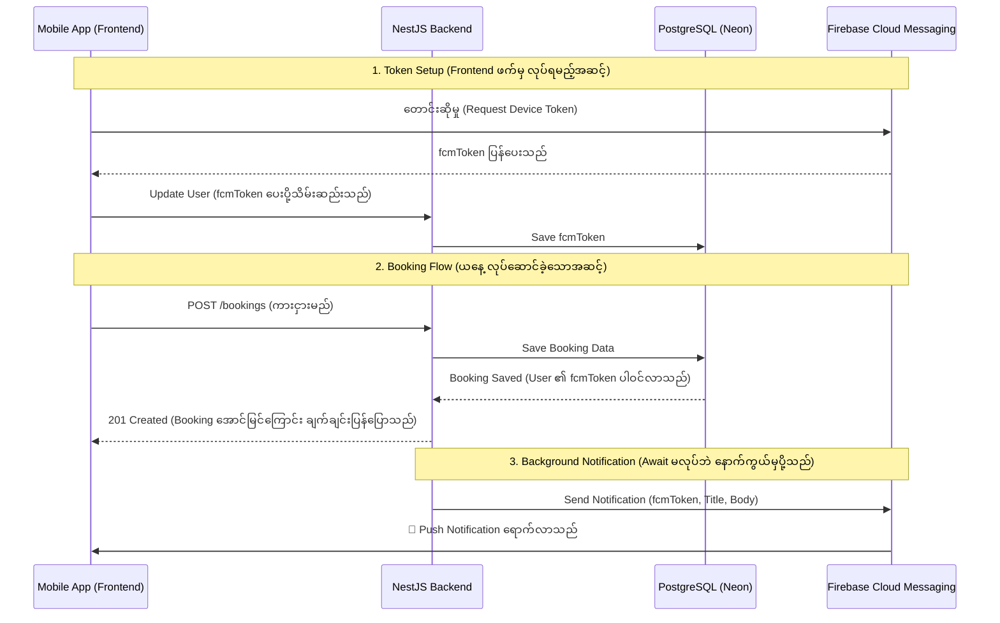

# Day 8: Firebase Admin SDK ဖြင့် Push Notifications ပို့ခြင်း

ယနေ့ သင်ခန်းစာတွင် ကျွန်ုပ်တို့သည် ကားငှားရမ်းမှု (Booking) အောင်မြင်သည့်အခါတိုင်း User ၏ ဖုန်းဆီသို့ အသိပေးစာ (Push Notification) တိုက်ရိုက်ရောက်ရှိစေရန် **Firebase Cloud Messaging (FCM)** စနစ်ကို NestJS Backend တွင် အောင်မြင်စွာ တပ်ဆင်နိုင်ခဲ့သည်။

---

## 🧠 Core Architecture Concepts (အခြေခံ သဘောတရားများ)

Code များကို မလေ့လာမီ၊ Push Notification အလုပ်လုပ်ပုံနှင့် Firebase ၏ အခန်းကဏ္ဍကို နားလည်ထားရန် အရေးကြီးသည်။

### 1. ဘာကြောင့် Firebase Admin SDK ကို သုံးရတာလဲ?
သာမန် Frontend တွင် သုံးသော Firebase SDK သည် User တစ်ယောက်ချင်းစီ၏ အခွင့်အရေး (Client-side Security Rules) ပေါ်တွင် အခြေခံသည်။ သို့သော် Backend (NestJS) တွင် **Firebase Admin SDK** ကို အသုံးပြုခြင်းအားဖြင့် Security Rules များကို ကျော်လွန်ကာ Admin အခွင့်အရေးအပြည့်ဖြင့် (ဥပမာ - ကြိုက်သည့်ဖုန်းဆီသို့ Notification လှမ်းပို့ခြင်း) စိတ်ချယုံကြည်စွာ လုပ်ဆောင်နိုင်မည် ဖြစ်သည်။ အဆိုပါ Admin အခွင့်အရေးကို ရရှိရန် `serviceAccountKey.json` ဟူသော Private Key ဖိုင်ကို အသုံးပြုရသည်။

### 2. Push Notification အလုပ်လုပ်ပုံ (Flow)

အောက်ပါ Sequence Diagram သည် Push Notification စနစ် အစမှအဆုံး အလုပ်လုပ်ပုံကို ပြသထားသည်။



---

## 🛠️ Step-by-Step Implementation Guide

### Step 1: Database တွင် Device Token သိမ်းရန် နေရာဖန်တီးခြင်း
User တစ်ယောက်ချင်းစီ၏ ဖုန်းကို ခွဲခြားသိနိုင်ရန် `fcmToken` ကို `schema.prisma` ရှိ `User` model တွင် ထည့်သွင်းခဲ့သည်။

```prisma
// prisma/schema.prisma

model User {
  id               Int       @id @default(autoincrement())
  email            String    @unique
  name             String?
  // ... (အခြားအချက်အလက်များ)
  fcmToken         String?   // 👈 Mobile Device Token သိမ်းရန်
  
  createdAt        DateTime  @default(now())
  updatedAt        DateTime  @updatedAt
}
```
> ပြင်ဆင်ပြီးနောက် `npx prisma db push` ကို Run ၍ Database သို့ အပြောင်းအလဲများ ပို့ဆောင်ခဲ့သည်။

---

### Step 2: Firebase Admin SDK ထည့်သွင်းခြင်း
Backend အတွက် လိုအပ်သော Package ကို Install လုပ်ခဲ့သည်။

```bash
npm install firebase-admin
```

ထို့နောက် Firebase Console မှ **Generate new private key** ဖြင့် `serviceAccountKey.json` ကို ဒေါင်းလုဒ်ဆွဲကာ `backend/` folder အတွင်း ထည့်သွင်းခဲ့သည်။ ဤဖိုင်သည် အလွန်အရေးကြီးသောကြောင့် GitHub သို့ မရောက်စေရန် `.gitignore` တွင် ကြိုတင် ထည့်သွင်းထားခဲ့သည်။

---

### Step 3: Global Firebase Module နှင့် Service တည်ဆောက်ခြင်း

Notification ပို့သည့် အလုပ်ကို သီးသန့်တာဝန်ယူရန် `FirebaseService` ကို တည်ဆောက်ခဲ့သည်။

**`src/firebase/firebase.service.ts`**
```typescript
import { Injectable, Logger } from '@nestjs/common';
import * as admin from 'firebase-admin';
import * as path from 'path';

@Injectable()
export class FirebaseService {
  private readonly logger = new Logger(FirebaseService.name);

  constructor() {
    try {
      // 1. Private Key ဖိုင်ကို ဖတ်ခြင်း
      const serviceAccountPath = path.resolve(process.cwd(), 'serviceAccountKey.json');
      const serviceAccount = require(serviceAccountPath);

      // 2. Firebase App ကို Initialize လုပ်ခြင်း
      if (!admin.apps.length) {
        admin.initializeApp({
          credential: admin.credential.cert(serviceAccount),
        });
        this.logger.log('Firebase Admin SDK initialized successfully. 🚀');
      }
    } catch (error) {
      this.logger.error('Failed to initialize Firebase Admin SDK ❌', error);
    }
  }

  // Notification ပို့ပေးမည့် Method
  async sendPushNotification(token: string, title: string, body: string, data?: any) {
    try {
      const message: admin.messaging.Message = {
        notification: { title, body },
        data: data || {},
        token: token, 
      };

      const response = await admin.messaging().send(message);
      this.logger.log(`Successfully sent message: ${response}`);
      return response;
    } catch (error) {
      this.logger.error('Error sending push notification', error);
    }
  }
}
```

ဤ Service ကို မည်သည့်နေရာမှမဆို အလွယ်တကူ ခေါ်သုံးနိုင်ရန် `@Global()` ဖြင့် `FirebaseModule` အဖြစ် တည်ဆောက်ခဲ့သည်။

**`src/firebase/firebase.module.ts`**
```typescript
import { Global, Module } from '@nestjs/common';
import { FirebaseService } from './firebase.service';

@Global() 
@Module({
  providers: [FirebaseService],
  exports: [FirebaseService], 
})
export class FirebaseModule {}
```
ထို့နောက် `app.module.ts` တွင် `FirebaseModule` ကို import လုပ်ခဲ့သည်။

---

### Step 4: Booking ဝင်လာလျှင် Notification တိုက်ရိုက်ပို့ခြင်း

Booking အသစ် ဝင်လာသည့်အချိန်တွင်၊ Database သို့ မှတ်တမ်းတင်ပြီးသည်နှင့် တစ်ပြိုင်နက် User ၏ ဖုန်းဆီသို့ Notification ပို့ရန် `BookingsService` တွင် ပြင်ဆင်ခဲ့သည်။

**`src/bookings/bookings.service.ts`**
```typescript
import { Injectable, ConflictException } from '@nestjs/common';
import { PrismaService } from '../prisma/prisma.service';
import { CreateBookingDto } from './dto/create-booking.dto';
import { FirebaseService } from 'src/firebase/firebase.service';

@Injectable()
export class BookingsService {
    // 1. FirebaseService ကို Inject လုပ်ခြင်း
    constructor(private prisma: PrismaService, private firebaseService: FirebaseService) { }

    async create(createBookingDto: CreateBookingDto) {
        // ... (ကားရက်ထပ်မထပ် စစ်ဆေးသည့် အပိုင်း) ...

        // 2. Booking အသစ်ကို Database သို့ Save ခြင်း
        const newBooking = await this.prisma.booking.create({
            data: createBookingDto,
            include: { car: true, user: true },
        });

        // 3. User တွင် fcmToken ရှိပါက Notification လှမ်းပို့ခြင်း
        if (newBooking.user && newBooking.user.fcmToken) {
            const title = 'Booking Confirmed! 🎉';
            const body = `Your booking for ${newBooking.car.brand} ${newBooking.car.model} is successful.`;

            // Await မခံထားသောကြောင့် Booking API ကို နှေးကွေးမသွားစေပါ (Fire and forget)
            this.firebaseService.sendPushNotification(
                newBooking.user.fcmToken,
                title,
                body
            );
        }
        return newBooking; 
    }
    // ...
}
```

---

## 🧪 Testing (စမ်းသပ်နည်း အဆင့်ဆင့်)

Frontend (Mobile App) မရှိသေးသောကြောင့် အစစ်အမှန် Device Token မရနိုင်သေးပါ။ သို့သော် `dummy-token-123` ဟူသော ဖုန်း Token အတုတစ်ခုကို အသုံးပြု၍ Backend လမ်းကြောင်း မှန်ကန်မှု ရှိမရှိကို အောက်ပါအတိုင်း အသေးစိတ် စမ်းသပ်နိုင်ပါသည်။

### အဆင့် ၁: Dummy Token ထည့်သွင်းခြင်း
1. Terminal အသစ်တစ်ခုဖွင့်၍ `npx prisma studio` ဟု ရိုက်ထည့်ကာ Prisma Studio ကို ဖွင့်ပါ။
2. **User** table ထဲသို့ ဝင်ပါ။
3. သင် လက်ရှိ စမ်းသပ်မည့် User အကောင့်၏ `fcmToken` ကွက်လပ်တွင် `dummy-token-123` ဟု ရိုက်ထည့်ပြီး Save ပြုလုပ်ပါ။

### အဆင့် ၂: Postman မှတစ်ဆင့် Booking အသစ် ဖန်တီးခြင်း
1. **Postman** ကို ဖွင့်ပါ။
2. ယခင်က ဖန်တီးထားသော Login API ကို လှမ်းခေါ်၍ Access Token အသစ်ကို ယူပါ။
3. Request အသစ်တစ်ခု ဖန်တီးပြီး Method ကို **POST** အဖြစ် ပြောင်းကာ `http://localhost:3000/bookings` သို့ ချိန်ပါ။
4. **Authorization** tab သို့ သွား၍ Type ကို `Bearer Token` ရွေးချယ်ကာ စောစောက ရထားသော JWT Token ကို ထည့်ပါ။
5. **Body** tab သို့ သွား၍ `raw` နှင့် `JSON` ကို ရွေးချယ်ပြီး အောက်ပါ Data ကို ထည့်ပါ-
   ```json
   {
       "carId": 1,
       "startDate": "2026-06-15T00:00:00Z",
       "endDate": "2026-06-20T00:00:00Z",
       "totalPrice": 150.00
   }
   ```
   *(မှတ်ချက် - `carId` နေရာတွင် သင့် Database ထဲ၌ တကယ်ရှိသော ကား၏ ID ကို ထည့်ပါ)*
6. **Send** ခလုတ်ကို နှိပ်ပါ။

### 📊 Testing Results & Analysis (ရလဒ်နှင့် အကဲဖြတ်ချက်)

**ရလဒ်:**
Postman တွင် Booking အောင်မြင်ကြောင်း (201 Created) ပြသမည်ဖြစ်ပြီး၊ NestJS run နေသော Terminal တွင်မူ အောက်ပါ Error အား တွေ့ရှိရမည်ဖြစ်သည်။
> `ERROR [FirebaseService] FirebaseMessagingError: The registration token is not a valid FCM registration token`

**အကဲဖြတ်ချက်:**
ဤ Error သည် **အောင်မြင်မှု၏ လက္ခဏာ** ဖြစ်သည်။ အဘယ်ကြောင့်ဆိုသော် ကျွန်ုပ်တို့၏ NestJS Backend မှ Firebase ဆီသို့ လှမ်းချိတ်ဆက်ပြီး Notification ပို့ရန် ကြိုးစားမှု အောင်မြင်သွားကြောင်းနှင့် ဖုန်း Token အတုဖြစ်နေ၍သာ Firebase မှ ပယ်ချလိုက်ခြင်းဖြစ်ကြောင်း သက်သေပြနေသောကြောင့် ဖြစ်သည်။ နောက်ပိုင်း Frontend နှင့် ချိတ်ဆက်ရာတွင် အစစ်အမှန် Token ကို အသုံးပြုလိုက်သည်နှင့် Notification များ အပြည့်အဝ အလုပ်လုပ်မည် ဖြစ်သည်။

---
**Day 8 ပြီးဆုံးပါပြီ။ နောက်ရက် Day 9 တွင် Cron Jobs အကြောင်းကို ဆက်လက်လေ့လာပါမည်။** 🚀
