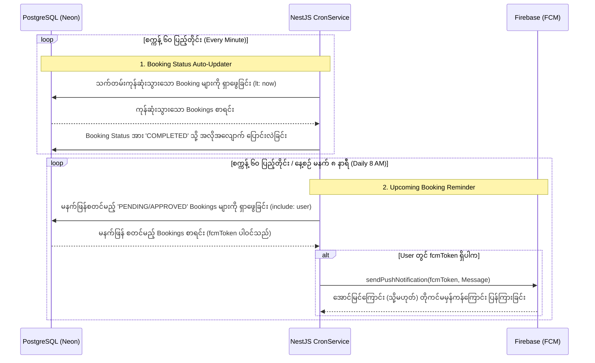
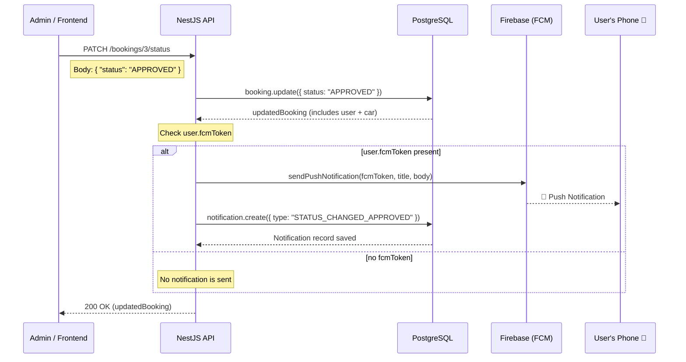

# Day 9: Task Scheduling & Cron Jobs ⏰🤖

ယနေ့ သင်ခန်းစာတွင် ကျွန်ုပ်တို့သည် API များကို client ဘက်မှ လှမ်းခေါ်စရာမလိုဘဲ သတ်မှတ်ထားသည့် အချိန်ရောက်ပါက နောက်ကွယ်မှ အလိုအလျောက် အလုပ်လုပ်ပေးမည့် **Task Scheduling (Cron Jobs)** စနစ်ကို NestJS Backend တွင် တပ်ဆင်ပါမည်။

ထို့အပြင် Database အဆင့်တွင် Booking status များကို စနစ်တကျ ထိန်းချုပ်နိုင်ရန် **Prisma Enum (BookingStatus)** ကိုပါ ပေါင်းစပ်ထည့်သွင်း တည်ဆောက်ပါမည်။

---

## 🧠 Core Architecture Concepts (အခြေခံ သဘောတရားများ)

### 1. Task Scheduling ဆိုသည်မှာ အဘယ်နည်း?

Web application များတွင် client ဘက်မှ action တစ်ခုခု လုပ်ဆောင်မှသာ (ဥပမာ- button နှိပ်ခြင်း၊ API ခေါ်ခြင်း) server ဘက်မှ code အလုပ်လုပ်ခြင်း မဟုတ်ဘဲ၊ သတ်မှတ်ထားသော အချိန်ဇယားအတိုင်း (ဥပမာ- ၁ မိနစ်တစ်ခါ၊ နေ့စဉ် မနက် ၈ နာရီတိုင်း) နောက်ကွယ်မှ အလိုအလျောက် run စေလိုသော task များကို **Task Scheduling / Cron Jobs** ဟု ခေါ်သည်။

### 2. Cron Jobs အလုပ်လုပ်ပုံ (Flow)

အောက်ပါ Sequence Diagram သည် ကျွန်ုပ်တို့ ယနေ့ တည်ဆောက်ခဲ့သော Cron Jobs ၂ ခု အလုပ်လုပ်ပုံကို ပြသထားသည်။



---

## 🛠️ Step-by-Step Implementation Guide

### Step 1: Library များ ထည့်သွင်းခြင်းနှင့် Module စတင်ဖွင့်လှစ်ခြင်း

Cron Job များကို အသုံးပြုနိုင်ရန် NestJS ရဲ့ တရားဝင် package ကို အောက်ပါအတိုင်း ထည့်သွင်းပါမည်-

```bash
npm install --save @nestjs/schedule
```

ထို့နောက် `app.module.ts` တွင် `ScheduleModule.forRoot()` ကို အသုံးပြုကာ တစ်ပရောဂျက်လုံးအတွက် Cron jobs စနစ်ကို စတင်ဖွင့်လှစ်ပါမည်။

**`src/app.module.ts`**

```typescript
import { Module } from "@nestjs/common";
import { ScheduleModule } from "@nestjs/schedule"; // 👈 Import လုပ်ပါ
import { CronModule } from "./cron/cron.module";

@Module({
  imports: [
    // ... (အခြား Module များ)
    ScheduleModule.forRoot(), // 👈 Global တင်ပေးရန်
    CronModule,
  ],
})
export class AppModule {}
```

---

### Step 2: Database တွင် Booking Status အတွက် Enum သတ်မှတ်ခြင်း

Database အဆင့်တွင် Booking status များကို တိတိကျကျ ကန့်သတ်နိုင်ရန် `schema.prisma` တွင် Enum သတ်မှတ်ကာ `Booking` table ၏ `status` နေရာတွင် အစားထိုးပါမည်။

**`prisma/schema.prisma`**

```prisma
model Booking {
  id         Int           @id @default(autoincrement())
  startDate  DateTime
  endDate    DateTime
  totalPrice Float
  status     BookingStatus @default(PENDING) // 👈 String အစား Enum သို့ ပြောင်းလဲခြင်း

  userId     Int
  user       User          @relation(fields: [userId], references: [id])
  carId      Int
  car        Car           @relation(fields: [carId], references: [id])

  createdAt  DateTime      @default(now())
  updatedAt  DateTime      @updatedAt
}

// 👈 Enum သစ် သတ်မှတ်ခြင်း
enum BookingStatus {
  PENDING
  APPROVED
  REJECTED
  CANCELLED
  COMPLETED
}
```

> ပြင်ဆင်ပြီးနောက် `npx prisma db push` နှင့် `npx prisma generate` တို့ကို run ၍ Database နှင့် Prisma Client ကို Update ပြုလုပ်ပါမည်။

---

### Step 3: Cron Service ကို တည်ဆောက်ခြင်း

နောက်ကွယ်မှ အလုပ်လုပ်မည့် Background task များကို `@Cron()` decorator သုံး၍ ရေးသားပါမည်။

**`src/cron/cron.service.ts`**

```typescript
import { Injectable, Logger } from "@nestjs/common";
import { Cron, CronExpression } from "@nestjs/schedule";
import { PrismaService } from "../prisma/prisma.service";
import { FirebaseService } from "../firebase/firebase.service";

@Injectable()
export class CronService {
  private readonly logger = new Logger(CronService.name);

  constructor(
    private readonly prisma: PrismaService,
    private readonly firebaseService: FirebaseService, // Firebase global service အား inject လုပ်ခြင်း
  ) {}

  // Task 1: သက်တမ်းကုန်ဆုံးသွားသော Booking status များကို 'COMPLETED' သို့ အလိုအလျောက် ပြောင်းလဲပေးခြင်း
  @Cron(CronExpression.EVERY_MINUTE)
  async handleAutoCompleteBookings() {
    this.logger.debug("Checking for expired bookings... 🔍");

    const expiredBookings = await this.prisma.booking.findMany({
      where: {
        endDate: {
          lt: new Date(),
        },
        status: {
          in: ["PENDING", "APPROVED"], // သက်တမ်းမကုန်ဆုံးသေးသော status များသာ
        },
      },
    });

    if (expiredBookings.length > 0) {
      for (const booking of expiredBookings) {
        await this.prisma.booking.update({
          where: { id: booking.id },
          data: { status: "COMPLETED" },
        });
        this.logger.log(
          `✅ Booking ID ${booking.id} ကို COMPLETED အဖြစ် ပြောင်းလဲလိုက်ပါပြီ။`,
        );
      }
    }
  }

  // Task 2: မနက်ဖြန် ခရီးစဉ်ရှိသော User များဆီသို့ Push Notification သတိပေးချက် ပို့ပေးခြင်း
  @Cron(CronExpression.EVERY_MINUTE) // *စမ်းသပ်ရန် ၁ မိနစ်တစ်ခါထားရှိပြီး၊ production တွင် EVERY_DAY_AT_8AM သို့ ပြောင်းလဲပါမည်။
  async handleUpcomingBookingReminders() {
    this.logger.debug("Checking for upcoming bookings tomorrow... 🔍");

    const tomorrowStart = new Date();
    tomorrowStart.setDate(tomorrowStart.getDate() + 1);
    tomorrowStart.setHours(0, 0, 0, 0);

    const tomorrowEnd = new Date();
    tomorrowEnd.setDate(tomorrowEnd.getDate() + 1);
    tomorrowEnd.setHours(23, 59, 59, 999);

    const upcomingBookings = await this.prisma.booking.findMany({
      where: {
        startDate: {
          gte: tomorrowStart,
          lte: tomorrowEnd,
        },
        status: {
          in: ["PENDING", "APPROVED"],
        },
      },
      include: {
        user: true,
      },
    });

    for (const booking of upcomingBookings) {
      if (booking.user && booking.user.fcmToken) {
        const title =
          booking.status === "APPROVED"
            ? "ကားငှားရမ်းမှု သတိပေးချက် 🚗"
            : "ခရီးစဉ်အတည်ပြုရန် သတိပေးချက် ⚠️";

        const body =
          booking.status === "APPROVED"
            ? `မင်္ဂလာပါ ${booking.user.name || "User"}၊ ` +
              `မနက်ဖြန်တွင် သင်ငှားရမ်းထားသည့် ကားခရီးစဉ် စတင်တော့မည်ဖြစ်၍ ` +
              `သတိပေးအပ်ပါသည်ခင်ဗျာ။`
            : `မင်္ဂလာပါ ${booking.user.name || "User"}၊ ` +
              `မနက်ဖြန်အတွက် သင်ငှားရမ်းထားသည့် ခရီးစဉ်သည် PENDING ဖြစ်နေဆဲဖြစ်ပါသဖြင့် ` +
              `အတည်ပြုပေးပါရန် သတိပေးအပ်ပါသည်ခင်ဗျာ။`;

        await this.firebaseService.sendPushNotification(
          booking.user.fcmToken,
          title,
          body,
        );

        this.logger.log(
          `🔔 Booking ID ${booking.id} (${booking.status}) အတွက် User ID ${booking.user.id} ` +
            `ဆီသို့ Notification ပို့ပြီးပါပြီ။`,
        );
      } else {
        this.logger.warn(
          `⚠️ Booking ID ${booking.id} ၏ User တွင် FCM Token မရှိသဖြင့် Notification မပို့နိုင်ပါ။`,
        );
      }
    }
  }
}
```

---

## 📝 Booking Status Change Flow



---

## 🧪 Verification & Testing (စမ်းသပ်မှုနှင့် ရလဒ်များ)

စမ်းသပ်မှုပြုလုပ်ရန် Prisma Studio တွင် အောက်ပါအတိုင်း Data ထည့်သွင်းစမ်းသပ်ပါမည်-

1. Booking ID 1, 2 အား အချိန်ကုန်ဆုံးပြီးသားအဖြစ် သတ်မှတ်ပေးပါက console တွင် `Booking ID ... ကို COMPLETED အဖြစ် ပြောင်းလဲလိုက်ပါပြီ` ဟု အလိုအလျောက် ပြောင်းလဲသွားပါမည်။
2. Booking ID 3 (PENDING) နှင့် Booking ID 4 (APPROVED) တို့အား မနက်ဖြန်စတင်မည့် နေ့စွဲများအဖြစ် ပြင်ဆင်ပြီး User ID 3 တွင် FCM Token ဖြည့်သွင်း၍ စမ်းသပ်ပါမည်။
3. စမ်းသပ်မှုရလဒ်အနေဖြင့် console တွင် အောက်ပါအတိုင်း အောင်မြင်စွာ အလုပ်လုပ်သည်ကို တွေ့ရပါမည်-
   - `🔔 Booking ID 3 (PENDING) အတွက် User ID 3 ဆီသို့ Notification ပို့ပြီးပါပြီ။`
   - Firebase SDK ကနေလည်း `FirebaseMessagingError: The registration token is not a valid FCM registration token` ဟူသော Error ကို ပြသပါမည်။ (Database တွင် ထည့်သွင်းထားသော FCM token မှာ အတု ဖြစ်နေခြင်းကြောင့်ဖြစ်ပြီး Firebase စနစ်ဆီသို့ ဆက်သွယ်မိကြောင်း သက်သေပြခြင်း ဖြစ်ပါမည်)

---

## 📦 Step 4: Notification Table တည်ဆောက်ခြင်း (Notification History & Duplicate Prevention)

Push Notification များကို Database ထဲတွင် မှတ်တမ်းတင်သိမ်းဆည်းရန်နှင့် ထပ်ခါတလဲလဲ မပို့မိစေရန်အတွက် `Notification` model အသစ်ကို `schema.prisma` တွင် ထည့်သွင်းပါမည်-

**`prisma/schema.prisma`**

```prisma
model Notification {
  id          Int      @id @default(autoincrement())
  title       String
  body        String
  type        String   // ဥပမာ - "UPCOMING_REMINDER_PENDING", "STATUS_CHANGED_APPROVED"
  isRead      Boolean  @default(false)

  userId      Int
  user        User     @relation(fields: [userId], references: [id])

  bookingId   Int?
  booking     Booking? @relation(fields: [bookingId], references: [id])

  createdAt   DateTime @default(now())
}
```

> `User` model နှင့် `Booking` model တို့တွင်လည်း `notifications Notification[]` relation field ကို ထည့်သွင်းပါမည်။

### Duplicate Prevention Logic (Cron Job ထဲတွင်)

Cron Job run သည့်အခါတိုင်း Notification ပို့ပြီးသော Booking ကို ထပ်မပို့မိစေရန် `type` field တွင် Status ကိုပါ ပူးတွဲသိမ်းဆည်းပါမည်-

```typescript
// စစ်ဆေးသည့်အခါ
const alreadySent = await this.prisma.notification.findFirst({
  where: {
    bookingId: booking.id,
    type: `UPCOMING_REMINDER_${booking.status}`, // Status-specific စစ်ဆေးခြင်း
  },
});
if (alreadySent) continue; // ပို့ပြီးသားဆိုပါက ကျော်သွားပါမည်
```

> ဤနည်းအားဖြင့် Booking တစ်ခုတည်းကိုပင် PENDING ဘဝတွင် Notification တစ်ကြိမ်ပို့ပြီး APPROVED သို့ ပြောင်းလဲသွားပါက Notification အသစ်ကို ထပ်မံပို့ဆောင်ပေးနိုင်ပါမည်။

---

## 🔄 Step 5: Real-time Status Update API တည်ဆောက်ခြင်း

Booking Status ပြောင်းလဲသည့်အချိန်တွင် User ဆီသို့ ချက်ချင်း Notification ပို့ဆောင်ပေးနိုင်ရန် PATCH API endpoint ကို တည်ဆောက်ပါမည်-

**`src/bookings/bookings.service.ts`**

```typescript
async updateStatus(id: number, status: string) {
    const updatedBooking = await this.prisma.booking.update({
        where: { id },
        data: { status: status as any },
        include: { user: true, car: true },
    });

    if (updatedBooking.user && updatedBooking.user.fcmToken) {
        const title = `Booking Status Updated! 🔔`;
        const body =
            `Your booking for ${updatedBooking.car.brand} ${updatedBooking.car.model} ` +
            `has been updated to ${status}.`;

        this.firebaseService.sendPushNotification(
            updatedBooking.user.fcmToken,
            title,
            body,
        );

        await this.prisma.notification.create({
            data: {
                title,
                body,
                type: `STATUS_CHANGED_${status}`,
                userId: updatedBooking.userId,
                bookingId: updatedBooking.id,
            },
        });
    }
    return updatedBooking;
}
```

**`src/bookings/bookings.controller.ts`**

```typescript
@Patch(':id/status')
updateStatus(
    @Param('id') id: string,
    @Body('status') status: string,
) {
    return this.bookingsService.updateStatus(+id, status);
}
```

> API Endpoint: `PATCH http://localhost:3000/bookings/:id/status` (Body: `{ "status": "APPROVED" }`)

---

## ⏰ Production Cron Timings

| Cron Job                         | Production Timing  | ရှင်းလင်းချက်                                            |
| -------------------------------- | ------------------ | -------------------------------------------------------- |
| `handleAutoCompleteBookings`     | `EVERY_HOUR`       | သက်တမ်းကုန်ဆုံးမှုကို နာရီတိုင်း စစ်ဆေးပါမည်             |
| `handleUpcomingBookingReminders` | `EVERY_DAY_AT_8AM` | မနက်ဖြန် ခရီးစဉ်ရှိသူများကို မနက် ၈ နာရီတွင် သတိပေးပါမည် |

---
