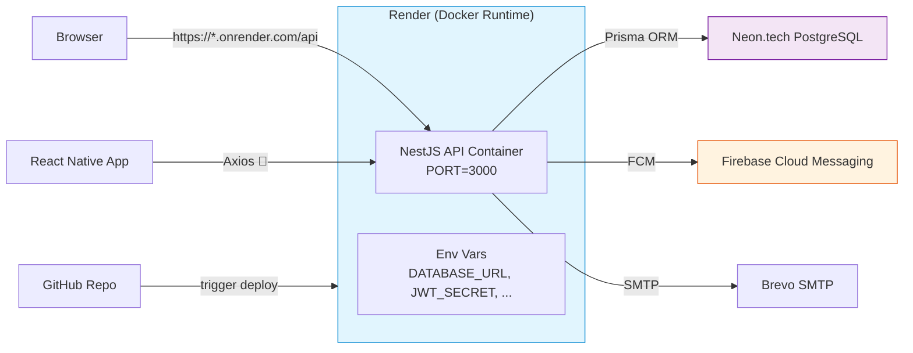

# Day 18 — Cloud Deployment: From Local Docker to Live Server

## Overview

**Goal:** Deploy the Car Rental API to Render (free tier) using Docker, configure production environment variables, and verify the live API is accessible from the internet.

By the end of Day 18, you will have:
- `https://car-rental-api.onrender.com/api` — Live Swagger UI accessible from anywhere
- Your React Native app pointed at the production API
- A deployment workflow you can repeat anytime

---

## Architecture: What We're Deploying



---

## Step 1: Prerequisites — What You Need

Before starting, make sure you have:

| Item | Check |
|------|-------|
| **Docker image builds locally** | `docker build -t test .` in `backend/` — should succeed |
| **GitHub repo** | Code pushed to `main` branch |
| **Neon.tech DB** | Already running, accessible from any IP (Neon allows all IPs by default) |
| **Render account** | Sign up at https://render.com (GitHub OAuth recommended) |
| **Docker Hub account** (optional) | Sign up at https://hub.docker.com — only if pushing via Docker Hub |

Your current Dockerfile at `backend/Dockerfile` is already multi-stage and production-ready:

```dockerfile
# Stage 1: Build
FROM node:20-alpine AS builder
WORKDIR /app
COPY package*.json ./
COPY prisma ./prisma/
RUN npm ci && npx prisma generate
COPY . .
RUN npm run build && npm prune --omit=dev

# Stage 2: Production
FROM node:20-alpine AS production
WORKDIR /app
ENV NODE_ENV=production
COPY --from=builder /app/dist ./dist
COPY --from=builder /app/node_modules ./node_modules
COPY --from=builder /app/package*.json ./
COPY --from=builder /app/prisma ./prisma
EXPOSE 3000
CMD ["node", "dist/src/main.js"]
```

---

## Step 2: Choose a Deployment Strategy

There are two ways to deploy to Render:

| Strategy | How It Works | Pros | Cons |
|----------|-------------|------|------|
| **A — Git Connect** | Render clones your repo and builds the Docker image itself | No Docker Hub needed; auto-deploys on git push | Build time counts against free tier minutes |
| **B — Docker Hub Push** | You build locally, push image to Docker Hub, Render pulls it | Faster deploy; no build on Render | Extra step to push; Docker Hub account needed |

**Recommendation:** Use **Strategy A (Git Connect)** — it's simpler and the free tier gives 750 build minutes/month, which is plenty.

---

## Step 3 (Strategy A): Deploy via Git Connect to Render

### 3a. Connect Render to GitHub

1. Go to https://dashboard.render.com
2. Click **"New +"** → **"Blueprint"** (because we have `render.yaml`)
3. Authorize Render to access your GitHub account
4. Select the repo: `ayechanaungdev/full-stack-development`
5. Render detects `render.yaml` automatically and pre-fills the config:

```yaml
# render.yaml (already in your repo)
services:
  - type: web
    name: car-rental-api
    env: docker
    repo: https://github.com/ayechanaungdev/full-stack-development
    branch: main
    dockerfilePath: ./backend/Dockerfile
    dockerContext: ./backend
    envVars:
      - key: DATABASE_URL
        sync: false      # ❗ You'll enter this manually
      - key: JWT_SECRET
        sync: false      # ❗ Manual entry
      - key: JWT_REFRESH_SECRET
        sync: false      # ❗ Manual entry
      - key: PORT
        value: 3000
```

6. Click **"Apply"** — Render creates the service but the build will pause because `DATABASE_URL` is not set yet.

### 3b. Configure Environment Variables

During the first deploy, Render shows an "Environment" tab. Add these variables:

| Variable | Value | Source |
|----------|-------|--------|
| `DATABASE_URL` | `postgresql://...` | Copy from your `backend/.env` or Neon dashboard |
| `SMTP_HOST` | `smtp-relay.brevo.com` | Brevo SMTP settings |
| `SMTP_PORT` | `587` | Brevo |
| `SMTP_USER` | `af4be6001@smtp-brevo.com` | Brevo login email |
| `SMTP_PASSWORD` | `xsmtpsib-...` | Brevo SMTP key |
| `SMTP_FROM` | `"Car Rental" <...>` | Sender email |
| `GOOGLE_CLIENT_ID` | `578722206606-...` | Google Cloud Console |
| `CLOUDINARY_CLOUD_NAME` | `dmd9xsaze` | Cloudinary dashboard |
| `CLOUDINARY_API_KEY` | `584657636669219` | Cloudinary |
| `CLOUDINARY_API_SECRET` | `sPQsGb0...` | Cloudinary |
| `JWT_SECRET` | _(generate new)_ | See note below |
| `JWT_REFRESH_SECRET` | _(generate new)_ | See note below |
| `PORT` | `3000` | Already in render.yaml |

**Generate secure JWT secrets:**
Run this command locally to generate random secrets:

```powershell
# Generate two random 64-character hex strings
$bytes = New-Object byte[] 32
[Security.Cryptography.RandomNumberGenerator]::Create().GetBytes($bytes)
$jwt1 = [BitConverter]::ToString($bytes) -replace '-',''
Write-Host "JWT_SECRET=$jwt1"

$bytes2 = New-Object byte[] 32
[Security.Cryptography.RandomNumberGenerator]::Create().GetBytes($bytes2)
$jwt2 = [BitConverter]::ToString($bytes2) -replace '-',''
Write-Host "JWT_REFRESH_SECRET=$jwt2"
```

> ⚠️ **Security Note:** Do NOT use the hardcoded `'MY_SUPER_SECRET_KEY_123'` and `'MY_SUPER_REFRESH_KEY_123'` from `auth.service.ts` in production. Replace them with env variables. See **Step 6** below.

### 3c. Add Firebase Service Account

Render does NOT have access to your local `serviceAccountKey.json`. You have two options:

**Option 1 (Recommended): Encode as env var**
```powershell
# Read and base64-encode the JSON file
$json = Get-Content "backend\serviceAccountKey.json" -Raw
$bytes = [Text.Encoding]::UTF8.GetBytes($json)
$b64 = [Convert]::ToBase64String($bytes)
Write-Host "FIREBASE_SERVICE_ACCOUNT=$b64"
```

Then add `FIREBASE_SERVICE_ACCOUNT` to Render env vars. In `firebase.service.ts`, decode it at startup:

```typescript
// In firebase.service.ts constructor
const serviceAccountJson = process.env.FIREBASE_SERVICE_ACCOUNT;
if (serviceAccountJson) {
  const decoded = Buffer.from(serviceAccountJson, 'base64').toString('utf-8');
  const serviceAccount = JSON.parse(decoded);
  // Use serviceAccount instead of require()
}
```

**Option 2 (Quick): Add file via Render Dashboard**
Render's free tier doesn't support file uploads directly. Use Option 1.

### 3d. Manual Deploy Trigger

After saving env vars:
1. Go to your Render dashboard → **Events** tab
2. Click **"Manual Deploy"** → **"Clear build cache & deploy"**
3. Watch the build logs — it will:
   - Clone the repo
   - Build the Docker image (multi-stage, ~3-5 min)
   - Start the container
4. When done, Render shows: `https://car-rental-api.onrender.com`

---

## Step 4 (Alternative): Deploy via Docker Hub (Strategy B)

If you prefer pushing to Docker Hub first:

```powershell
# 1. Build the image
cd backend
docker build -t car-rental-api:latest .

# 2. Tag for Docker Hub
docker tag car-rental-api:latest <your-dockerhub-username>/car-rental-api:latest

# 3. Login and push
docker login
docker push <your-dockerhub-username>/car-rental-api:latest

# 4. On Render: New Web Service → "Existing Docker Hub image"
#    Enter: <your-dockerhub-username>/car-rental-api:latest
```

---

## Step 5: Verify the Live API

### 5a. Check Swagger UI

Open your browser: **https://car-rental-api.onrender.com/api**

Expected result:
- Swagger UI loads with "Car Rental API" title
- All endpoint groups are listed (Auth, Cars, Bookings, etc.)
- "Authorize" button is present

> ⚠️ **First request may be slow** (5-15s) — Render free tier spins down the container after inactivity. This is called **cold start**. Subsequent requests are fast.

### 5b. Test a Live Endpoint

Open a terminal and test with curl:

```powershell
# Test health — should return 404 (no root route) or Swagger redirect
curl -s https://car-rental-api.onrender.com/api -o /dev/null -w "%{http_code}"

# Test login with invalid credentials — expect 401
curl -s -X POST https://car-rental-api.onrender.com/auth/login `
  -H "Content-Type: application/json" `
  -d '{"email":"test@test.com","password":"wrong"}'

# Test GET cars — expect 200 with JSON array
curl -s https://car-rental-api.onrender.com/cars | head -c 200
```

### 5c. Test JWT Auth Flow

```powershell
# 1. Login with a real user from your DB
$login = curl -s -X POST https://car-rental-api.onrender.com/auth/login `
  -H "Content-Type: application/json" `
  -d '{"email":"your-email@example.com","password":"your-password"}'

# 2. Extract access token (PowerShell)
$token = ($login | ConvertFrom-Json).accessToken

# 3. Use the token to access a protected route
curl -s https://car-rental-api.onrender.com/bookings `
  -H "Authorization: Bearer $token"
```

---

## Step 6: 🔴 Critical — Replace Hardcoded JWT Secrets

Your current `auth.service.ts` uses hardcoded secrets:

```typescript
// ❌ DO NOT use in production
secret: 'MY_SUPER_SECRET_KEY_123',
```

**Fix:** Update `auth.service.ts` to read from env variables:

```typescript
// In auth.service.ts
private readonly jwtSecret = process.env.JWT_SECRET || 'fallback-dev-only';
private readonly jwtRefreshSecret = process.env.JWT_REFRESH_SECRET || 'fallback-dev-only';

async generateTokens(userId: number, email: string, role: string) {
  const payload = { sub: userId, email, role };

  const [accessToken, refreshToken] = await Promise.all([
    this.jwtService.signAsync(payload, {
      secret: this.jwtSecret,       // ✅ Read from env
      expiresIn: '15m',
    }),
    this.jwtService.signAsync(payload, {
      secret: this.jwtRefreshSecret, // ✅ Read from env
      expiresIn: '7d',
    }),
  ]);
  return { accessToken, refreshToken };
}
```

Also update both `jwt.strategy.ts` and `jwt-refresh.strategy.ts`:

```typescript
// jwt.strategy.ts — constructor
secretOrKey: process.env.JWT_SECRET || 'MY_SUPER_SECRET_KEY_123',

// jwt-refresh.strategy.ts — constructor
secretOrKey: process.env.JWT_REFRESH_SECRET || 'MY_SUPER_REFRESH_KEY_123',
```

This way, when `JWT_SECRET` and `JWT_REFRESH_SECRET` are set in Render's env vars, they'll be used. If not set (local dev), the hardcoded fallbacks work.

---

## Step 7: Update Frontend to Use Live API

### 7a. Update local `.env` for testing

```env
# frontend/.env — replace LAN IP with Render URL
EXPO_PUBLIC_API_URL=https://car-rental-api.onrender.com
```

### 7b. Update production fallback in config

```typescript
// frontend/lib/config.ts
const getBaseUrl = (): string => {
  const envUrl = process.env.EXPO_PUBLIC_API_URL;
  if (envUrl) return envUrl;

  if (__DEV__) {
    return 'http://10.0.2.2:3000';
  }

  // ✅ Set your actual Render URL
  return 'https://car-rental-api.onrender.com';
};
```

### 7c. Test the App

1. Rebuild the Expo app: `npx expo start --clear`
2. The app now points to the production API
3. Test: Login, browse cars, create a booking

---

## Step 8: Set Up Auto-Deploy (Git Push)

Render can auto-deploy when you push to `main`:

1. In Render dashboard → your service → **Settings**
2. Scroll to **"Deploy Hook"**
3. Copy the URL like: `https://api.render.com/deploy/srv-xxx?key=yyy`
4. In your GitHub repo → **Settings** → **Webhooks** → **Add webhook**
   - Payload URL: (paste Render deploy hook)
   - Content type: `application/json`
   - Events: **"Push events"**

OR simpler: keep the **"Auto-Deploy"** toggle ON in Render settings (enabled by default for Blueprint). Every push to `main` triggers a new deploy automatically.

---

## Step 9: Verify Full Production Readiness

### 9a. API Response Checklist

| Endpoint | Expected | Status |
|----------|----------|--------|
| `GET /cars` | 200 + JSON array | ✅ |
| `POST /auth/login` | 200 + tokens | ✅ |
| `GET /bookings` (with token) | 200 or empty array | ✅ |
| `GET /api` | Swagger UI HTML | ✅ |
| `POST /auth/refresh` (with refresh token) | 200 + new tokens | ✅ |

### 9b. Check Logs

Render provides live logs:

1. Dashboard → your service → **Logs** tab
2. Watch for:
   - `NestJS — Server is running on http://localhost:3000` ✅
   - `Firebase Admin SDK initialized successfully` ✅
   - Any `ERROR` or `UnhandledPromiseRejection` ❌

### 9c. Test Cold Start

1. Wait 15 minutes (Render free tier spins down after 15 min of inactivity)
2. Visit `https://car-rental-api.onrender.com/api`
3. First request should take ~5-15 seconds (cold start)
4. Subsequent requests should be fast (<500ms)

---

## Potential Errors & Fixes

| Error | Cause | Fix |
|-------|-------|-----|
| `PrismaClientInitializationError: P1001` | `DATABASE_URL` not set or wrong | Check env var in Render dashboard; verify Neon is accessible |
| `Cannot find module './auth/jwt.strategy'` | Build copy missed files | Check `.dockerignore` isn't excluding `dist/` |
| `FirebaseAppError: Invalid service account` | Missing `serviceAccountKey.json` | Use base64 env var approach (Step 3c) |
| `401 Unauthorized` on protected routes | JWT secret mismatch | Hardcoded secret in code vs env var; ensure both match |
| `ERR_CONNECTION_REFUSED` | Container not started | Check Render logs; cold start may take 30s |
| `413 Payload Too Large` | Request body > default limit | Already handled — `bodyParser.json({ limit: '10mb' })` |
| Swagger UI loads but shows "Failed to fetch" | CORS not configured | `app.enableCors()` already in `main.ts` — should work |

---

## Key Takeaways

| Concept | Why It Matters |
|---------|---------------|
| **Docker multi-stage build** | Production image is lean (~200MB) — no dev dependencies, no source maps, no TypeScript compiler |
| **Render auto-deploy** | Push to `main` → GitHub webhook → Render build → live in 3-5 minutes |
| **Cold start** | Free tier containers spin down after inactivity; first request is slow. Day 19 fixes this with keep-alive pings |
| **JWT secrets in env vars** | Never hardcode secrets in code. Use `process.env.JWT_SECRET` so the same code works in dev and production |
| **Base64 env vars for files** | Render free tier doesn't support file uploads; encode JSON files as base64 strings in env variables |

---

## Next: Day 19 — Connection Pooling & Keep-Alive

The API is live, but:
1. **Cold starts** are annoying (~10-15s first request)
2. **Neon free tier** also spins down after inactivity
3. **Prisma connections** could be optimized with pooling

Day 19 will:
1. Set up **Neon connection pooling** (PgBouncer) for stable DB connections
2. Create a **cron-job.org** ping to keep both Render and Neon awake
3. Optimize Prisma connection settings for serverless environments

---

## Git Commits Reference

```text
Day 18: update JWT strategies to read secrets from env
Day 18: add Firebase base64 env var support
Day 18: deploy to Render and verify live API
Day 18: update frontend config for production API URL
```

---

_End of Day 18 Guide_
